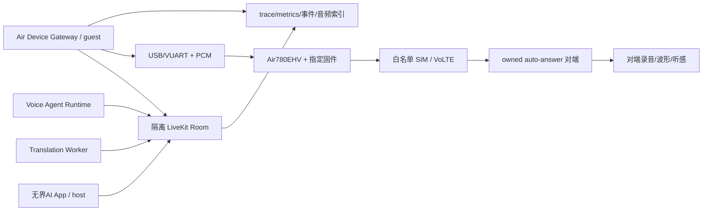

# 无界AI Air780 电话完整测试与验收计划

版本：v1.1
日期：2026-08-04
状态：执行基线；`Gate 0A PASS / Gate 0B BLOCKED_UNVERIFIED`

## 1. 目标与产品边界

本计划验证两条产品链：

1. 人工翻译电话：App(host) + Air Device Gateway(guest) + Translation
   Worker(worker)，P0 只传译声。
2. AI 代打电话：Air Device Gateway(guest) + Voice Agent Runtime(worker)，App
   可监督、暂停、取消并在同一通电话内接管。

电话接入固定为 Air780EHV + SIM + VoLTE。LiveKit 只承担 room、participant、
track、定向订阅和 Worker 调度；不使用 SIP 中继或 LiveKit SIP Trunk。Air780
本身不是 LiveKit 客户端，Beelink 上的 Air Device Gateway 以 guest 身份加入房间。

以下结论不得混用：

- H0/H1 模拟测试只能证明合同和状态机，不能证明真实电话可用。
- 单次文件播放不能证明连续实时 PCM 上行注入。
- LiveKit participant 已连接不能证明运营商电话已接通。
- 收到字幕不能证明译音已写回电话上行。
- 单向成功不能证明双向翻译或人工接管已通过。

## 2. 强制执行顺序

```text
环境与资产冻结
  -> Gate 0A 双向采集（已通过）
  -> Gate 0B 上行注入数字/模拟桥决策
  -> Gate 1 固件/VUART/设备控制
  -> Gate 2 Gateway/租约/数据一致性
  -> Gate 3 LiveKit 媒体隔离
  -> Gate 4 人工翻译电话
  -> Gate 5 AI 代打与人工接管
  -> Gate 6 故障注入/恢复/计费
  -> Gate 7 多设备/运营商/长稳/白名单试用
```

任一 Gate 的阻断用例失败，后续真实拨号 Gate 停止。不得通过关闭断言、隐藏日志、
降级为 mock 或换一组号码绕过。

## 3. 证据等级

| 等级 | 环境 | 能证明什么 |
| --- | --- | --- |
| H0 | 单元、合同、静态 fixture | codec、schema、纯状态转换 |
| H1 | 本地模拟 Gateway/设备/LiveKit client | adapter、幂等和错误路径 |
| H2 | 隔离主机（Windows 证据台架或 Beelink）+ 真 Air780 + 音频台架 | VUART、PCM、固件和设备控制；证据必须标明主机 |
| H3 | 隔离 LiveKit + 真模型 + PostgreSQL + 真 Air | 跨服务媒体、租约、恢复和数据流 |
| H4 | owned 白名单号码 + 真 App + 双端录音 | 真实人工电话和 AI 电话体验 |
| H5 | 多设备、三运营商、弱信号、8h soak、白名单试用 | 小规模商用稳定性 |

Gate 0 至少需要 H2；人工翻译电话和 AI 代打分别至少需要 H4；发布至少需要 H5。

## 4. 测试拓扑

当前物理连接为 Air780 接在 Beelink USB。Windows 仅是 Gate 0A 已归档证据来源，
不是当前运行主机；重新执行任何真实测试前仍需实时确认 USB、串口占用、固件运行态、
SIM/VoLTE 和录音同意。



台架必须能够同时保存：注入前 PCM、VUART frame index、模块事件、LiveKit track
与 subscription、对端录音。只有单一录音而没有时钟对齐信息时，不能判定 clear、
首包或跨轨泄漏。

## 5. 开测前冻结清单

### 5.1 硬件和固件

- Air780 精确型号、开发板/载板 revision、IMEI/序列号脱敏哈希。
- 13/113 固件完整版本、下载来源、文件 SHA-256、烧录工具版本。
- USB VID/PID、VUART 枚举、线缆和供电方案。
- SIM 运营商、VoLTE 注册状态、测试号码脱敏哈希、套餐和禁拨策略。
- 路径 C 时额外冻结 ESP32-S3、ES8388、模拟音频电路和固件 SHA-256。

### 5.2 软件和服务

- 仓库 commit、branch、dirty diff SHA-256；不得把 `outputs/` 纳入源码包。
- Node/Flutter/LiveKit SDK、LiveKit Server、PostgreSQL、镜像 digest。
- API、Gateway、Worker、Agent、ASR/MT/TTS 的版本和参数 fingerprint。
- Beelink OS/kernel、CPU/GPU/内存、USB topology、系统时钟/NTP 状态。
- 测试环境使用独立 room 前缀、数据库 schema、设备池和白名单号码。

### 5.3 合规和安全

- 通话双方知情同意录音与 AI/翻译参与。
- 禁拨紧急、高资费、投诉、骚扰和非授权号码。
- 日志不得保存明文手机号、ICCID、IMEI、token、音频正文或用户工具凭据。
- 证据包中的号码、设备号只保留稳定脱敏哈希。

任一冻结项缺失时，执行结果标记 `BLOCKED`，不能标记 `PASS`。

## 6. 固定音频与场景集

| Fixture | 内容 | 用途 |
| --- | --- | --- |
| F-AUD-001 | -18 dBFS、1 kHz、60 秒 PCM16LE | 采样率、增益、错速、削波 |
| F-AUD-002 | 300–3400 Hz logarithmic sweep | 电话带宽和频响 |
| F-AUD-003 | 静音/低幅噪声/脉冲各 30 秒 | underrun、旧缓冲、爆音 |
| F-AUD-004 | 中文 20 句 | ASR/MT/TTS 和数字实体 |
| F-AUD-005 | 英文 20 句 | ASR/MT/TTS 和专名 |
| F-AUD-006 | 中英混说 20 句 | LID spans、型号、电话号码 |
| F-AUD-007 | 0–9、`*#ABCD` | DTMF 正确性 |
| F-AUD-008 | 10 分钟循环人声 + 静音 | 队列、clear、长稳 |

所有 WAV/PCM 必须固定 sample rate、channel、sample format 和 SHA-256。模型质量
不是 Gate 0 的判定依据；Gate 0 使用源波形和对端波形判定传输是否成立。

## 7. Gate 0A 采集与 Gate 0B 连续 VoLTE 上行注入

详细台架要求见 `docs/poc/air780-gate0-plan.md`，冻结证据见
`docs/poc/air8780v4-v2046-113-hardware-baseline-20260804.md`。

### 7.1 Gate 0A：真实双向 PCM 采集 — PASS

Air8780V4/Air780EHV、V2046-113、诊断 007/audio_v2 已在 Windows 台架通过
真实 VoLTE 双向 16 kHz PCM 采集：每路 6,400 bytes/200 ms；59.542 秒
COUNT_ONLY 上、下行各 297 callbacks；15.359 秒原始 VUART 上、下行各 76 帧，
sequence gap=0；约 449.99 秒看门狗无重启或 USB 重枚举。

该 PASS 只证明采集格式、节拍、USB/VUART 完整性和看门狗，不证明连续译音注入、
远端可懂度、原声泄漏为 0 或端到端翻译电话可用。

### 7.2 Gate 0B：连续上行译音注入 — BLOCKED_UNVERIFIED

必须取得以下之一：

- `PASS_0B_DIGITAL`：指定量产固件连续数字 PCM 注入通过。
- `PASS_0B_BRIDGE`：ESP32-S3/ES8388 模拟音频桥通过。
- `FAIL_0B`：两条路径均不满足，停止产品化。

#### 数字路径核心门槛

| 指标 | P0 通过标准 |
| --- | ---: |
| 8/16 kHz 格式 | 实际采样率误差 <= 1%；无半速/倍速 |
| 削波样本占比 | < 0.1% |
| 1 kHz 频率误差 | <= 1% |
| 连续音频 gap | 丢失占比 <= 0.5%；单次不可恢复 gap <= 200 ms |
| clear/stop P95 | <= 300 ms；之后旧音频 0 帧 |
| 30 分钟长稳 | 0 crash、0 卡死、队列/RAM 无线性增长 |
| 500 次 start/stop | 500/500 确定终态；0 旧缓冲回放 |
| USB 重连 | 旧 lease/fence 100% 失效；不自动重拨 |

运营商无线链路可能引入抖动，因此必须同时保存模块本地注入时钟和对端录音；无法
归因的 gap 只可标记 `CONDITIONAL`，不能直接通过。

#### 数字路径强制停止条件

- 官方/厂商只能提供整文件播放、内置 TTS 或无法复现的示例。
- 连续缓冲没有明确 refill、underrun、stop、clear 语义。
- start/stop 后会重放旧 buffer，或 USB 重连会继续旧通话。
- 30 分钟出现不可恢复卡死、内存/队列持续增长或对端持续爆音。

满足任一条件即停止数字路径，转模拟音频桥；不长期等待未承诺接口。

## 8. Gate 1：固件、VUART 与设备控制

### 8.1 协议门槛

- VUART v1 golden frame 跨 Node/Lua 一致；字段 little-endian、CRC32 一致。
- Air780→Beelink 的 v1 会话音频固定 16 kHz、PCM16LE mono、6,400 bytes/200 ms；
  Beelink→LiveKit 再重切为 10 个 640-byte/20-ms frame。
- 板端稳定输出保持每路 6,400 bytes/200 ms；Beelink Gateway 必须把每块重切为
  10 个 640-byte/20-ms 帧后发布 LiveKit，并保留原始 device sequence、
  subframe index 和 call generation。不得为了迎合 LiveKit 修改板端缓冲。
- ASR 可直接消费原始 200 ms 块或由 Worker 聚合；板端诊断 `WJAI/1` 头不能
  冒充已经完成 VUART v1 跨语言互通。
- 坏 magic/version/length/CRC 在进入电话状态机前拒绝并计数。
- audio sequence gap 计数并补静音；音频不重传、不重复播放迟到帧。
- 控制命令必须 ACK；相同 commandId+payload 只执行一次，不同 payload 冲突。
- leaseId/fencingToken 不匹配时，dial/hangup/DTMF/PCM 全部拒绝。

### 8.2 设备控制门槛

- dial、ringing、connected、DTMF、local/remote hangup 都有单调设备事件。
- LiveKit joined 不得把业务状态提升为 connected。
- 100 次真实拨号 0 重复拨号、0 悬挂 call、0 失联 lease。
- VUART 在双向 16 kHz PCM + 控制/心跳条件下，实测吞吐至少保留 2 倍余量。
- firmware restart、USB 拔插、Gateway restart 均进入确定终态。

## 9. Gate 2：Device Gateway、租约与数据一致性

### 9.1 注册和租约

- 设备注册包含 deviceId、固件、能力、采样率和 heartbeat 时间。
- 两个请求并发 claim 同一设备时只有一个 CAS 成功。
- 同一 communicationSessionId 重放 claim 返回同一 lease，不重复分配。
- fencingToken 只增不减；旧 token 在 API、Gateway 和设备三层均拒绝。
- heartbeat 过期先进入 quarantine，不立刻分配给第二通电话。
- release/reconcile 幂等；Gateway/API 重启后从 PostgreSQL 恢复权威状态。

### 9.2 命令和事件

- dial/hangup/DTMF/reconcile 统一携带 operationId、commandId、lease/fence。
- 设备事件经可靠 inbox 去重；outbox 重放不产生第二通电话。
- provider timeout 后只 reconcile，禁止直接发第二个 dial。
- communicationSessionId、providerCallId、deviceId、leaseId 可关联，但日志不写号码。

## 10. Gate 3：LiveKit 媒体与权限隔离

P0 硬门槛为 `raw cross-audio = 0`：

| 路径 | 允许 | 禁止 |
| --- | --- | --- |
| App host microphone | Translation Worker | Air guest/其他 human |
| Air 电话下行 | Translation Worker | App host/其他 human |
| Worker TTS guest | 精确 Air guest leg | App/其他 guest |
| Worker TTS host | 精确 App host leg | Air/其他 host |

其他门槛：

- Air guest token 绑定 communicationSessionId/deviceId/leaseId；短 TTL、禁止 data。
- Gateway 使用 `autoSubscribe=false`，只对精确目标 TTS track 订阅。
- track subscription permission 未成功前，Worker 不输出第一个 TTS PCM frame。
- host/Air/旁观 participant 接收到对方原声均为 0 帧。
- LiveKit reconnect、participant replacement、token 轮换后权限不扩大。
- 30 分钟房间内 raw leak、错向 TTS、旧 generation 音频均为 0 帧。

验收必须同时使用 LiveKit subscription 记录和端点实际收帧计数；只看 UI 静音不算通过。

## 11. Gate 4：人工翻译电话

### 11.1 正常链路

1. API 创建 communicationSession 和 room。
2. Device Gateway claim Air 设备并取得短 Token。
3. Air 拨号；模块事件到 connected 后才允许媒体进入 active。
4. 电话下行 -> Air Gateway -> Worker -> MT/TTS -> App。
5. App microphone -> Worker -> MT/TTS -> Air Gateway -> VoLTE uplink。
6. 任一方挂断后停止媒体、释放 Worker/lease/hold，并完成唯一结算。

### 11.2 必测场景

- 正常接听、忙线、无人接、拒接、无效号码。
- 对端挂断、App 挂断、取消时仍在 dialing/ringing。
- Wi-Fi/有线网络切换、LiveKit reconnect、模型 timeout/fallback。
- 中英双向、数字/金额/时间/地址/型号、中英混说。
- 30 分钟和 60 分钟连续通话。

### 11.3 通过标准

| 指标 | P0 门槛 |
| --- | ---: |
| speech end -> 对端首个可听译音 P50 | <= 1.5 s |
| speech end -> 对端首个可听译音 P95 | <= 3.0 s |
| 正常语句有 final 译文 | >= 99% |
| raw cross-audio | 0 帧 |
| 旧 generation/错向 TTS | 0 帧 |
| 无接听计费 | 0 |
| 每通电话 settle | 恰好 1 条 |
| 100 次拨号 | 0 重复、0 悬挂 lease、100 个确定终态 |
| 60 分钟 | 0 crash、0 不可恢复断线、0 线性队列增长 |

## 12. Gate 5：AI 代打、监督与同通接管

只开放白名单低风险预约/查询。必测：

- 开场明确披露 AI/录音/任务目的；对方拒绝后立即退出。
- 授权、号码 allowlist、频控和任务风险在拨号前完成。
- 真人、IVR、语音信箱分类；DTMF 仅按授权步骤发送。
- App 可查看状态和字幕，pause 不等于 hangup，cancel 必须挂断并结算。
- 人工接管保持相同 communicationSessionId/providerCallId/运营商电话，不重拨。
- 接管时旧 Agent generation、TTS 和待执行 tool 全部取消。
- tool commandId 幂等；LLM 文本不能直接伪造 tool success。
- 高风险支付、转账、身份承诺和无限制外呼 100% 阻断或要求人工确认。
- Agent crash/restart 后 reconcile；无法确定状态时停止新 dial 并转人工处理。

通过标准：20 个低风险脚本全部有确定结果；取消/接管各 20 次不重拨、不重复工具、
不串话、不重复结算；高风险负例 100% 被阻断。

## 13. Gate 6：故障注入和恢复

| 故障 | 预期行为 |
| --- | --- |
| USB/VUART 丢失 | 当前 call 进入 unknown/ending；旧 fence 失效；不自动重拨 |
| Air reboot | 进入 quarantine；reconcile 后确定失败或结束 |
| Gateway SIGKILL | 新实例恢复 lease；旧实例命令被 fence 拒绝 |
| LiveKit 断开 | 电话状态不由 presence 改写；恢复后重新施加订阅权限 |
| Worker crash | 译音停止；旧 generation 不回放；重派或明确失败 |
| ASR/MT/TTS timeout | 按 stage fallback；不阻塞挂断和结算 |
| PostgreSQL 暂停 | 不产生第二个 operation；恢复后 inbox/outbox 收敛 |
| API restart | session/lease/hold/ledger 一致；End 可重放 |
| 事件重复/乱序 | aggregateVersion 单调；终态不回退 |
| 资源已满 | N+1 请求 admission denied；已接通电话不受影响 |

故障注入结果必须保存故障开始/结束时刻、对应事件、状态转移、数据库记录和媒体帧数。

## 14. Gate 7：容量、环境与试用

- 单设备并发上限固定为 1；N 台设备最多 N 通，N+1 明确拒绝。
- 多设备 claim 不串 deviceId/SIM/room/lease；拔掉一台不影响其他设备。
- 目标运营商先通过；发布前覆盖移动/联通/电信 VoLTE。
- 覆盖稳定信号、弱信号、切网、忙时和不同对端手机。
- 8 小时混合 soak：正常通话、忙线、取消、接管、模型故障交替。
- 设备、USB hub、电源和音频桥记录温度；无热重启、降频导致的持续破音。
- 白名单试用必须能远程禁用设备、号码、AI Agent 和上行注入能力。

小规模试用前必须完成隐私、录音同意、禁拨、退款和投诉处理流程。

## 15. 证据包

每次运行使用 `AIR-YYYYMMDD-HHMMSS-<short-id>`，保存到：

```text
outputs/air780-acceptance/<runId>/
  run-manifest.json
  source-snapshot/
  hardware/
  firmware/
  commands/commands.jsonl
  events/device-events.jsonl
  events/livekit-events.jsonl
  vuart/frame-index.jsonl
  audio/input/
  audio/local-capture/
  audio/peer-capture/
  metrics/
  traces/
  database/
  redacted-logs/
  test-results.csv
  deviations.md
  acceptance-summary.md
```

音频大文件可单独存储，但 manifest 必须记录路径、大小、SHA-256、采样率、通道、
开始/结束时钟。`acceptance-summary.md` 只允许 `PASS / CONDITIONAL / FAIL /
BLOCKED / NOT_RUN`；NOT_RUN 不计通过。

## 16. 分工和预计工期

| 工作包 | 负责人角色 | 依赖 | 预计 |
| --- | --- | --- | ---: |
| HW-001 采集基线/注入接口 | 硬件/固件 | Gate 0A 已通过；Gate 0B 需授权号码 | 1–2 天 |
| Gate 0B 数字或模拟桥 | 硬件/QA | HW-001 注入 PoC | 2–3 天 |
| FW-001 VUART Lua | 固件 | Gate 0B 路径确定 | 2 天 |
| DG-001 USB/Gateway | 服务端 | FW-001 | 2–3 天 |
| API-001 PostgreSQL lease | API/数据 | DG-001 合同 | 2 天 |
| Gate 3 媒体隔离 | LiveKit/安全/QA | DG/API | 1–2 天 |
| Gate 4 人工电话 | App/Worker/QA | Gate 0–3 | 2–3 天 |
| Gate 5 AI 电话 | Agent/安全/QA | Gate 4 | 2–3 天 |
| Gate 6/7 长稳 | QA/运维 | 前置全部通过 | 3–5 天 |

工期从硬件、固件、白名单 SIM/号码和录音同意均到位后计算；缺一项则保持 BLOCKED。

## 17. 当前状态与下一执行点

当前已有 H0/H1：VUART host codec、模拟设备幂等、stale fence、内存租约、Air
Provider、Air guest token 和精确 TTS 订阅策略。另有 Gate 0A H2 真实采集证据，
但它不提升 Gate 0B 注入状态。

当前 Air780 已接在 Beelink USB。2026-08-04 09:58 +08:00 只读探测确认
`19d1:0001`、`ttyACM0/1/2` 和稳定 by-id 路径，端口当时均未占用；`beelink`
用户不在 `dialout` 组。未经授权不得改用户组、udev 或 systemd 权限。

下一执行点固定为：

1. 在不连接生产 App 的隔离台架上，为 Gate 0B-D 生成新的 run manifest。
2. 经现场授权后，先验证有限 RAW zbuff 的 `EXT_SRC_DONE` 间隙、连续拼接、
   stop/clear/挂断清理、远端可懂度、延迟和原声泄漏。
3. 数字路径失败立即评估 Gate 0B-C 模拟音频桥。
4. 只有 Gate 0B 通过，才实现真实译音回灌并进入完整 Gate 1–7。

完整逐项用例见 `docs/acceptance/air780-test-case-matrix-20260803.csv`，单次执行记录
使用 `docs/acceptance/air780-test-run-template.md`。
