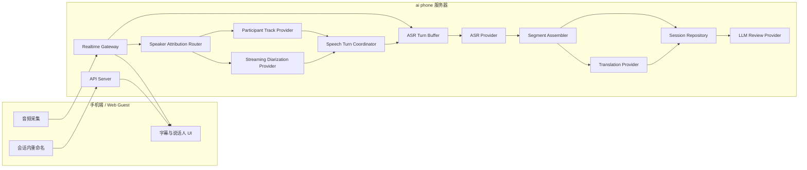
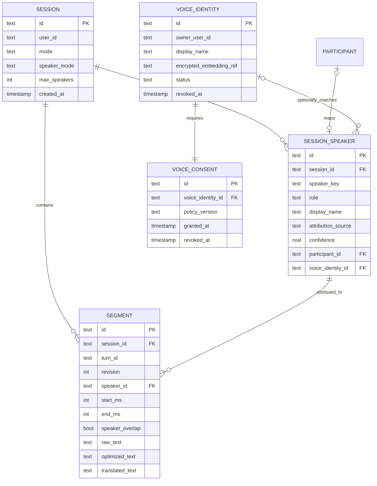

# ai phone 说话人归属技术设计

版本：v1.7
日期：2026-07-11

## 1. 目标与边界

说话人能力拆成三层，不能混为一个功能：

1. **角色归属**：利用 Call Link、PSTN 或独立音轨直接得到 `host/guest/agent`。
2. **说话人分离**：单麦克风音频输出稳定的匿名标签，例如 `speaker_1/speaker_2`。
3. **身份识别**：用户明确授权并录入声纹后，把匿名标签映射为姓名。

说话人分离只回答“谁在什么时候说话”，不能证明现实身份。未授权、低置信度或多人重叠时必须显示匿名标签或“未知说话人”，不得由 LLM 根据文本猜测姓名。

## 2. 当前缺口

- speaker 字段、时间对齐、字幕和历史已经贯通，代码已支持确认换人后按 `boundaryMs` 提交 ASR turn；Beelink ASR 和固定双声源已通过，iPhone 快速换人尚未验收。
- 普通 VAD/最大时长恰好先于 speaker boundary 完成时可能产生 endpoint race；当前有替代结果时去重，空结果时保留普通端点防止漏句，并把 race/miss 写入 session。固定双声源 race=0，真机短停顿场景仍需量化。
- SegmentAssembler 已禁止不同 speaker 的 ASR 段继续合并，但无法修复 ASR 段内部已经混入两个人的问题。
- App 和 API 曾把 conversation 默认写成 2 人，与对话、聆听和会议的多人场景不符。
- turn 尚未持久化 `dominantLanguage/detectedLanguages/mixedLanguage`，但 SegmentAssembler 已取消语言变化硬断点。

## 3. 统一数据契约

新增可选 `speaker` 对象：

```ts
interface SpeakerAttribution {
  speakerId: string;
  role: "self" | "peer" | "host" | "guest" | "agent" | "speaker" | "unknown";
  label?: string;
  source: "participant_track" | "diarization" | "voiceprint" | "language_role" | "manual";
  confidence?: number;
}
```

`TranscriptEvent`、`SessionSegmentDto`、App 字幕、历史记录、导出和会后 review 均透传该对象。声纹模板 ID 不返回 App，也不写入普通 session 导出。

## 4. 数据流

```text
Call Link/PSTN 独立音轨
  -> participant metadata
  -> participant_track attribution
  -> ASR -> translation -> subtitle/history

面对面单麦克风
  -> PCM 16 kHz fan-out
  -> VAD + Streaming Diarization Provider
  -> speaker time spans
  -> SpeechTurnCoordinator (confirmed speaker boundary)
  -> ASR Turn Buffer 在 boundaryMs 切分音频
  -> Qwen3-ASR turn text
  -> SegmentAssembler (same speaker only)
  -> translation -> subtitle/history

可选实名
  -> consented voice enrollment
  -> voiceprint match
  -> confidence gate
  -> named label or anonymous fallback
```

## 5. Provider 设计

新增 `SpeakerAttributionProvider`，与 ASR Provider 并列，不能写死在 Qwen3-ASR 实现中：

- `off`：不识别，兼容现有链路。
- `participant_track`：Call Link/PSTN 默认，准确性最高。
- `streaming_sortformer`：Beelink 服务端单麦克风流式分离候选。
- `voiceprint`：后续授权身份识别，不作为默认能力。

首选评测 `nvidia/diar_streaming_sortformer_4spk-v2.1`。官方模型支持在线说话人分离、Arrival-Order Speaker Cache 和最多 4 个说话人；正式接入前必须在独立 harness 测延迟、DER、显存、长会话标签漂移和中英混说。

## 6. App 交互

- 字幕顶部显示说话人标签和稳定颜色，同一 speaker 在会话内颜色不变。
- 默认显示“我/对方”仅限独立音轨或明确手动映射；单麦克风动态显示“说话人 1/2/3/4”，不能假设只有两人。
- 用户可在会话中或历史详情中把匿名标签重命名，但只修改本次会话展示。
- VoiceOver/TalkBack 按“说话人、原文、译文、状态”顺序朗读。
- 重叠说话显示主要 speaker，并在诊断字段记录 overlap；不得合并两个 speaker 的文本。

## 7. 隐私与合规

- 说话人分离无需保存声纹，默认只保存匿名 label。
- 身份识别必须单独告知、单独同意、可撤回和可删除。
- 声纹模板加密存储，不能进入日志、导出、LLM prompt 或普通备份。
- 低置信度匹配必须回退匿名，禁止为了界面完整强制给出姓名。

## 8. 分阶段开发

1. `OPT-SPK-001`：统一 speaker 数据契约，Call Link 独立音轨先贯通字幕、历史和 review。
2. `OPT-SPK-002`：独立 harness 部署 Streaming Sortformer，完成双人和多人固定语料评测。
3. `OPT-SPK-003`：接入普通 realtime，增加 ASR 后置时间对齐、不同 speaker 段禁止合并和 App 标签。
4. `OPT-SPK-004`：可选声纹实名、授权、撤回、删除和误识别门禁。
5. `OPT-SPK-005`：SpeechTurnCoordinator、防抖和说话人边界状态机。
6. `OPT-SPK-006`：ASR Turn Buffer、按 `boundaryMs` 切音频并保留连续 VAD 状态。
7. `OPT-SPK-007`：按 speaker turn 排队纠错、翻译和 TTS，不跨说话人合并上下文。
8. `OPT-SPK-008`：多人默认、混合语种、overlap、unknown 和 speaker revision 策略。

## 9. 验收门槛

- Call Link/PSTN 独立音轨角色归属准确率 100%。
- 2至4人安静场景分别验收；双人 DER 不高于15%，四人和噪声场景不高于25%。
- speaker 切换 P95 不高于 1.2 秒，同一人 30 分钟标签不无故漂移。
- speaker 变化处不得被 SegmentAssembler 合并成同一字幕。
- 中文夹英文、英文夹中文和专有名词不得触发 speaker 切换或硬断点。
- conversation、meeting、classroom 和 business 默认允许模型容量内最多4个匿名说话人，不设置2人产品限制。
- 身份识别低于阈值显示匿名；未授权场景不生成或持久化声纹。

### 9.1 当前门禁状态（2026-07-11）

- Beelink 已运行固定 `diar_streaming_sortformer_4spk-v2.1.nemo` stateful low-latency 服务，Gateway 测试环境已启用。
- 固定双声源和 iPhone 基础测试可以显示“说话人 1/2”，短句对齐证据已修复。
- 模型容量为4人，产品默认已统一为 `maxSpeakers=4`；这不是承诺超过4人的单麦克风实时分离。
- 抢话、重叠、真人四人、历史重命名、纪要和导出仍待正式验收，不能仅凭基础测试宣称商业发布完成。
- `OPT-SPK-005` 代码和自动化门禁已完成；ASR boundary API 可回切 PCM 且不重置连续 VAD，Beelink 部署和 iPhone 快速换人验收待执行。
- 完整模型证据见 `docs/poc/sortformer-speaker-shadow-evaluation-report.md`。

## 10. 技术架构

### 10.1 总体结构



最终部署仍是“手机端 + 服务器端”两层。`Speaker Attribution Router`、ASR、翻译、TTS 和 LLM 都属于服务器内部 Provider，App 不保存 Beelink 内部模型地址。

### 10.2 组件职责

| 组件 | 职责 | 失败策略 |
| --- | --- | --- |
| Speaker Attribution Router | 根据 session 模式选择独立音轨、diarization、manual 或 off | 回退 `unknown` |
| Participant Track Provider | 从 LiveKit/PSTN participant metadata 得到稳定角色 | 元数据非法时拒绝角色，不猜测 |
| Streaming Diarization Provider | 把 PCM 转成带起止时间的匿名 speaker spans | 熔断并旁路，不中断 ASR |
| Speech Turn Coordinator | 综合 participant、speaker span 和 VAD，确认 turn 边界 | 低置信度不强切，回退 VAD 端点 |
| ASR Turn Buffer | 保留未提交 PCM，并在 `boundaryMs` 切成上一 turn 和下一 turn | speaker 切段不重置连续 VAD 状态 |
| Segment Assembler | 只在相同 speaker 内合并语义残句 | 不跨 speaker、overlap 或 unknown 边界合并 |
| Voice Identity Matcher | 在明确授权后匹配声纹 | 低置信度返回匿名 |
| Session Repository | 保存 speaker、segment 归属和别名 | 幂等 upsert，保留旧数据兼容 |

### 10.3 Provider 接口

```ts
interface SpeakerAttributionProvider {
  readonly name: string;
  createSession(input: SpeakerSessionInput): Promise<void>;
  pushAudio(frame: TimedAudioFrame): Promise<SpeakerSpan[]>;
  flush(sessionId: string): Promise<SpeakerSpan[]>;
  closeSession(sessionId: string): Promise<void>;
  healthCheck(): Promise<boolean>;
}

interface SpeakerSpan {
  speakerId: string;
  startMs: number;
  endMs: number;
  confidence?: number;
  overlap?: boolean;
  final?: boolean;
}
```

Provider 接口与具体模型隔离。`streaming_sortformer` 只是第一候选，后续可以替换 NeMo clustering、云端 diarization 或端侧实现，不修改 App 和 session 数据模型。

### 10.4 时间基准与对齐

- App 音频帧必须携带 session 内单调递增的 `timestampMs` 和 `sequence`。
- ASR 结果增加 `startMs/endMs`；模型不返回时由 Gateway 使用输入批次边界估算，并标记 `timingSource=estimated`。
- diarization 输出使用同一个 session 时间轴。
- Aligner 按 speaker 聚合同一 ASR 区间内的所有碎片，先合并重复时间区间，再选择累计覆盖最大的 speaker；重叠比例低于门槛时返回 `unknown`。
- 后置归属兼容路径最多等待300ms；启用 turn segmentation 后，确认边界直接控制 ASR 音频提交，不依赖事后猜测整段 speaker。
- streaming provider 在说话持续期间返回 `final=false` 临时 span，闭合或 flush 后用相同 `speakerId + startMs` 返回最终 span；Gateway 采用幂等替换，不能重复累计。
- 语言检测维护独立的 `dominantLanguage/detectedLanguages/mixedLanguage`，不得参与 speaker ID 或硬断点判断。

### 10.5 三种运行路径

**Call Link/PSTN**

```text
participant audio track
  -> participant identity/role
  -> ASR
  -> segment(speaker source=participant_track)
```

该路径不运行 diarization，避免浪费计算和引入误差。

**面对面单麦克风**

```text
audio batch
  -> VAD and diarization fan-out
  -> confirmed speaker boundary
  -> ASR Turn Buffer split
  -> anonymous speaker turn
  -> translation and subtitle
```

**端侧模式**

首版不在手机内运行说话人模型。端侧只支持 `manual/language_role/off`，界面必须明确显示“按语言区分”或“未识别说话人”，不得伪装为声纹识别结果。

### 10.6 并发、背压和降级

- ASR/翻译是主链路；diarization 是可降级旁路。
- speaker 队列满时丢弃最旧的未对齐 span，并记录 `speaker_span_dropped`，不能丢 ASR final。
- 每个 session 独立维护 speaker cache；重连可在 45 秒 grace 内恢复匿名 speaker 映射。
- Sortformer 每个 session 持有独立 AOSC/FIFO state；模型调用可串行，但不得通过重复 `diarize()` 重置状态。
- 手机 24 kHz PCM 必须以有状态 resampler 连续转换为模型 16 kHz 输入，禁止逐帧独立重采样。
- Provider 不健康时 session 继续运行，speaker source 变为 `unknown`，历史和结算不受影响。
- Call Link 的 participant track 角色不能被 diarization 或 voiceprint 覆盖。

## 11. 事件和 API 协议

### 11.1 Realtime 事件

```ts
interface TranscriptEvent {
  type: "transcript.partial" | "transcript.final";
  sessionId: string;
  segmentId: string;
  turnId?: string;
  revision?: number;
  text: string;
  startMs?: number;
  endMs?: number;
  speaker?: SpeakerAttribution;
}

interface SpeakerUpdatedEvent {
  type: "speaker.updated";
  sessionId: string;
  segmentId: string;
  turnId?: string;
  revision?: number;
  speaker: SpeakerAttribution;
}
```

`turnId` 是一次稳定发言轮次的不可变标识；`revision` 是该 segment 归属修订版本。`speaker.updated` 只更新归属和界面，不触发 ASR、翻译、TTS 或重复计费。旧客户端不携带这两个字段时保持原有 segment 语义，服务器不得按 `segmentId` 伪造 turn。

### 11.2 Session 配置

```ts
interface SpeakerAttributionOptions {
  mode: "off" | "auto" | "participant_track" | "diarization" | "manual";
  maxSpeakers?: 2 | 3 | 4;
  allowVoiceIdentity?: boolean;
}
```

- 普通对话、聆听、课堂和商务模式默认 `auto + maxSpeakers=4`；旧客户端发送2或3时，服务器在 auto/diarization 模式规范化为4。
- Call Link/PSTN 强制 `participant_track`。
- participant track 按房间真实参与者处理，不使用单麦克风 diarization 的4人上限。
- 单麦克风超过4人时显示已有匿名槽位或未知说话人，不伪造第5人的稳定身份；后续可由批处理 Provider 增强。

### 11.2.1 当前启用范围

2026-07-11 起，在线测试环境直接启用 Streaming Sortformer v2.1：Gateway 使用
`SPEAKER_PROVIDER=http` 连接 Beelink Speaker Service。固定语料、30 分钟稳定性和
无标注真人 shadow 已完成；用户决定跳过真人 RTTM 质量门禁，先进入真实使用。
该决定只放开测试环境，不等同于生产发布验收。端侧模式仍不加载说话人模型，
Call Link/PSTN 的 participant track 仍优先于 diarization。

### 11.3 管理接口

| 方法 | 路径 | 用途 |
| --- | --- | --- |
| GET | `/sessions/:sessionId/speakers` | 查询本次会话 speaker 列表和统计 |
| PATCH | `/sessions/:sessionId/speakers/:speakerId` | 修改本次会话展示名 |
| POST | `/voice-identities` | 创建授权声纹身份，P2 才开放 |
| DELETE | `/voice-identities/:identityId` | 撤回并删除声纹身份 |

所有 speaker rename 必须校验 session 所有权。Call Link guest 只能修改自己的展示名，不能修改其他 participant。

## 12. 逻辑数据模型

### 12.1 实体关系



### 12.2 session_speakers

| 字段 | 类型 | 约束与说明 |
| --- | --- | --- |
| id | text | PK，服务器生成 |
| session_id | text | FK，删除 session 时级联删除 |
| speaker_key | text | session 内稳定键，如 `speaker_1` |
| role | text | self/peer/host/guest/agent/speaker/unknown |
| display_name | text nullable | 用户可见别名 |
| attribution_source | text | participant_track/diarization/voiceprint/language_role/manual |
| confidence | real nullable | 0 到 1 |
| participant_id | text nullable | Call Link/PSTN 映射 |
| voice_identity_id | text nullable | 仅服务器内部可见 |
| color_slot | int | 会话内稳定颜色槽，不保存颜色值 |
| created_at/updated_at | timestamp | 审计时间 |

唯一索引：`(session_id, speaker_key)`。`voice_identity_id` 不进入 App DTO、导出或 LLM prompt。

### 12.3 segments 扩展字段

| 字段 | 类型 | 说明 |
| --- | --- | --- |
| speaker_id | text nullable | FK 到 session_speakers |
| turn_id | text nullable | 新 session 内稳定发言轮次；旧数据允许为空 |
| revision | int nullable | 归属修订版本；新 turn 从0开始，旧数据允许为空 |
| speaker_source | text nullable | 归属来源快照，便于审计 |
| speaker_confidence | real nullable | 归属置信度 |
| speaker_overlap | bool | 是否检测到重叠说话 |
| start_ms/end_ms | int nullable | session 时间轴区间 |
| timing_source | text nullable | model/estimated/participant_track |
segment upsert 使用 `(session_id, segment_id)` 幂等键。`turn_id` 首次写入后不可被迟到事件改写；较大 revision 可更新原文、说话人和时间轴，较小 revision 不得回滚这些字段。翻译字段独立合并，因此旧 revision 的迟到译文仍可补齐，但不能覆盖新归属。

### 12.4 voice_identities

该表仅在 `OPT-SPK-004` 启用：

- `encrypted_embedding_ref` 指向加密对象，不在主数据库保存明文向量。
- `status` 为 pending/ready/revoked/deleted。
- 必须关联有效 consent；撤回后立即禁用匹配并删除 embedding 对象。
- 历史 session 默认回退匿名标签；只有用户手工命名的 session alias 可以保留。

### 12.5 当前替代存储

目前不要求配置真实数据库。Repository 层先使用以下 JSON 结构持久化：

```json
{
  "sessionId": "sess_123",
  "segments": [
    {
      "id": "seg_1",
      "speaker": {
        "speakerId": "speaker_1",
        "role": "speaker",
        "displayName": "客户",
        "source": "diarization",
        "confidence": 0.91
      },
      "timing": {
        "startMs": 1240,
        "endMs": 4380,
        "source": "client"
      }
    }
  ]
}
```

JSON adapter 与未来 SQLite WAL/PostgreSQL adapter 使用同一 Repository 接口。迁移时先双读校验，再切写入源；不能在 App 内直接访问数据库。

## 13. Repository 接口和事务边界

```ts
interface SpeakerRepository {
  upsertSpeaker(input: SessionSpeakerRecord): Promise<void>;
  listSpeakers(sessionId: string): Promise<SessionSpeakerRecord[]>;
  renameSpeaker(sessionId: string, speakerId: string, name: string): Promise<void>;
  assignSegment(input: SegmentSpeakerAssignment): Promise<void>;
  revokeVoiceIdentity(identityId: string, userId: string): Promise<void>;
}
```

- `upsertSpeaker + assignSegment` 在 SQLite/PostgreSQL 中使用单事务。
- JSON adapter 使用临时文件、fsync 和原子 rename，避免写到一半损坏。
- session end 必须等待 speaker assignment outbox drain，但 diarization 失败不能阻止结算。
- 删除 session 时删除匿名 speaker 和 segment attribution；账单 ledger 不保存 speaker 信息。

## 14. LLM、历史和导出

- Review 输入只包含 `speakerId/displayName/role` 和 segment 文本，不包含声纹引用、embedding 或匹配分数。
- 摘要、决定和待办的 evidence 必须引用 segment id，并可展示对应说话人。
- Markdown/CSV 导出增加 `speaker` 列；未知时为空或“未知说话人”。
- 用户重命名 speaker 后，历史和导出动态使用最新会话 alias，不改写原始 ASR 文本。

## 15. 可观测性

每个 session 记录：

- `speaker_provider`、`speaker_model_version`。
- `speaker_attributed_segment_rate`。
- `speaker_unknown_rate`、`speaker_overlap_rate`。
- `speaker_switch_latency_p50/p95`。
- `speaker_label_revision_count`、`speaker_span_dropped_count`。
- 固定语料记录 DER/JER；线上日志不得记录 embedding 或原始音频。

## 16. 迁移与兼容

1. 所有 speaker 字段先设为 optional，旧历史读取为 `unknown`，无需批量伪造 speaker。
2. 先接 Call Link participant track，验证端到端数据契约。
3. 再启用 diarization shadow mode：计算但不展示，只收集指标。
4. 达到门槛后按测试账号灰度展示匿名标签。
5. 声纹实名独立开关，不能随 diarization 自动启用。

## 17. 实施状态

截至 2026-07-12 已完成：

- 共享 `SpeakerAttributionDto`、`SegmentTimingDto`、session speaker 策略和 `speaker.updated` 协议。
- Call Link/Worker 使用 participant track 生成权威 speaker，并写入统一 Session Repository。
- ASR 响应携带同一音频时间轴；Gateway 已实现 ASR 后置 speaker span 对齐和不同 speaker 段禁止合并。
- HTTP Speaker Provider 与 ASR 并行，失败时只降级归属，不中断 ASR/翻译。
- App 实时字幕、Call Link、历史、纪要输入、Markdown/CSV/JSON 导出已消费统一 speaker。
- 会话内 speaker 清单和重命名 API 已实现，重命名后 review 失效并重新生成。
- Gateway 已实现 `SpeechTurnCoordinator`：240ms证据、65%占比、0.60置信度、连续两个增长窗口和 overlap 抑制。
- ASR Service 已实现 `/asr/sessions/:sessionId/boundary`，在 `boundaryMs` 切开 PCM，提交上一 turn 并保留下一 turn，且不重置 VAD Provider 状态。
- Gateway 支持一次 ASR 调用返回多个有序 transcript；边界 turn 固定携带上一位 `speakerId`，不会被后置对齐改写。
- SegmentAssembler 不再把语种变化作为硬断点，仍严格禁止跨 speaker 合并。
- Gateway 音频批次使用首帧时间作为整批 PCM 起点，避免 ASR 与 Speaker 时间轴随批次长度偏移。
- session diagnostics 已贯通音频帧/批次/丢帧、boundary hit/miss/error、确认延迟、回切时长、endpoint race 和 endpoint reason；重复 End 不覆盖首份证据。
- 固定双声源真实全链路会话 `4296e08a-3b2f-4449-9ebb-0299f142db49` 正确输出 `speaker_1 -> speaker_2`，边界连续且 hit=1、miss/error/race/drop=0。
- `turnId/revision` 部署会话 `8703925d-c08e-4e1e-bff6-36a533a40146` 正确保存 `turn_1/speaker_1` 与 `turn_2/speaker_2`，事件和历史顺序一致，确认延迟720ms。

尚未宣称完成：

- iPhone 无停顿快速换人、短停顿 endpoint race、30分钟稳定性尚未验收。
- 2秒脱敏元数据窗口已完成；完整 PCM 回溯只在真实 race/miss 证明有必要后启用，不能无证据增加常态延迟和内存。
- 抢话、重叠、真人四人和超过4人的能力边界验收。
- 授权声纹身份的同意、加密 embedding、撤回和删除闭环。

## 18. 说话人驱动的分句、断点和翻译

### 18.1 边界优先级

1. 结束、暂停、异常 finalize 和手动 flush 为最高优先级硬断点。
2. Call Link/PSTN participant track 变化立即形成硬断点。
3. MarbleNet 静音端点和最大分段形成硬断点。
4. diarization 新 speaker 持续不少于240ms、证据占比不低于65%、置信度不低于0.60且连续两个窗口稳定后，形成 speaker 硬断点。
5. 标点和语义完整只形成软断点。
6. 语种变化不是硬断点；中英混说、姓名、品牌、型号和字母串保持在同一 speaker turn。

发生 speaker 边界时，ASR Turn Buffer 在 `boundaryMs` 回切已有 PCM：边界前提交上一 speaker，边界后保留给下一 speaker。该操作只结束 turn，不结束 VAD speech lifecycle。

当前代码中 `SpeechTurnCoordinator` 只消费 speaker span，不接收 ASR language；因此语种变化无法进入硬边界状态机。Speaker boundary HTTP 提交失败时降级为原 ASR/VAD 分句，不中断字幕和翻译。

### 18.2 混合语种

每个 turn 保存 `dominantLanguage`、`detectedLanguages` 和 `mixedLanguage`。中文主导的混合句整体中译英，英文主导的混合句整体英译中，原句中的专有词保持保护。只有新语种持续1.2至1.5秒、置信度不低于0.85、前方有300ms停顿且前后都是完整语义时，才允许作为软语义边界。

### 18.3 翻译队列

- 翻译键为 `turnId + revision`，按 `startMs` 排序，不按模型完成顺序展示。
- 一个 turn 只属于一个 speaker；翻译输入不能拼接其他 speaker 的正文。
- 可携带最近3至4个已完成 turn 作为代词、姓名和术语上下文，但 Provider 只能输出当前 turn 的译文。
- 同一 speaker 的未完成短句最多等待300至500ms；确认 speaker 变化后立即提交上一 turn。
- `overlap=true` 时实时翻译主 speaker，保存其他活跃 speaker 作为诊断；独立 participant tracks 可分别翻译。
- speaker revision 只更新标签；原文不变时不重复翻译、TTS 或计费。
