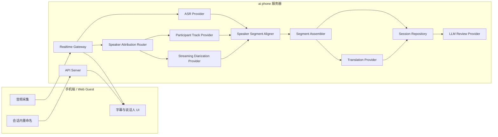
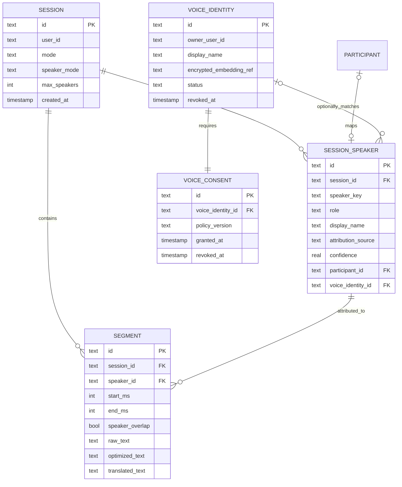

# ai phone 说话人归属技术设计

版本：v1.1
日期：2026-07-11

## 1. 目标与边界

说话人能力拆成三层，不能混为一个功能：

1. **角色归属**：利用 Call Link、PSTN 或独立音轨直接得到 `host/guest/agent`。
2. **说话人分离**：单麦克风音频输出稳定的匿名标签，例如 `speaker_1/speaker_2`。
3. **身份识别**：用户明确授权并录入声纹后，把匿名标签映射为姓名。

说话人分离只回答“谁在什么时候说话”，不能证明现实身份。未授权、低置信度或多人重叠时必须显示匿名标签或“未知说话人”，不得由 LLM 根据文本猜测姓名。

## 2. 当前缺口

- 普通 realtime 的 `TranscriptEvent`、`SessionSegmentDto`、App `SubtitleSegment` 和历史记录没有说话人字段。
- Qwen3-ASR 当前返回文本、语言和置信度，不返回 speaker label 或时间区间。
- SegmentAssembler 只按语言和语义边界合并，尚未把“说话人变化”作为强制断句条件。
- Call Link 已有 `speakerRole`，但没有复用到普通同传数据契约。

## 3. 统一数据契约

新增可选 `speaker` 对象：

```ts
interface SpeakerAttribution {
  speakerId: string;
  role: "self" | "peer" | "host" | "guest" | "agent" | "speaker" | "unknown";
  label?: string;
  source: "participant_track" | "diarization" | "voiceprint" | "language_role" | "manual";
  confidence?: number;
}
```

`TranscriptEvent`、`SessionSegmentDto`、App 字幕、历史记录、导出和会后 review 均透传该对象。声纹模板 ID 不返回 App，也不写入普通 session 导出。

## 4. 数据流

```text
Call Link/PSTN 独立音轨
  -> participant metadata
  -> participant_track attribution
  -> ASR -> translation -> subtitle/history

面对面单麦克风
  -> PCM 16 kHz fan-out
  -> VAD + Streaming Diarization Provider
  -> speaker time spans
  -> ASR text time spans
  -> SpeakerSegmentAligner
  -> SegmentAssembler (speaker change forces split)
  -> translation -> subtitle/history

可选实名
  -> consented voice enrollment
  -> voiceprint match
  -> confidence gate
  -> named label or anonymous fallback
```

## 5. Provider 设计

新增 `SpeakerAttributionProvider`，与 ASR Provider 并列，不能写死在 Qwen3-ASR 实现中：

- `off`：不识别，兼容现有链路。
- `participant_track`：Call Link/PSTN 默认，准确性最高。
- `streaming_sortformer`：Beelink 服务端单麦克风流式分离候选。
- `voiceprint`：后续授权身份识别，不作为默认能力。

首选评测 `nvidia/diar_streaming_sortformer_4spk-v2.1`。官方模型支持在线说话人分离、Arrival-Order Speaker Cache 和最多 4 个说话人；正式接入前必须在独立 harness 测延迟、DER、显存、长会话标签漂移和中英混说。

## 6. App 交互

- 字幕顶部显示说话人标签和稳定颜色，同一 speaker 在会话内颜色不变。
- 默认显示“我/对方”仅限独立音轨或明确手动映射；单麦克风默认“说话人 1/2”。
- 用户可在会话中或历史详情中把匿名标签重命名，但只修改本次会话展示。
- VoiceOver/TalkBack 按“说话人、原文、译文、状态”顺序朗读。
- 重叠说话显示主要 speaker，并在诊断字段记录 overlap；不得合并两个 speaker 的文本。

## 7. 隐私与合规

- 说话人分离无需保存声纹，默认只保存匿名 label。
- 身份识别必须单独告知、单独同意、可撤回和可删除。
- 声纹模板加密存储，不能进入日志、导出、LLM prompt 或普通备份。
- 低置信度匹配必须回退匿名，禁止为了界面完整强制给出姓名。

## 8. 分阶段开发

1. `OPT-SPK-001`：统一 speaker 数据契约，Call Link 独立音轨先贯通字幕、历史和 review。
2. `OPT-SPK-002`：独立 harness 部署 Streaming Sortformer，完成双人和多人固定语料评测。
3. `OPT-SPK-003`：接入普通 realtime，增加时间对齐、speaker 强制断句和 App 标签。
4. `OPT-SPK-004`：可选声纹实名、授权、撤回、删除和误识别门禁。

## 9. 验收门槛

- Call Link/PSTN 独立音轨角色归属准确率 100%。
- 双人安静场景 DER 不高于 15%，噪声场景不高于 25%。
- speaker 切换 P95 不高于 1.2 秒，同一人 30 分钟标签不无故漂移。
- speaker 变化处不得被 SegmentAssembler 合并成同一字幕。
- 身份识别低于阈值显示匿名；未授权场景不生成或持久化声纹。

## 10. 技术架构

### 10.1 总体结构



最终部署仍是“手机端 + 服务器端”两层。`Speaker Attribution Router`、ASR、翻译、TTS 和 LLM 都属于服务器内部 Provider，App 不保存 Beelink 内部模型地址。

### 10.2 组件职责

| 组件 | 职责 | 失败策略 |
| --- | --- | --- |
| Speaker Attribution Router | 根据 session 模式选择独立音轨、diarization、manual 或 off | 回退 `unknown` |
| Participant Track Provider | 从 LiveKit/PSTN participant metadata 得到稳定角色 | 元数据非法时拒绝角色，不猜测 |
| Streaming Diarization Provider | 把 PCM 转成带起止时间的匿名 speaker spans | 熔断并旁路，不中断 ASR |
| Speaker Segment Aligner | 用时间重叠把 ASR segment 绑定到 speaker | 超时先发匿名，允许迟到修正 |
| Segment Assembler | 合并语义片段；speaker 变化时强制切段 | 不跨 speaker 合并 |
| Voice Identity Matcher | 在明确授权后匹配声纹 | 低置信度返回匿名 |
| Session Repository | 保存 speaker、segment 归属和别名 | 幂等 upsert，保留旧数据兼容 |

### 10.3 Provider 接口

```ts
interface SpeakerAttributionProvider {
  readonly name: string;
  createSession(input: SpeakerSessionInput): Promise<void>;
  pushAudio(frame: TimedAudioFrame): Promise<SpeakerSpan[]>;
  flush(sessionId: string): Promise<SpeakerSpan[]>;
  closeSession(sessionId: string): Promise<void>;
  healthCheck(): Promise<boolean>;
}

interface SpeakerSpan {
  speakerId: string;
  startMs: number;
  endMs: number;
  confidence?: number;
  overlap?: boolean;
}
```

Provider 接口与具体模型隔离。`streaming_sortformer` 只是第一候选，后续可以替换 NeMo clustering、云端 diarization 或端侧实现，不修改 App 和 session 数据模型。

### 10.4 时间基准与对齐

- App 音频帧必须携带 session 内单调递增的 `timestampMs` 和 `sequence`。
- ASR 结果增加 `startMs/endMs`；模型不返回时由 Gateway 使用输入批次边界估算，并标记 `timingSource=estimated`。
- diarization 输出使用同一个 session 时间轴。
- Aligner 选择与 ASR 区间重叠时长最大的 speaker；重叠比例低于门槛时返回 `unknown`。
- speaker 结果最多等待 300ms，超过后先发送匿名 transcript；迟到结果使用 `speaker.updated` 修正，不重新执行翻译。

### 10.5 三种运行路径

**Call Link/PSTN**

```text
participant audio track
  -> participant identity/role
  -> ASR
  -> segment(speaker source=participant_track)
```

该路径不运行 diarization，避免浪费计算和引入误差。

**面对面单麦克风**

```text
audio batch
  -> ASR and diarization fan-out
  -> time alignment
  -> anonymous speaker segment
  -> translation and subtitle
```

**端侧模式**

首版不在手机内运行说话人模型。端侧只支持 `manual/language_role/off`，界面必须明确显示“按语言区分”或“未识别说话人”，不得伪装为声纹识别结果。

### 10.6 并发、背压和降级

- ASR/翻译是主链路；diarization 是可降级旁路。
- speaker 队列满时丢弃最旧的未对齐 span，并记录 `speaker_span_dropped`，不能丢 ASR final。
- 每个 session 独立维护 speaker cache；重连可在 45 秒 grace 内恢复匿名 speaker 映射。
- Provider 不健康时 session 继续运行，speaker source 变为 `unknown`，历史和结算不受影响。
- Call Link 的 participant track 角色不能被 diarization 或 voiceprint 覆盖。

## 11. 事件和 API 协议

### 11.1 Realtime 事件

```ts
interface TranscriptEvent {
  type: "transcript.partial" | "transcript.final";
  sessionId: string;
  segmentId: string;
  text: string;
  startMs?: number;
  endMs?: number;
  speaker?: SpeakerAttribution;
}

interface SpeakerUpdatedEvent {
  type: "speaker.updated";
  sessionId: string;
  segmentId: string;
  speaker: SpeakerAttribution;
}
```

`speaker.updated` 只更新归属和界面，不触发 ASR、翻译、TTS 或重复计费。

### 11.2 Session 配置

```ts
interface SpeakerAttributionOptions {
  mode: "off" | "auto" | "participant_track" | "diarization" | "manual";
  maxSpeakers?: 2 | 3 | 4;
  allowVoiceIdentity?: boolean;
}
```

- 普通对话默认 `auto`，在线模式可选择 diarization，端侧模式回退 language role。
- Call Link/PSTN 强制 `participant_track`。
- Listening/会议模式可配置 2 到 4 人。

### 11.3 管理接口

| 方法 | 路径 | 用途 |
| --- | --- | --- |
| GET | `/sessions/:sessionId/speakers` | 查询本次会话 speaker 列表和统计 |
| PATCH | `/sessions/:sessionId/speakers/:speakerId` | 修改本次会话展示名 |
| POST | `/voice-identities` | 创建授权声纹身份，P2 才开放 |
| DELETE | `/voice-identities/:identityId` | 撤回并删除声纹身份 |

所有 speaker rename 必须校验 session 所有权。Call Link guest 只能修改自己的展示名，不能修改其他 participant。

## 12. 逻辑数据模型

### 12.1 实体关系



### 12.2 session_speakers

| 字段 | 类型 | 约束与说明 |
| --- | --- | --- |
| id | text | PK，服务器生成 |
| session_id | text | FK，删除 session 时级联删除 |
| speaker_key | text | session 内稳定键，如 `speaker_1` |
| role | text | self/peer/host/guest/agent/speaker/unknown |
| display_name | text nullable | 用户可见别名 |
| attribution_source | text | participant_track/diarization/voiceprint/language_role/manual |
| confidence | real nullable | 0 到 1 |
| participant_id | text nullable | Call Link/PSTN 映射 |
| voice_identity_id | text nullable | 仅服务器内部可见 |
| color_slot | int | 会话内稳定颜色槽，不保存颜色值 |
| created_at/updated_at | timestamp | 审计时间 |

唯一索引：`(session_id, speaker_key)`。`voice_identity_id` 不进入 App DTO、导出或 LLM prompt。

### 12.3 segments 扩展字段

| 字段 | 类型 | 说明 |
| --- | --- | --- |
| speaker_id | text nullable | FK 到 session_speakers |
| speaker_source | text nullable | 归属来源快照，便于审计 |
| speaker_confidence | real nullable | 归属置信度 |
| speaker_overlap | bool | 是否检测到重叠说话 |
| start_ms/end_ms | int nullable | session 时间轴区间 |
| timing_source | text nullable | model/estimated/participant_track |
| speaker_revision | int | 迟到修正版本，默认 0 |

segment upsert 使用 `(session_id, segment_id)` 幂等键。`speaker.updated` 仅在 revision 更大时覆盖，防止乱序事件把新归属回滚。

### 12.4 voice_identities

该表仅在 `OPT-SPK-004` 启用：

- `encrypted_embedding_ref` 指向加密对象，不在主数据库保存明文向量。
- `status` 为 pending/ready/revoked/deleted。
- 必须关联有效 consent；撤回后立即禁用匹配并删除 embedding 对象。
- 历史 session 默认回退匿名标签；只有用户手工命名的 session alias 可以保留。

### 12.5 当前替代存储

目前不要求配置真实数据库。Repository 层先使用以下 JSON 结构持久化：

```json
{
  "sessionId": "sess_123",
  "segments": [
    {
      "id": "seg_1",
      "speaker": {
        "speakerId": "speaker_1",
        "role": "speaker",
        "displayName": "客户",
        "source": "diarization",
        "confidence": 0.91
      },
      "timing": {
        "startMs": 1240,
        "endMs": 4380,
        "source": "client"
      }
    }
  ]
}
```

JSON adapter 与未来 SQLite WAL/PostgreSQL adapter 使用同一 Repository 接口。迁移时先双读校验，再切写入源；不能在 App 内直接访问数据库。

## 13. Repository 接口和事务边界

```ts
interface SpeakerRepository {
  upsertSpeaker(input: SessionSpeakerRecord): Promise<void>;
  listSpeakers(sessionId: string): Promise<SessionSpeakerRecord[]>;
  renameSpeaker(sessionId: string, speakerId: string, name: string): Promise<void>;
  assignSegment(input: SegmentSpeakerAssignment): Promise<void>;
  revokeVoiceIdentity(identityId: string, userId: string): Promise<void>;
}
```

- `upsertSpeaker + assignSegment` 在 SQLite/PostgreSQL 中使用单事务。
- JSON adapter 使用临时文件、fsync 和原子 rename，避免写到一半损坏。
- session end 必须等待 speaker assignment outbox drain，但 diarization 失败不能阻止结算。
- 删除 session 时删除匿名 speaker 和 segment attribution；账单 ledger 不保存 speaker 信息。

## 14. LLM、历史和导出

- Review 输入只包含 `speakerId/displayName/role` 和 segment 文本，不包含声纹引用、embedding 或匹配分数。
- 摘要、决定和待办的 evidence 必须引用 segment id，并可展示对应说话人。
- Markdown/CSV 导出增加 `speaker` 列；未知时为空或“未知说话人”。
- 用户重命名 speaker 后，历史和导出动态使用最新会话 alias，不改写原始 ASR 文本。

## 15. 可观测性

每个 session 记录：

- `speaker_provider`、`speaker_model_version`。
- `speaker_attributed_segment_rate`。
- `speaker_unknown_rate`、`speaker_overlap_rate`。
- `speaker_switch_latency_p50/p95`。
- `speaker_label_revision_count`、`speaker_span_dropped_count`。
- 固定语料记录 DER/JER；线上日志不得记录 embedding 或原始音频。

## 16. 迁移与兼容

1. 所有 speaker 字段先设为 optional，旧历史读取为 `unknown`，无需批量伪造 speaker。
2. 先接 Call Link participant track，验证端到端数据契约。
3. 再启用 diarization shadow mode：计算但不展示，只收集指标。
4. 达到门槛后按测试账号灰度展示匿名标签。
5. 声纹实名独立开关，不能随 diarization 自动启用。

## 17. 实施状态

截至 2026-07-11 已完成：

- 共享 `SpeakerAttributionDto`、`SegmentTimingDto`、session speaker 策略和 `speaker.updated` 协议。
- Call Link/Worker 使用 participant track 生成权威 speaker，并写入统一 Session Repository。
- ASR 响应携带同一音频时间轴；Gateway 已实现 speaker span 对齐和 speaker 变化强制断句。
- HTTP Speaker Provider 与 ASR 并行，失败时只降级归属，不中断 ASR/翻译。
- App 实时字幕、Call Link、历史、纪要输入、Markdown/CSV/JSON 导出已消费统一 speaker。
- 会话内 speaker 清单和重命名 API 已实现，重命名后 review 失效并重新生成。

尚未宣称完成：

- Streaming Sortformer 服务部署、固定双人/多人语料 DER/JER 评测和 shadow mode。
- 真实单麦克风 speaker 标签真机验收。
- 授权声纹身份的同意、加密 embedding、撤回和删除闭环。
