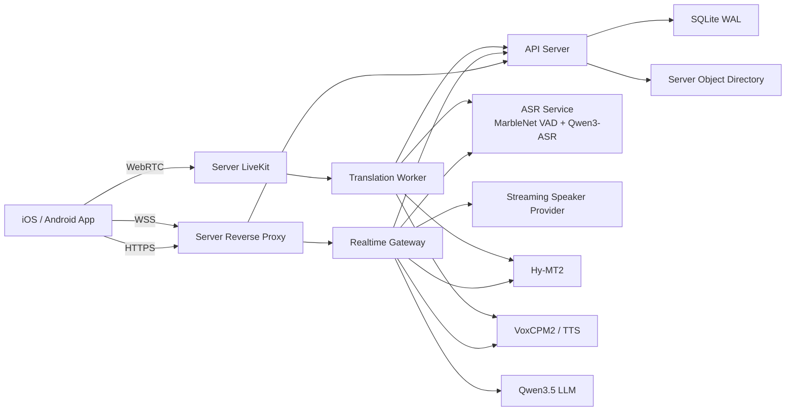

# ai phone 两层部署与数据流设计

版本：v1.2
日期：2026-07-11  
状态：已确认约束，进入实施

## 1. 架构约束

部署后只存在两个运行节点：

1. 手机端：Flutter App。
2. 服务器端：API、Realtime Gateway、Worker、LiveKit、模型服务和数据存储。

Mac 只用于代码开发、构建和运维，不运行测试或生产链路中的 API、Gateway、LLM、ASR、翻译或 TTS。测试阶段将 Beelink 定义为服务器，不再把它作为独立的第三层模型节点。

## 2. 目标拓扑



手机只配置一个服务器基地址。API 创建 realtime session 时返回 WSS 和 LiveKit 参数，App 不直接配置 ASR、翻译、TTS、LLM 或 Worker 地址。

## 3. 服务器内部部署

服务器程序作为一个发布单元，建议使用 Docker Compose 或等效 systemd bundle 管理：

```text
reverse-proxy
api-server
realtime-gateway
translation-worker
livekit
asr-service
translation-service
tts-service
speaker-service
llm-runtime
```

`MarbleNet VAD` 是 `asr-service` 内部 Speech Frontend，不增加第三个部署节点或公开端口。ONNX、Mel 预处理资产和 Qwen3-ASR 随同一个服务器发布单元管理。

部署规则：

- 外部只开放 HTTPS/WSS 和 LiveKit 所需端口。
- 模型服务和内部 API 只监听 loopback、容器网络或服务器私网。
- 所有组件读取同一份 `server.env` 和同一份模型路由文件。
- 内部调用使用服务名或 `127.0.0.1`，不得使用 Mac IP。
- 手机配置不得包含 `localhost`、Mac 局域网 IP、模型端口或内部密钥。
- Tailscale 只用于开发运维和内测访问，不作为正式产品拓扑的一层。
- Speaker Provider 与 ASR 并行，是可降级旁路；故障不得中断字幕和翻译。
- App 只提交 speaker 策略，不持有说话人模型地址、密钥或内部端口。
- 在线 VAD 由 ASR Service 权威执行；App 静音门控必须偏保守，不能因本地 RMS 较低丢弃待上传语音。
- `/health` 必须返回实际 `vadProvider` 和 `vadThreshold`；发生 `rms_fallback` 时进入诊断告警但不终止会话。

## 4. 暂时数据存储方案

当前无法配置 PostgreSQL/Redis，因此近期采用 SQLite WAL，不继续扩展 JSON Store。

### 4.1 SQLite 所有权

- 只有 API Server 可以直接读写 SQLite。
- Gateway、Worker、PSTN Bridge 和 Agent Worker 通过内部 API 写事件。
- SQLite 文件固定放在服务器持久化目录，例如 `/var/lib/ai-phone/data/ai-phone.db`。
- 启用 WAL、foreign keys、busy timeout 和事务。
- 每个写入命令必须带幂等键。

### 4.2 数据分类

| 数据 | 当前存储 | 权威方 | 说明 |
| --- | --- | --- | --- |
| 账号、授权、权益 | SQLite | API Server | 必须事务写入 |
| session、segment、review | SQLite | API Server | segment 保留 raw/optimized/translated |
| usage、ledger、退款 | SQLite | API Server | append-only ledger，禁止覆盖余额历史 |
| 术语和行业选择 | SQLite | API Server | 保存版本和用户归属 |
| 实时短期状态 | Gateway 内存 + API session 状态 | Gateway/API | 单服务器阶段不引入 Redis |
| 参考声音和导出文件 | 服务器对象目录 | API Server | SQLite 只保存路径、hash 和归属 |
| App 设置 | 手机本地 | App | 不作为计费和历史真源 |
| 登录 token | Keychain/Keystore | App | 不写普通明文文件 |

### 4.3 最小表

```text
accounts
auth_sessions
consents
translation_sessions
session_segments
session_reviews
terms
voice_profiles
usage_ledger
idempotency_keys
outbox_events
```

`usage_ledger` 和 `outbox_events` 使用只追加设计。session 结束、用量结算和 outbox 事件必须在同一事务提交。

### 4.4 备份和损坏处理

- 每日使用 SQLite backup API 生成一致性快照，不能直接复制正在写入的主文件。
- 每次发布前执行 `PRAGMA quick_check`。
- 保留最近 7 个每日快照和 4 个每周快照。
- 数据库损坏时服务进入 not_ready，不允许静默创建空库覆盖原数据。
- 对象目录和 SQLite 快照使用同一备份批次编号。

### 4.5 后续迁移

Repository 接口不能暴露 SQLite 特有 SQL。未来迁移 PostgreSQL 时：

1. 冻结写入或开启双写窗口。
2. 导出 SQLite 快照。
3. 导入 PostgreSQL 并校验数量、余额和 hash。
4. 切换 Repository adapter。
5. Redis 只在多实例 Gateway 或高可用需求出现后引入。

## 5. 核心数据流

### 5.1 创建和运行 realtime session

```text
App -> API: POST /realtime/sessions
API -> SQLite: 创建 session、usage hold、幂等键
API -> App: sessionId、一次性 realtime token、WSS endpoint
App -> Gateway: WSS 连接和 audio.frame
Gateway -> ASR: 音频窗口/flush
ASR Speech Frontend: 16kHz normalize -> MarbleNet VAD -> endpoint/最大分段
ASR -> Gateway: partial/final、language、confidence
Gateway -> Speaker Provider: 同时间轴音频帧
Speaker Provider -> Gateway: anonymous speaker spans
Gateway: 时间对齐，speaker 变化强制断句
Gateway -> Translation/TTS: 带 speaker 的 final 文本
Gateway -> App: transcript、translation、speaker.updated、audio.output
Gateway -> API internal: segment.final 事件
API -> SQLite: segment 幂等落库
```

### 5.2 结束和异常断开

```text
App/Gateway -> API: end(sessionId, idempotencyKey)
API transaction:
  flush 后的最后 segments
  session ended
  usage ledger entry
  release unused hold
  outbox review_requested
API -> App: ended、consumedSeconds、remainingSeconds
```

WebSocket close、App 被杀和网络中断使用相同 end/finalize 事务，不能形成另一套结算路径。

### 5.3 会后 review

```text
Review Worker -> API: claim review event
API -> SQLite: 读取 raw/optimized/translated segments
Review Worker -> LLM: 结构化 review 请求
Review Worker -> API: review result + evidence segment ids
API -> SQLite: 保存 review 和 provider fingerprint
App -> API: 查询历史详情
```

## 6. 手机端边界

- 端侧模式可在无服务器时完成 ASR/翻译基础流程。
- 在线模式只连接统一服务器地址。
- App 不负责最终余额、结算和云端历史真值。
- 网络失败时本地只保存待同步命令和幂等键，不伪造服务端成功状态。
- App 启动不得同步加载模型、网络、账号和历史；首帧先展示 UI，再异步恢复状态。

## 7. 发布和测试门禁

- Release/Profile App 中不得包含 Mac 地址、`localhost` 或模型服务端口。
- 客户端切换统一服务器前，目标 `/health` 必须可用，且 account、session、usage ledger、terms、voice profile 的迁移数量和 hash 必须校验通过。
- 迁移验收前不得提前将 App 的 `API_BASE_URL` 指向空服务器，否则客户端会表现为登录、余额和历史“被清空”。
- 服务器健康页必须证明 API、Gateway、模型和 SQLite 都在同一服务器发布单元。
- 停止 Mac 上全部服务后，手机在线同传仍应正常。
- 停止服务器后，手机必须明确显示在线不可用，端侧模式仍可进入。
- 单服务器重启后，已结束历史和 ledger 不丢失；进行中的 session 可安全 finalize 或标记 interrupted。
