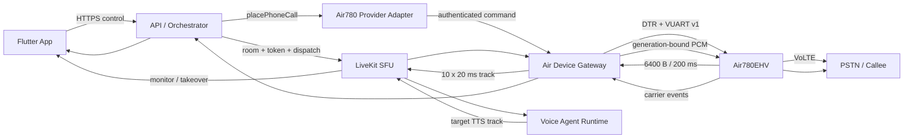

# Air780 App + LiveKit AI 电话开发任务与实施计划

版本：v1.2
日期：2026-08-04
状态：`PURE_SOFTWARE_CONTROL_MEDIA_PASS / M1_M2_NOT_FIELD_VERIFIED /
AI_DUPLEX_BLOCKED_BY_GATE_0B`

## 1. 目标与完成口径

本计划把现有独立组件接成一条可从 App 发起的 Air780 电话产品链。目标架构固定为：

- App 负责创建、授权、开始、监督、取消和同通接管。
- API 负责 `communicationSessionId`、LiveKit room、Agent dispatch、设备租约、
  provider operation、计费和权威业务状态。
- LiveKit SFU 负责 participant、track、重连和 Worker 调度；本产品 profile 不使用
  LiveKit SIP Trunk。
- Beelink Air Device Gateway 以 guest 加入 room，同时通过 DTR + VUART v1 控制
  Air780EHV。
- Air780EHV + SIM + VoLTE 是真实号码和 carrier 状态来源。

分四个可独立判定的里程碑，禁止提前混报：

| 里程碑 | 用户能力 | 完成判定 |
| --- | --- | --- |
| M1 App Carrier Dial | App 点开始后 Air780 只拨一次，状态和挂断可见 | `APP_AIR780_DIAL_READY` |
| M2 AI Listen | 对方声音经 Air780/Gateway/LiveKit 到达 Voice Agent | `AIR780_LIVEKIT_DOWNLINK_READY` |
| M3 AI Duplex | Agent TTS 经 LiveKit/Gateway/Air780 回到同一 PSTN 通话 | `AI_DUPLEX_READY` |
| M4 Internal Deploy | App、API、Gateway、LiveKit、Agent 可重复部署和恢复 | `INTERNAL_DEPLOY_READY` |

M1 不是 AI 电话完成；M2 不是双向通话完成；只有 M3 才能做一次完整 AI 电话实验。
M4 也只允许内部白名单，不代表商用发布。

## 2. 冻结架构



硬边界：

1. DIAL/HANGUP、租约、fencing、carrier 状态走控制面，不经 LiveKit data message。
2. PCM 不经过 API；实时音频只经过 Gateway、LiveKit 和 Worker。
3. LiveKit participant `joined` 不能把电话状态提升为 `connected`。
4. Air guest 固定 `autoSubscribe=false`，只订阅服务端准入的精确目标 TTS track。
5. 每个 App start 最多产生一个 DIAL 副作用；超时进入 reconcile，禁止生成第二个
   commandId 再拨。
6. 板端保持 6,400-byte/200-ms 块；20-ms 重切只发生在 Gateway。
7. 旧 SIP adapter 只兼容保留；Air780 产品 profile 必须禁用 SIP outbound。
8. Gate 0B 未通过前禁止把 M1/M2 写成完整 AI 电话。

## 3. 当前基线

| 组件 | 已有 | 缺口 |
| --- | --- | --- |
| Flutter AI 代打 | 草稿/授权/start/取消/接管；独立显示 Carrier 与 LiveKit 状态，仅 Carrier connected 允许接管 | 未部署到真实 Air profile，未做真机可见验收 |
| Agent start | 业务语义已改为 `place_phone_call`，Air profile 走 provider-neutral runtime | 未与真实 Air 音轨和真实模型完成一次 room 集成 |
| API provider | Air adapter 已注册；设备/租约/通话/heartbeat/track admission、CAS 和 inbox/outbox 已实现 | 033/034 尚未在目标 PostgreSQL 应用并做崩溃恢复演练 |
| Gateway 控制 | daemon、DTR SerialTransport、HTTP ingress、boot admission、命令 durable ledger、事件 durable outbox及 DIAL 前 room/device 精确回滚已实现 | 未在 Beelink 启动，未打开真实 if06，未发送真实 DIAL |
| Gateway 媒体 | rtc-node、`autoSubscribe=false`、6400→10×640 pump、精确 TTS track admission 已实现 | 未用真实 LiveKit/Agent/Air780 验证 M2；尚无 Gate 0B 后的 TTS→VUART pump |
| 板端 | production R2 无拨号 HELLO/HEARTBEAT 历史证据已通过 | 最近历史状态为恢复诊断007，本轮未探测；真实 DIAL/持续媒体未运行 |
| PSTN 回灌 | `cc.extern_source` 接口线索 | Gate 0B 连续 refill/clear/hangup/可懂度未证明 |

### 3.1 2026-08-04 纯软件实现状态

| 工作项 | 当前判定 | 证据边界 |
| --- | --- | --- |
| AIR-CTRL-001/002/003 | `HOST_SOFTWARE_PASS` | provider-neutral 调用、Air runtime、拨号前持久化、确定性 providerCallId、失败收敛均有单元/合同测试 |
| AIR-GW-001/002/003 | `HOST_SOFTWARE_PASS` | daemon/DTR/VUART、boot gate、ACK replay、命令原子账本、Carrier/LiveKit/heartbeat durable outbox 均有 mock 测试 |
| AIR-LK-001/002 | `HOST_SOFTWARE_PASS` | rtc-node guest 与 6400-byte 无损重切/发布已测试，未使用真实 room 或真实 Air780 |
| AIR-LK-003 | `PARTIAL` | 服务端精确 track admission、重连重新准入、伪造 track 拒绝已测试；真实 App 监督与 raw cross-audio=0 尚未验收 |
| M1/M2 | `NOT_FIELD_VERIFIED` | 没有 Beelink 串口、真实拨号或真实 LiveKit 媒体证据，禁止宣称通过 |
| AIR-FW-001/002、M3 | `BLOCKED_UNVERIFIED` | Gate 0B 未通过，未实现或运行生产 TTS→PSTN 连续回灌 |

Gateway 的命令账本只保存 command/idempotency 标识、请求 SHA-256 和结果，不保存号码、
LiveKit token 或 PCM。Carrier、LiveKit participant 和 heartbeat 分别使用 0600 权限的
原子事件 outbox；损坏或不兼容的 durable state 会在打开串口前阻止 Gateway 启动。
`room_not_ready` 被证明发生在串口前并映射为 not-dispatched；设备明确拒绝时只清理本次
新建的 room/device binding。ACK 丢失或超时不会清理现场，而是保持 pending 并强制对账。

## 4. 实施批次与开发任务

### Batch A — App 到 Air780 的 provider-neutral 控制链（M1 前半）

#### AIR-CTRL-001 去除业务层 SIP 写死

主要文件：

- `services/api-server/src/modules/agent-calls/agent-call-start.ts`
- `services/api-server/src/modules/agent-calls/agent-call-start-runtime.ts`
- `services/api-server/src/modules/agent-calls/agent-call-execution-readiness.ts`
- `services/api-server/src/modules/agent-calls/voice-agent-call-execution.routes.ts`
- `packages/contracts/src/communication/telephony.ts`
- `packages/contracts/src/communication/provider-operations.ts`

交付：

- Agent tool 业务名改为 `place_phone_call`，operation 使用 `phone_outbound`。
- `AGENT_CALL_PROVIDER_ADAPTER=air780_volte` 成为合法 product profile。
- 执行 route 按 provider registry 调用 `TelephonyProvider.placePhoneCall`，不直接调用
  `executeLiveKitSipOutbound`。
- 旧 `place_sip_call`/SIP adapter 只在兼容 profile 内映射，不影响旧数据回放。

退出条件：Air profile 的调用图不再经过 `sip_outbound` 或 `livekit_sip`。

#### AIR-CTRL-002 Session、Room、Agent 与设备租约编排

主要文件：

- `services/api-server/src/modules/device-calls/`
- `services/api-server/src/modules/call-links/`
- `services/api-server/src/modules/agent-calls/agent-call-session.ts`
- `services/api-server/src/modules/worker-dispatches/`

交付：

- 以 `communicationSessionId` 创建 `call_<id>` room。
- 在拨号前完成 Voice Agent dispatch、Gateway guest token 和设备 lease CAS。
- token 绑定 session/device/lease/generation；App 不获得设备控制权限。
- `callId/sessionId` 仅作为兼容映射，不能创建第二个业务聚合根。

退出条件：room、worker、设备租约任一未 ready 时不创建 DIAL operation。

#### AIR-CTRL-003 注册 Air780 provider runtime

主要文件：

- `services/api-server/src/modules/device-calls/air780-device-provider-adapter.ts`
- 新增 provider registry/runtime factory 和 Gateway client
- `services/api-server/src/app.ts`

交付：

- 注入真实 lease verifier、PostgreSQL call recorder 和 Gateway client。
- DIAL 前持久化 operation/outbox；ACK/ERROR/carrier event 经 inbox 去重。
- timeout 标记 `unknown + reconciliationRequired`，绝不直接发第二次 DIAL。

退出条件：同一 start、重复 HTTP、worker 重领任务均只产生一个 provider operation。

### Batch B — 可部署 Air Device Gateway（M1 后半）

#### AIR-GW-001 Gateway daemon 与配置入口

主要文件：

- `services/air-device-gateway/src/runtime/`
- `services/air-device-gateway/package.json`
- `.env.example`

交付：

- 新增可执行 `main` 和 `start`，组合 `NodeSerialTransport`、
  `VuartSerialFrameTransport`、boot admission 和 command exchange。
- 只允许 Linux/Beelink、稳定 AirM2M `if06` by-id 路径和显式 hardware enable。
- readiness 分开报告 process、tty、DTR、HELLO、HEARTBEAT、boot admission、room。

退出条件：没有 DTR 或当前 boot 未 reconcile 时，Gateway command ingress fail closed。

#### AIR-GW-002 API→Gateway 命令入口

交付：

- 内部认证的 dial/hangup/reconcile 接口；请求大小、并发和 deadline 有界。
- 请求必须携带 operationId/commandId/idempotencyKey/session/device/lease/fence/generation。
- 同 ID 同 payload 返回同一结果；同 ID 不同 payload 和旧 fence/generation 拒绝。
- 明文号码只在执行内存中短暂存在，不写日志、metrics 或证据文件。

退出条件：网络重试、ACK 丢失和 API/Gateway 任一重启都不能触发第二通电话。

#### AIR-GW-003 Carrier 事件与确定性结束

交付：

- CALL_STATE 可靠回传 API；carrier 是 dialing/ringing/connected/ended 的唯一权威。
- App cancel、Agent end、远端挂断和 Gateway disconnect 都收敛到单一终态。
- 新 boot/USB reconnect 清除旧 generation 媒体并进入 quarantine，禁止自动重拨。

M1 退出条件：App 的一次 start 能触发 Air780 单次 DIAL，显示 carrier 状态并完成一次
HANGUP；这仍不宣称 AI 音频可用。

### Batch C — Gateway 的真实 LiveKit 媒体链（M2）

#### AIR-LK-001 rtc-node Room client

主要文件：

- `services/air-device-gateway/src/media/livekit-device-participant.ts`
- 新增 `AirDeviceRoomClient` 的 `@livekit/rtc-node` 实现
- `services/air-device-gateway/package.json`

交付：

- 复用仓库兼容 profile 的 rtc-node 版本，不引入第二套 LiveKit SDK 版本。
- guest 用服务端短期 token 入房，`autoSubscribe=false`。
- reconnect 后重新进行 token/track admission，权限不能扩大。

#### AIR-LK-002 Air780 下行发布

交付：

- 6,400-byte/200-ms PCM 在 Gateway 无损重切为 10×640-byte/20-ms。
- 发布 `air780-downlink-<deviceId>`，携带 session/device/lease/generation 属性。
- gap/duplicate/out-of-order/drop/backpressure 可观测；旧 generation 零回流。

#### AIR-LK-003 TTS 精确订阅与 App 监督

交付：

- 只订阅与 admission 完全匹配的 Worker TTS track。
- App 可进入同 room 监听状态、暂停、取消和申请同通接管。
- human raw track 不直接跨 leg；`raw cross-audio=0`。

M2 退出条件：真实对端说话可经 Air780→Gateway→LiveKit 被 Voice Agent ASR 消费，
但尚未向 PSTN 播放 AI 声音。

### Batch D — Gate 0B 与完整 AI 回灌（M3）

#### AIR-FW-001 有限数字注入结论

前置：用户单独授权 production/真实电话/录音；不更换 CORE、不清 KV/FS、不使用
USB BOOT。

交付：

- 按 `EXT_SRC_DONE` 驱动连续 RAW zbuff refill，busy 时拒绝覆盖。
- zbuff 生命周期持续到完成事件；underrun、stop/clear、挂断和 generation cancel 明确。
- 保存注入前 PCM、VUART sequence、模块事件、对端录音和时钟哈希。

退出条件：连续可懂 TTS、旧音频 0、原声泄漏 0；失败则立即转
ESP32-S3/ES8388 模拟音频桥，不以单次文件播放替代。

#### AIR-FW-002 Gateway TTS pump

交付：

- LiveKit TTS track 解帧、重采样和有界 queue 后写入当前 generation。
- barge-in、pause、clear、hangup 取消全部未播放块。
- reconnect 或 lease/fence 变化后旧 PCM 100% 拒绝。

M3 退出条件：同一真实 carrier call 内完成
`PSTN→ASR→Agent→TTS→PSTN`，并能在不重拨的情况下暂停、取消或人工接管。

### Batch E — App 产品接线与部署（M4）

#### AIR-APP-001 App 状态与控制

主要文件：

- `apps/mobile/lib/src/features/ai_calling_agent/`

交付：

- 沿用现有草稿/授权/start UI；provider 由服务端 profile 决定，客户端不得任意选线路。
- 分开显示 room/worker/device/carrier 状态，只有 carrier connected 才显示已接通。
- cancel、hangup、pause 和 takeover 使用同一 `communicationSessionId`，接管不重拨。
- readiness 不满足时显示具体阻断，不显示“已进入执行队列”的伪成功。

#### AIR-DEP-001 Beelink Gateway 部署

交付：

- systemd 最小权限服务、稳定 by-id、专用用户/组、restart quarantine 和资源上限。
- API、LiveKit、Gateway 地址全部配置化；token、secret、号码不入库。
- 产品 profile 明确关闭 LiveKit SIP outbound。

#### AIR-DEP-002 一次集成实验与恢复

实施策略：软件阶段使用合同/mock，不反复拨真实电话；M1、Gate 0B、M3 各只安排一次
边界清晰的现场实验。每次真实实验只使用本人/已授权号码，禁止紧急、高资费和非授权号码。

M4 退出条件：App 安装后可创建任务、一次拨号、AI 双向语音、确定性挂断和同通接管；
服务或 USB 重启后不自动重拨、不重复计费，诊断证据脱敏。

## 5. 执行顺序与依赖

```text
AIR-CTRL-001
  -> AIR-CTRL-002
  -> AIR-CTRL-003
  -> AIR-GW-001/002/003
  -> M1 App Carrier Dial
  -> AIR-LK-001/002/003
  -> M2 AI Listen
  -> AIR-FW-001
  -> AIR-FW-002
  -> M3 AI Duplex
  -> AIR-APP-001 + AIR-DEP-001/002
  -> M4 Internal Deploy
```

最快可见路径是先完成 Batch A+B，让 App 能控制 Air780 实拨；完整 AI 电话不能绕过
Batch C+D。

## 6. 文件所有权与并行边界

| 范围 | 所有权 | 禁止越界 |
| --- | --- | --- |
| Contracts | `packages/contracts/src/communication/` | 不改媒体模型和无关 provider |
| API control | `agent-calls/`、`device-calls/`、必要的 provider operations | 不重构无关 SIP/recording 模块 |
| Gateway | `services/air-device-gateway/` | 不在 API 内处理 PCM |
| App | `features/ai_calling_agent/` | 不重写整个 App 导航/账户系统 |
| Firmware | `firmware/air780-livekit-bridge/` | Gate 0B 前不改 CORE/板端 6400-byte 缓冲 |
| Deployment | Gateway 专属 systemd/env/runbook | 不覆盖 Beelink 其他服务和模型 WIP |

当前 dirty worktree、`outputs/`、ASR/说话人 WIP 必须全部保留；未经用户要求不
reset/checkout/clean/commit/push。

## 7. 最小验证策略

开发阶段只跑修改边界的合同、单元、typecheck/build 和静态门禁；不为每个代码批次重复
刷机或拨号。真实硬件只在里程碑退出时运行：

1. M1：一次 App→Air780 拨号/挂断，证明控制链。
2. Gate 0B：一次独立注入实验，证明回灌物理路径。
3. M3：一次完整 AI 双向电话，证明产品闭环。

任何 timeout/断连结果为 `unknown` 时只 reconcile，不以再次拨号“确认”。完整发布、长稳、
多运营商和并发仍由既有 acceptance plan 管理，不混入日常开发循环。

## 8. 最终 Definition of Done

- App 一次 start 对应一个 `communicationSessionId`、一个 provider operation 和最多一次 DIAL。
- Gateway/Agent 入房是拨号前置，但只有 carrier event 能宣告 connected。
- 对方 PCM 只到 Worker；AI TTS 只到当前 Air leg；raw cross-audio 为 0。
- 旧 lease/fence/generation、跨 room/identity/track 全部拒绝。
- TTS clear、挂断、重连后旧音频为 0，未知拨号结果不自动重试。
- App 能监督、暂停、取消并在同一通电话内接管。
- 号码、token、PCM 正文和设备唯一标识不进入普通日志。
- Gate 0B 和一次真实双向闭环未完成前，状态只能是 `PARTIAL/BLOCKED`。
