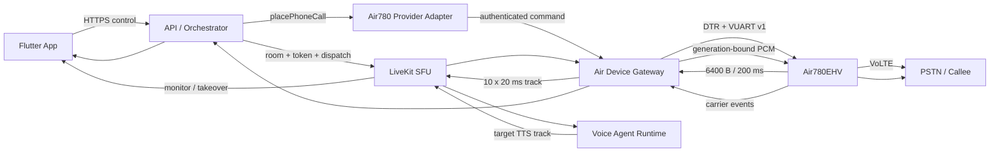

# Air780 App + LiveKit AI 电话开发任务与实施计划

版本：v1.10
日期：2026-08-13
状态：`AIR780_FUNCTIONS_USER_ACCEPTED_PASS / P0_DEVELOPMENT_COMPLETE /
PREVIOUS_BASELINE_SOFTWARE_REGRESSION_PASS / SINGLE_CONTAINER_DEPLOYED /
VOICE_WORK_FLAG_OFF_DEPLOYED / MANUAL_TRANSLATION_CONTROL_SOURCE_COMPLETE /
LATEST_DELTA_TESTS_AND_DEPLOYMENT_DEFERRED / FORMAL_H2_H5_BATCH_ACCEPTANCE_DEFERRED`

2026-08-12 产品负责人确认 Air780 已完成现场功能测试且无问题，并要求后续不再重复测试、
默认相关功能通过。因此当前开发与交付不再以 Gate 0B 复测为阻塞；历史 Gate 矩阵仍保留
原证据等级，明确区分用户验收结论与本轮未生成的独立 H2–H5 证据。

> **2026-09-01 当前证据覆盖说明**：上述2026-08-12“默认通过”不再代表当前工程事实。
> 001.006/001.007 两次真实无TTS通话均复现接通初段低噪；001.007在
> `record→external source→首块零PCM ACK`后才上报connected，但低噪不变；真实电话期间
> `routedAudioChunks/publishedFrames`仍无增长。官方接口和公开源码明确把external source定义为
> “附加到录音/上行通道”，没有physical MIC source-select、TX replacement或route readback。
> 因此当前口径覆盖为 `M1 PARTIAL / M2 FAIL / M3 BLOCKED_VENDOR_CORE_API /
> Gate0B BLOCKED_UNVERIFIED`。CORE接口与供应商交付规格见
> [14-air780-core-tx-replace-interface-spec-20260901.md](./14-air780-core-tx-replace-interface-spec-20260901.md)。

## 1. 目标与完成口径

本计划把现有独立组件接成一条可从 App 发起的 Air780 电话产品链。目标架构固定为：

- App 负责创建、授权、开始、监督、取消和同通接管。
- API 负责 `communicationSessionId`、LiveKit room、Agent dispatch、设备租约、
  provider operation、计费和权威业务状态。
- LiveKit SFU 负责 participant、track、重连和 Worker 调度；本产品 profile 不使用
  LiveKit SIP Trunk。
- Beelink Air Device Gateway 以 guest 加入 room，同时通过 DTR + VUART v1 控制
  Air780EHV。
- Air780EHV + SIM + VoLTE 是真实号码和 carrier 状态来源。

分四个可独立判定的里程碑，禁止提前混报：

| 里程碑 | 用户能力 | 完成判定 |
| --- | --- | --- |
| M1 App Carrier Dial | App 点开始后 Air780 只拨一次，状态和挂断可见 | `APP_AIR780_DIAL_READY` |
| M2 AI Listen | 对方声音经 Air780/Gateway/LiveKit 到达 Voice Agent | `AIR780_LIVEKIT_DOWNLINK_READY` |
| M3 AI Duplex | Agent TTS 经 LiveKit/Gateway/Air780 回到同一 PSTN 通话 | `AI_DUPLEX_READY` |
| M4 Internal Deploy | App、API、Gateway、LiveKit、Agent 可重复部署和恢复 | `INTERNAL_DEPLOY_READY` |

M1 不是 AI 电话完成；M2 不是双向通话完成；只有 M3 才能做一次完整 AI 电话实验。
M4 也只允许内部白名单，不代表商用发布。

## 2. 冻结架构



硬边界：

1. DIAL/HANGUP、租约、fencing、carrier 状态走控制面，不经 LiveKit data message。
2. PCM 不经过 API；实时音频只经过 Gateway、LiveKit 和 Worker。
3. LiveKit participant `joined` 不能把电话状态提升为 `connected`。
4. Air guest 固定 `autoSubscribe=false`，只订阅服务端准入的精确目标 TTS track；joined
   也不能使电话下行发布或 TTS 注入开始，二者均以 carrier `connected` 为前置。
5. 每个 App start 最多产生一个 DIAL 副作用；超时进入 reconcile，禁止生成第二个
   commandId 再拨。
6. 板端保持 6,400-byte/200-ms 块；20-ms 重切只发生在 Gateway。
7. 旧 SIP adapter 只兼容保留；Air780 产品 profile 必须禁用 SIP outbound。
8. Gate 0B 未通过前禁止把 M1/M2 写成完整 AI 电话。

## 3. 当前基线与状态口径

本节保留 2026-08-04 的实现基线，避免把当日软件证据改写成事后现场结论。8 月 6–12
的现场、部署和 P0 修复记录以仓库根目录 `PROGRESS_LOG.md` 为准；它们可将 M1/M2
提升到 `PARTIAL`，但不能替代 Gate 0B、Gate 3–7 的正式验收。

### 3.1 2026-08-04 设计/纯软件基线

| 组件 | 已有 | 缺口 |
| --- | --- | --- |
| Flutter AI 代打 | 草稿/授权/start/取消/接管；独立显示 Carrier 与 LiveKit 状态，仅 Carrier connected 允许接管 | 未部署到真实 Air profile，未做真机可见验收 |
| Agent start | 业务语义已改为 `place_phone_call`，Air profile 走 provider-neutral runtime | 未与真实 Air 音轨和真实模型完成一次 room 集成 |
| API provider | Air adapter 已注册；设备/租约/通话/heartbeat/track admission、CAS 和 inbox/outbox 已实现 | 033/034 尚未在目标 PostgreSQL 应用并做崩溃恢复演练 |
| Gateway 控制 | daemon、DTR SerialTransport、HTTP ingress、boot admission、命令 durable ledger、事件 durable outbox及 DIAL 前 room/device 精确回滚已实现 | 未在 Beelink 启动，未打开真实 if06，未发送真实 DIAL |
| Gateway 媒体 | rtc-node、`autoSubscribe=false`、6400→10×640 pump、精确 TTS track admission 已实现 | 未用真实 LiveKit/Agent/Air780 验证 M2；尚无 Gate 0B 后的 TTS→VUART pump |
| 板端 | production R2 无拨号 HELLO/HEARTBEAT 历史证据已通过 | 最近历史状态为恢复诊断007，本轮未探测；真实 DIAL/持续媒体未运行 |
| PSTN 回灌 | `cc.extern_source` 接口线索 | Gate 0B 连续 refill/clear/hangup/可懂度未证明 |

### 3.2 2026-08-04 纯软件实现状态

| 工作项 | 当前判定 | 证据边界 |
| --- | --- | --- |
| AIR-CTRL-001/002/003 | `HOST_SOFTWARE_PASS` | provider-neutral 调用、Air runtime、拨号前持久化、确定性 providerCallId、失败收敛均有单元/合同测试 |
| AIR-GW-001/002/003 | `HOST_SOFTWARE_PASS` | daemon/DTR/VUART、boot gate、ACK replay、命令原子账本、Carrier/LiveKit/heartbeat durable outbox 均有 mock 测试 |
| AIR-LK-001/002 | `HOST_SOFTWARE_PASS` | rtc-node guest 与 6400-byte 无损重切/发布已测试，未使用真实 room 或真实 Air780 |
| AIR-LK-003 | `PARTIAL` | 服务端精确 track admission、重连重新准入、伪造 track 拒绝已测试；真实 App 监督与 raw cross-audio=0 尚未验收 |
| M1/M2 | `NOT_FIELD_VERIFIED` | 没有 Beelink 串口、真实拨号或真实 LiveKit 媒体证据，禁止宣称通过 |
| AIR-FW-001/002、M3 | `BLOCKED_UNVERIFIED` | Gate 0B 未通过，未实现或运行生产 TTS→PSTN 连续回灌 |

### 3.3 2026-08-12 当前执行视图

| 范围 | 最新可用证据 | 正式口径与下一门禁 |
| --- | --- | --- |
| M1 App Carrier Dial | 历史现场记录已有 App/API/Gateway/Air780 真实通话、schema/lease recovery 和 carrier 事件收敛修复 | `PARTIAL`；仍须按 M1 用例冻结一次 start=最多一次 DIAL、状态可见、hangup 和未知状态 reconcile 证据 |
| M2 Air780 下行与 LiveKit | 历史现场通话中 Gateway 已发布 Air780 下行帧，App/Worker 精确音轨链路与 generation 阻断均有回归；翻译电话启用 `translationMediaOnly`，AI 代打保持 host 全房间监听 | `PARTIAL`；须完成 Gate 3 端点收帧计数、重连和 30 分钟 `raw cross-audio=0` 验收 |
| M3 TTS→PSTN | Gateway TTS pump、精确 guest TTS admission、VUART write quarantine，以及 Lua external-source/input/DONE 故障关闭候选均已实现并有单元测试 | `BLOCKED_UNVERIFIED`；必须先完成 Gate 0B 连续注入、远端可懂度、物理 MIC 双 marker、clear/断连/挂断和长稳 |
| M4 内部部署/恢复 | 单一应用容器、配置化地址、DTR/HELLO/heartbeat、热拔插重连候选和 App 监督/接管代码已有记录 | `PARTIAL`；须在 Gate 0B/M3 后以当前部署版本复验 USB/服务恢复不重拨、不重复计费，并完成 Gate 4–7 |

任何“历史现场记录”都不是当前设备状态探测，更不是正式通过；新的现场动作必须重新核对
USB、串口占用、Gateway readiness、固件/hash、同意记录与冻结 run manifest。

### 3.4 2026-08-13 P0 源码收口（验证统一后置）

本节保留源码冻结时的历史口径；其“尚未执行验证/部署”状态已由 3.5 的后续全量回归、数据库升级
和单容器部署证据覆盖，不应再作为当前执行状态读取。

产品负责人要求先完成开发，测试、构建、部署和现场回归统一后置。当前源码交付包括：

- 单一 `wujie-ai` 应用容器内的非关键 Agent、Voice、Gateway 子进程有界退避恢复；不会按功能
  拆成多个应用容器。Air USB/媒体恢复只恢复 API 和板端共同确认的原 call/generation，不发送
  DIAL，也不因整容器重启扩大故障域。
- 单容器 health/pin 门禁要求 API、realtime、Translation Agent 及其 TTS/LLM 预热、所有已启用
  Voice/SRT/Air 运行组件同时健康；新镜像只有在 Docker health 和稳定窗口都通过后才更新 pin。
  Translation 依赖失败只会保持 not-ready 并原地重试，不再出现“容器健康但生成话术失败”。
- Air 产品 HELLO 准入固定要求 capability `0x07` 和 `maxPayloadBytes>=8192`；未知 bit、缺少
  control/downlink/uplink 任一能力或短 payload 容量均保持 quarantine，并只暴露脱敏原因计数。
  `0x10` 不因现场出现就被擅自定义或放行。Windows production bundle 由 manifest/hash 驱动的
  生成器输出九个扁平 Lua 文件，禁止继续手工拼包。
- AI 代打 pause/resume、cancel/hangup、同通 takeover 和结构化结果摘要闭环。接管必须在服务端
  持久化精确 Host identity 后才开麦；挂断确定未下发时保留当前接管并允许同一 operation 重试，
  accepted/unknown 只等待 carrier 终态。翻译修复没有改变 AI Host 的全房间监听行为。
- 人工翻译四段媒体边界：App raw→Worker、Worker guest TTS→Air、Air raw→Worker、Worker host
  TTS→App。App 和 Gateway 均校验发布者身份/attributes/metadata/generation；重连或权限降级时
  fail closed。翻译 App 不直接订阅 Air 原声，也不播放自己的目标 Air 译音。
- App 在 LiveKit room 重连、participant 加入或离开后都会重新施加本地发布准入和远端精确
  TTS 订阅，不能沿用断线前缓存权限；AI 代打 `agent_monitored` 的 Host 全房间监听保持原样。
- Translation Worker 使用 provider VAD 证据阻断显式静音段的幻觉 transcript，避免“对方未说话
  仍播放无关译音”；没有 VAD 能力的兼容 provider 不被臆造的 RMS 阈值误杀。
- TTS 缺少用户音色时固定 `zh_female_natural`，translation、Voice Agent、API 和部署示例一致，
  不按句随机换音色。
- 手机号翻译页的 Air780 挂断以 carrier 终态为准：确定未下发允许复用同一 operation 重试，
  控制绑定缺失也会在任何 Gateway 副作用前标成同一 operation 可重试；accepted/unknown 只停
  本地麦克风并等待线路结束，关麦不能确认时直接断开本地 room。carrier 终态同时收敛 hangup
  operation、Worker、room 和结算。App 不再把完整服务端 JSON 直接显示给用户，而是保留错误码
  并显示可执行的安全提示；Air carrier 状态缺失时即使 LiveKit 已有远端 participant 也不能显示
  “电话已接通”。
- Translation Agent 与 Gateway、Voice Agent、AI 任务 worker 一样由唯一 `wujie-ai` 容器内的
  supervisor 原地恢复；子进程重启不重启整个应用容器，也不生成新的 DIAL。
- 新增或更新了上述边界的单元/合同/Widget 测试，并将本轮触及的超 350 行源文件按责任拆分；
  2026-08-28 已完成 Node 根级 `488 files / 1899 tests`、全 workspace typecheck、lint/350 行、
  Flutter `487/487 + analyze 0` 和 ASR `105/105`。状态为
  `SOURCE_AUTOMATION_PASS / DEPLOYMENT_PENDING`，不替代当前 HEAD 镜像、真实迁移或现场通话。

当前 P0 还额外保证：source failure 后若 `cc.hangUp` 显式拒绝，板端只上报非终态
`unknown/unknown`，Gateway 立即 quarantine 媒体但不伪造 carrier terminal；并且所有
`connected` 前或 `unknown` 的 Air780 下行均丢弃计数，不能在稍后 connected 后发布到
LiveKit。`carrier=unknown` 还必须跨 API 的 memory/PostgreSQL provider-operation
状态机收敛为 `unknown`，并投影为 AI 代打的 `reconciliation_required`；此时保持同一
operation/session、禁止下一次 DIAL，直到真实 carrier event 或服务商对账恢复为
`connected`/终态。Air780 手机号翻译页通过仅限发起账户的状态查询读取 carrier 状态，
`ringing`/`connected`/`unknown` 的可见文案不得由 LiveKit room participant 推断；
它们是收口和媒体准入保证，不是物理 MIC 隔离证据。

Gateway 的命令账本只保存 command/idempotency 标识、请求 SHA-256 和结果，不保存号码、
LiveKit token 或 PCM。Carrier、LiveKit participant 和 heartbeat 分别使用 0600 权限的
原子事件 outbox；损坏或不兼容的 durable state 会在打开串口前阻止 Gateway 启动。
`room_not_ready` 被证明发生在串口前并映射为 not-dispatched；设备明确拒绝时只清理本次
新建的 room/device binding。ACK 丢失或超时不会清理现场，而是保持 pending 并强制对账。

### 3.5 2026-08-13 开发完成与统一验收后置

当前通讯主线的生产代码、测试源码、数据库迁移、单容器部署和恢复合同已经完成；后续不再把
H1–H5 现场用例误列成“待开发功能”。本次开发收口的可复核边界如下：

- 根级全量 Node 回归为 `449 test files / 1741 tests` 全绿；其中 Air Gateway
  `41/235`、API `163/588`、Translation Worker `53/208`、Voice Agent `13/28`。
  TypeScript typecheck、lint/350 行门禁、dependency security、LiveKit compatibility 和
  `git diff --check` 同步通过。Flutter、ASR 与跨语言合同沿用本批未再修改相关实现后的全绿结果。
- PostgreSQL 新增并在 Beelink 应用 `036_air_device_media_policy`：28 条既有 Air call 均有明确
  `agent_monitored` 或 `translation_isolated` policy，零空值；旧 HMAC cutover evidence 只在
  旧 schema 为当前 manifest 精确前缀、036 专用校验和数据库 identity 均通过后原子升级。
  部署脚本在替换现有容器前执行 `postgres:startup-check`，禁止 schema/evidence 漂移时启动新版本。
- 唯一应用容器已固化为 `ai-phone-wujie-ai`；API、Realtime、Translation Agent、Voice Agent、
  Agent worker 和 Air Gateway 仍在一个容器内由 supervisor 管理，不按模块拆容器。容器健康使用
  Gateway `/healthz` 检查进程和 durable state；真实 Air 协议、设备和媒体准入继续由 `/readyz`
  fail closed。拔出或暂未准入 Air 不再迫使整套模型和应用容器重启。
- 已部署固定镜像 `ai-phone-server:air780-p0-20260813-0444`，镜像 ID
  `sha256:8a1e3775138009bc957096257c1bc4bc1a004b2b15ef4c826ff91405fd019a9e`；容器以
  `node` 用户运行、Docker health 为 healthy、restart count 为 0，Linux production image 的
  `npm audit --omit=dev` 为 0。
- 后续 Voice Work/ownership/delivery 开发批次已将 PostgreSQL 从 36 段升级到 41 段并完成
  cutover evidence validator；当前固定镜像为 `ai-phone-server:voice-work-verify-20260813-0841`
  （image ID `sha256:f64bf6ee48887fcb59579f7335ac1fcafb88a6f75ca4fef23706a270fc131a2d`）。
  唯一 `ai-phone-wujie-ai` 容器仍为 healthy/restart count 0，六个内部组件均 running；四个新增
  Voice Work/ownership/delivery flag 全部默认关闭，因此不改变本计划既有 Air780、AI 代打或翻译
  媒体行为。
- 当前板端运行时曾只读观察到私有 `001.002.001-yj20260812b/0x17/6461`，与冻结 production
  bundle `001.002.002/0x07/8192` 不一致，因此 `/readyz` 正确保持
  `hello_capability_unsupported`。这属于现场 bundle/admission 状态，不是缺少生产 decoder 或
  Gateway 功能；不得通过猜测 `0x10` 含义来放宽协议。
- 产品负责人要求先结束开发、再一次性执行现场验收，并确认既有 Air780 功能测试可按
  `USER_ACCEPTED_PASS` 作为产品验收输入。因此本节不重新拨号、刷写、录音或生成 H2–H5 证据；
  矩阵中软件项最多提升为 `passed_h0`，真实四段音轨、Gate 0B、长稳和故障注入留待统一批次。

开发完成的判断只覆盖本计划 Batch A–E 的源码和部署交付，不把 H2–H5 后置验收写成代码未完成，
也不把用户验收输入伪装成本轮独立实验数据。

### 3.6 2026-08-13 人工翻译通话控制增量（统一测试前源码冻结）

在不改变 AI 代打 Host 全房间监听语义的前提下，人工翻译电话新增以下生产控制闭环，Air780
与保留的 SIP provider 共用业务合同：

- 本机麦克风静音只控制 App raw→Worker；译声 pause/resume 只控制 Worker guest TTS→电话，
  两者状态独立，不能用关麦冒充停止对端译声。
- Type-to-Speak 复用原 translation/MT/TTS/track admission 链，使用 operationId 派生的确定性
  speech/turn identity。provider-operation 先以 `accepted` 表示仅允许投递，Worker 的 prepared 回执
  再把它持久推进到 `active` 并结清 delivery outbox；只有该响应成功返回后才调用处理链。未经
  prepared 的 succeeded 回执必须拒绝，prepared 响应丢失则不执行，最终回执丢失也不跨 Worker
  重播，并在 120 秒后失败收敛。
  这是允许保守漏执行的 durable at-most-once，不是对端可闻 exactly-once 证明。
- pause/resume 经账户绑定 API、provider-operation 幂等账本、原子 reliable inbox/outbox、持久
  control generation、服务端 LiveKit RELIABLE 定向消息和 Worker 有界 inbox 执行。pause 先停止/
  清队列再 ACK；resume 先由 API 持久记录 prepared 且继续保持 paused，Worker 才解除暂停并回报
  最终结果，任何未知结果保持 fail closed。
- 目标 Worker 必须同时匹配 room、callId、`call_translation` agent kind 和当前 dispatch
  generation；Worker 只接受 server-originated data，并复核 dial/control binding 与 TTL。pending、
  last-settled 和 operation key 都持久绑定 dispatch/control generation，旧租约不能借新 Worker 回执。
  pause/resume 使用不含客户端随机键的数据库代际槽位，同一 session/control/dispatch generation 在
  多 API 实例下最多创建一个 operation；state pending 写入前崩溃会按 failed+paused 消费该代际，
  不能永久占槽或放行原译音。
- provider-operation 与 delivery outbox 在 memory/JSON/SQLite store transaction 或 PostgreSQL
  aggregate transaction 中原子创建；同键重放严格复核 session/operation key/payload 并补建缺失
  outbox。恢复器发布前先持久推进 operation 到 accepted；Type-to-Speak 的 `active` 只表示当前
  Worker 已取得本次执行权，不表示对端已听到。pause/resume 在状态结算和 operation
  结算之间崩溃时，再由 recovery 从持久 last-settled 状态补齐终态；只有最终回执或确定性补偿后
  才结清其 delivery outbox。
- App 可写入不含号码、文本、PCM 和录音的声音问题时间点；相同幂等键重复只生成一个 marker，
  响应丢失后继续复用原键。
- App 对 Air780/SIP 共用 provider-neutral phone-status 接口和单一轮询生命周期。SIP 的
  `active` 只由 provider operation/webhook 对账产生；Air780 的 `connected` 只由 carrier record
  产生，LiveKit Worker/participant presence 不参与状态提升。状态响应必须绑定
  call/session/operation/provider，Air780 还绑定 call generation；只有同一绑定的远端终态才能触发
  本地房间清理和用量结算。Air/SIP 挂断命令返回后均先隔离本机原音，不能用控制命令响应代替
  dial/carrier 终态。

本节最新源码和测试已完成本地自动化、typecheck、Flutter analyze 和构建门；3.5 的历史部署镜像
仍只对应前一源码版本，不能覆盖本节增量。当前状态为
`SOURCE_AUTOMATION_PASS / CURRENT_HEAD_IMAGE_AND_FIELD_ACCEPTANCE_PENDING`。

## 4. 实施批次与开发任务

### Batch A — App 到 Air780 的 provider-neutral 控制链（M1 前半）

#### AIR-CTRL-001 去除业务层 SIP 写死

主要文件：

- `services/api-server/src/modules/agent-calls/agent-call-start.ts`
- `services/api-server/src/modules/agent-calls/agent-call-start-runtime.ts`
- `services/api-server/src/modules/agent-calls/agent-call-execution-readiness.ts`
- `services/api-server/src/modules/agent-calls/voice-agent-call-execution.routes.ts`
- `packages/contracts/src/communication/telephony.ts`
- `packages/contracts/src/communication/provider-operations.ts`

交付：

- Agent tool 业务名改为 `place_phone_call`，operation 使用 `phone_outbound`。
- `AGENT_CALL_PROVIDER_ADAPTER=air780_volte` 成为合法 product profile。
- 执行 route 按 provider registry 调用 `TelephonyProvider.placePhoneCall`，不直接调用
  `executeLiveKitSipOutbound`。
- 旧 `place_sip_call`/SIP adapter 只在兼容 profile 内映射，不影响旧数据回放。

退出条件：Air profile 的调用图不再经过 `sip_outbound` 或 `livekit_sip`。

#### AIR-CTRL-002 Session、Room、Agent 与设备租约编排

主要文件：

- `services/api-server/src/modules/device-calls/`
- `services/api-server/src/modules/call-links/`
- `services/api-server/src/modules/agent-calls/agent-call-session.ts`
- `services/api-server/src/modules/worker-dispatches/`

交付：

- 以 `communicationSessionId` 创建 `call_<id>` room。
- 在拨号前完成 Voice Agent dispatch、Gateway guest token 和设备 lease CAS。
- token 绑定 session/device/lease/generation；App 不获得设备控制权限。
- `callId/sessionId` 仅作为兼容映射，不能创建第二个业务聚合根。

退出条件：room、worker、设备租约任一未 ready 时不创建 DIAL operation。

#### AIR-CTRL-003 注册 Air780 provider runtime

主要文件：

- `services/api-server/src/modules/device-calls/air780-device-provider-adapter.ts`
- 新增 provider registry/runtime factory 和 Gateway client
- `services/api-server/src/app.ts`

交付：

- 注入真实 lease verifier、PostgreSQL call recorder 和 Gateway client。
- DIAL 前持久化 operation/outbox；ACK/ERROR/carrier event 经 inbox 去重。
- timeout 标记 `unknown + reconciliationRequired`，绝不直接发第二次 DIAL。

退出条件：同一 start、重复 HTTP、worker 重领任务均只产生一个 provider operation。

### Batch B — 可部署 Air Device Gateway（M1 后半）

#### AIR-GW-001 Gateway daemon 与配置入口

主要文件：

- `services/air-device-gateway/src/runtime/`
- `services/air-device-gateway/package.json`
- `.env.example`

交付：

- 新增可执行 `main` 和 `start`，组合 `NodeSerialTransport`、
  `VuartSerialFrameTransport`、boot admission 和 command exchange。
- 只允许 Linux/Beelink、稳定 AirM2M `if06` by-id 路径和显式 hardware enable。
- readiness 分开报告 process、tty、DTR、HELLO、HEARTBEAT、boot admission、room。

退出条件：没有 DTR 或当前 boot 未 reconcile 时，Gateway command ingress fail closed。

#### AIR-GW-002 API→Gateway 命令入口

交付：

- 内部认证的 dial/hangup/reconcile 接口；请求大小、并发和 deadline 有界。
- 请求必须携带 operationId/commandId/idempotencyKey/session/device/lease/fence/generation。
- 同 ID 同 payload 返回同一结果；同 ID 不同 payload 和旧 fence/generation 拒绝。
- 明文号码只在执行内存中短暂存在，不写日志、metrics 或证据文件。

退出条件：网络重试、ACK 丢失和 API/Gateway 任一重启都不能触发第二通电话。

#### AIR-GW-003 Carrier 事件与确定性结束

交付：

- CALL_STATE 可靠回传 API；carrier 是 dialing/ringing/connected/ended 的唯一权威。
- App cancel、Agent end、远端挂断和 Gateway disconnect 都收敛到单一终态。
- 新 boot/USB reconnect 清除旧 generation 媒体并进入 quarantine，禁止自动重拨。

M1 退出条件：App 的一次 start 能触发 Air780 单次 DIAL，显示 carrier 状态并完成一次
HANGUP；这仍不宣称 AI 音频可用。

### Batch C — Gateway 的真实 LiveKit 媒体链（M2）

#### AIR-LK-001 rtc-node Room client

主要文件：

- `services/air-device-gateway/src/media/livekit-device-participant.ts`
- 新增 `AirDeviceRoomClient` 的 `@livekit/rtc-node` 实现
- `services/air-device-gateway/package.json`

交付：

- 复用仓库兼容 profile 的 rtc-node 版本，不引入第二套 LiveKit SDK 版本。
- guest 用服务端短期 token 入房，`autoSubscribe=false`。
- reconnect 后重新进行 token/track admission，权限不能扩大。

#### AIR-LK-002 Air780 下行发布

交付：

- 6,400-byte/200-ms PCM 在 Gateway 无损重切为 10×640-byte/20-ms。
- 发布 `air780-downlink-<deviceId>`，携带 session/device/lease/generation 属性。
- gap/duplicate/out-of-order/drop/backpressure 可观测；旧 generation 零回流。

#### AIR-LK-003 TTS 精确订阅与 App 监督

交付：

- 只订阅与 admission 完全匹配的 Worker TTS track。
- App 可进入同 room 监听状态、暂停、取消和申请同通接管。
- human raw track 不直接跨 leg；`raw cross-audio=0`。

M2 退出条件：真实对端说话可经 Air780→Gateway→LiveKit 被 Voice Agent ASR 消费，
但尚未向 PSTN 播放 AI 声音。

### Batch D — Gate 0B 与完整 AI 回灌（M3）

#### AIR-FW-001 有限数字注入结论

前置：用户单独授权 production/真实电话/录音；不更换 CORE、不清 KV/FS、不使用
USB BOOT。

交付：

- 按 `EXT_SRC_DONE` 驱动连续 RAW zbuff refill，busy 时拒绝覆盖。
- zbuff 生命周期持续到完成事件；underrun、stop/clear、挂断和 generation cancel 明确。
- 保存注入前 PCM、VUART sequence、模块事件、对端录音和时钟哈希。

退出条件：连续可懂 TTS、旧音频 0、原声泄漏 0；失败则立即转
ESP32-S3/ES8388 模拟音频桥，不以单次文件播放替代。

#### AIR-FW-002 Gateway TTS pump

交付：

- LiveKit TTS track 解帧、重采样和有界 queue 后写入当前 generation。
- barge-in、pause、clear、hangup 取消全部未播放块。
- reconnect 或 lease/fence 变化后旧 PCM 100% 拒绝。

M3 退出条件：同一真实 carrier call 内完成
`PSTN→ASR→Agent→TTS→PSTN`，并能在不重拨的情况下暂停、取消或人工接管。

### Batch E — App 产品接线与部署（M4）

#### AIR-APP-001 App 状态与控制

主要文件：

- `apps/mobile/lib/src/features/ai_calling_agent/`

交付：

- 沿用现有草稿/授权/start UI；provider 由服务端 profile 决定，客户端不得任意选线路。
- 分开显示 room/worker/device/carrier 状态，只有 carrier connected 才显示已接通。
- cancel、hangup、pause 和 takeover 使用同一 `communicationSessionId`，接管不重拨。
- readiness 不满足时显示具体阻断，不显示“已进入执行队列”的伪成功。

#### AIR-DEP-001 Beelink Gateway 部署

交付：

- systemd 最小权限服务、稳定 by-id、专用用户/组、restart quarantine 和资源上限。
- API、LiveKit、Gateway 地址全部配置化；token、secret、号码不入库。
- 产品 profile 明确关闭 LiveKit SIP outbound。

#### AIR-DEP-002 一次集成实验与恢复

实施策略：软件阶段使用合同/mock，不反复拨真实电话；M1、Gate 0B、M3 各只安排一次
边界清晰的现场实验。每次真实实验只使用本人/已授权号码，禁止紧急、高资费和非授权号码。

M4 退出条件：App 安装后可创建任务、一次拨号、AI 双向语音、确定性挂断和同通接管；
服务或 USB 重启后不自动重拨、不重复计费，诊断证据脱敏。

## 5. 执行顺序与依赖

```text
AIR-CTRL-001
  -> AIR-CTRL-002
  -> AIR-CTRL-003
  -> AIR-GW-001/002/003
  -> M1 App Carrier Dial
  -> AIR-LK-001/002/003
  -> M2 AI Listen
  -> AIR-FW-001
  -> AIR-FW-002
  -> M3 AI Duplex
  -> AIR-APP-001 + AIR-DEP-001/002
  -> M4 Internal Deploy
```

最快可见路径是先完成 Batch A+B，让 App 能控制 Air780 实拨；完整 AI 电话不能绕过
Batch C+D。

## 6. 文件所有权与并行边界

| 范围 | 所有权 | 禁止越界 |
| --- | --- | --- |
| Contracts | `packages/contracts/src/communication/` | 不改媒体模型和无关 provider |
| API control | `agent-calls/`、`device-calls/`、必要的 provider operations | 不重构无关 SIP/recording 模块 |
| Gateway | `services/air-device-gateway/` | 不在 API 内处理 PCM |
| App | `features/ai_calling_agent/` | 不重写整个 App 导航/账户系统 |
| Firmware | `firmware/air780-livekit-bridge/` | Gate 0B 前不改 CORE/板端 6400-byte 缓冲 |
| Deployment | Gateway 专属 systemd/env/runbook | 不覆盖 Beelink 其他服务和模型 WIP |

当前 dirty worktree、`outputs/`、ASR/说话人 WIP 必须全部保留；未经用户要求不
reset/checkout/clean/commit/push。

## 7. 最小验证策略

开发阶段只跑修改边界的合同、单元、typecheck/build 和静态门禁；不为每个代码批次重复
刷机或拨号。真实硬件只在里程碑退出时运行：

1. M1：一次 App→Air780 拨号/挂断，证明控制链。
2. Gate 0B：一次独立注入实验，证明回灌物理路径。
3. M3：一次完整 AI 双向电话，证明产品闭环。

任何 timeout/断连结果为 `unknown` 时只 reconcile，不以再次拨号“确认”。完整发布、长稳、
多运营商和并发仍由既有 acceptance plan 管理，不混入日常开发循环。

## 8. 最终 Definition of Done

- App 一次 start 对应一个 `communicationSessionId`、一个 provider operation 和最多一次 DIAL。
- Gateway/Agent 入房是拨号前置，但只有 carrier event 能宣告 connected。
- 对方 PCM 只到 Worker；AI TTS 只到当前 Air leg；raw cross-audio 为 0。
- 旧 lease/fence/generation、跨 room/identity/track 全部拒绝。
- TTS clear、挂断、重连后旧音频为 0，未知拨号结果不自动重试。
- App 能监督、暂停、取消并在同一通电话内接管。
- 号码、token、PCM 正文和设备唯一标识不进入普通日志。
- Gate 0B 和一次真实双向闭环未完成前，状态只能是 `PARTIAL/BLOCKED`。
