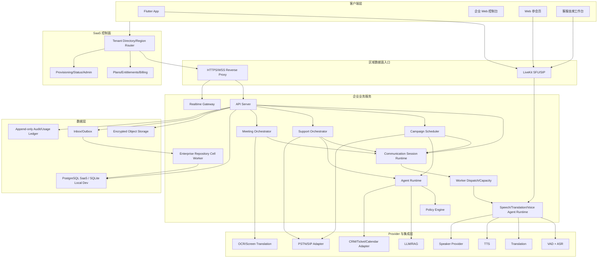
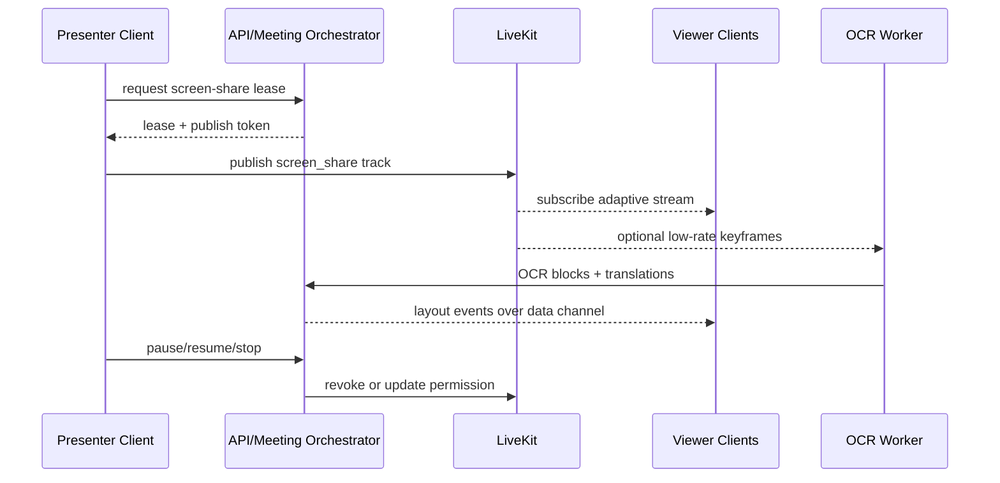
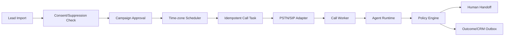
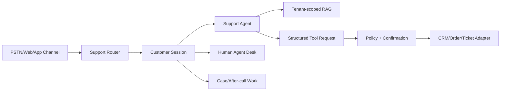

# 无界AI企业版技术架构

版本：v1.5
日期：2026-07-18
状态：SaaS 详细架构基线，已对齐统一通讯平台和 PostgreSQL Primary

## 1. 架构目标

- 复用无界AI统一 Communication Session、LiveKit、Speech/Translation/Voice Agent Runtime、
  PSTN、LLM、TTS、Speaker 和可靠事件能力。
- 三条企业业务线共享租户、知识、会话、审计、用量和 Provider 层。
- 保持客户端层和服务器层两层部署，不引入 Mac 生产依赖。
- 以多租户 SaaS 统一交付，不向客户部署服务器或模型。
- 在本地开发环境和 SaaS 区域集群之间保持 Repository/Adapter 可迁移。
- AI 负责理解和生成，确定性状态机与 Policy Engine 负责执行和风险控制。

## 2. 总体架构



### 2.1 控制、业务和媒体路径

| 路径 | 入口 | 同步职责 | 异步职责 | 禁止事项 |
| --- | --- | --- | --- | --- |
| 控制面 | `/saas/v1` | 租户发现、订阅/权益读取、route document | provision、暂停、导出、删除、账期聚合 | 不转发实时音频，不直接写区域业务表 |
| 业务数据面 | `/enterprise/v1` | tenant/RBAC、命令校验、查询、短期 token | outbox、导入、发布、调度、材料生成 | 不信任客户端 tenantId，不跨 region 漂移数据 |
| 实时信令 | WSS/Realtime Gateway | session、track、字幕和播放控制 | 质量事件、降级事件 | 不作为长期业务状态真值 |
| 媒体面 | LiveKit/SIP/PSTN Bridge | 音频和 screen track 转发 | 录制/OCR 旁路（需授权） | 不直接写业务数据库或决定结算 |
| Provider/Adapter | 服务器内部接口 | 能力探测、模型推理、工具调用 | webhook inbox、CRM/日历 outbox | 不向客户端暴露密钥和内部地址 |

命令成功仅表示业务状态已经持久化；需要外部副作用的操作返回 `accepted/processing`，由 outbox 驱动。客户端不得把 HTTP 超时解释为命令失败后换新幂等键重试。

## 3. SaaS 拓扑和部署边界

### 3.1 控制面和区域数据面

SaaS 控制面保存租户目录、套餐、区域归属、全局功能版本和服务状态，不处理实时音频。租户创建时分配 `homeRegion`，控制面把客户端引导到对应区域数据面。

区域数据面保存租户业务数据并运行 API、LiveKit、Worker、模型和 Provider Adapter。实时音频不经过全局控制面，避免跨区域延迟和数据漂移。

首个 SaaS 试点可以只有一个区域 cell，但接口中仍保留 region 和 cell 归属；不能把固定 Beelink 地址写入客户端产品逻辑。

### 3.2 客户端层

- Flutter App：移动会议、实时翻译、告警、接管和企业设置入口。
- 企业 Web 控制台：活动、知识、坐席、会议、分析和审计。
- Web 参会页：免安装入会、麦克风、字幕、译音和屏幕共享。
- 坐席工作台：客服队列、实时字幕、客户信息和人工接管。

客户端不持有模型地址、PSTN 密钥、CRM 密钥或国家规则真值。

### 3.3 服务器层

服务器作为一个可发布单元，包含：

```text
reverse-proxy
api-server
enterprise-repository-worker
realtime-gateway
communication-session-runtime
worker-dispatch
translation-worker
voice-agent-runtime
livekit
campaign-scheduler
support-orchestrator
meeting-orchestrator
agent-runtime
pstn-bridge
asr-service
translation-service
tts-service
speaker-service
llm-runtime
ocr-service
database
object-storage
```

本地开发和封闭演示允许多个逻辑模块运行在同一 Node/Python 进程。真实企业 SaaS 试点必须使用 PostgreSQL、正式域名、HTTPS/WSS、租户限流、备份和监控；不能把单机 SQLite 演示环境直接升级为付费服务。

#### 3.3.1 与当前仓库的映射

| 逻辑能力 | 当前代码落点 | 演进方式 |
| --- | --- | --- |
| 账号、Tenant、RBAC、企业命令 | `services/api-server` | 先按 domain module 隔离；只有独立扩缩容或故障域需要时才拆服务 |
| Enterprise Repository runtime/cell Worker | `services/api-server/src/modules/enterprise`、`services/api-server/src/infrastructure/postgres` | API 使用单一 `legacy|postgres` runtime；独立启动的 cell Worker 仅以 cell discovery 和 tenant transaction 角色 claim/finalize |
| Communication Session、Provider Operation、Dispatch、Recording 和 Usage | 上游稳定提交 `fe1c3c2` 已导入企业分支，`ENT-DATA-008/CORE-013` 已补 tenant scope 和企业业务绑定 | 公共 runtime 已成为代码基线；签名 dispatch ticket 和设备/声音策略仍由 `ENT-CORE-014/015` 完成 |
| PostgreSQL Primary 基础 | 公共31段 migration/Primary Runtime 与企业现有11段 migration | 已收敛为一个 Storage Driver/启动编排和两个有序 manifest；按 tenant/directory/cell/migration/maintenance 使用最小权限连接，等待真实 H3 验收 |
| 实时信令、字幕和 playback 控制 | `services/realtime-gateway` | 保持无业务数据库直写，通过 API/事件提交业务结果 |
| ASR、翻译、TTS、Agent call worker | `services/translation-worker`，后续接入统一 dispatch/runtime | 按 session/track/任务横向扩展，Provider 继续通过 Adapter；API 进程不运行媒体或 LLM 循环 |
| PSTN 媒体桥 | `services/pstn-bridge` | 只处理 Provider 媒体/状态协议，不承载 Campaign 真值 |
| 共享契约和事件 | `packages/contracts` | 客户端/服务端共同编译，版本变更保持向后兼容 |
| Campaign/Support/Meeting Orchestrator | 尚未实现的逻辑模块 | 初期进入 API/Worker 内的独立 module，不预先制造微服务 |
| SaaS 控制面、PostgreSQL、对象存储 | 尚未通过企业生产门禁 | 试点前按 `ENT-CORE-009/010/011`、`ENT-DATA-001/007/008/009` 实现和独立验收 |

架构图中的逻辑组件不等于当前已经存在的可部署服务。文档和 readiness 必须区分 `designed`、`implemented`、`verified` 与 `production_ready`。

### 3.4 SaaS cell

一个区域可以包含多个 cell。每个租户在同一时刻只属于一个 cell，控制面目录记录 `tenantId -> homeRegion -> cellId`。cell 故障切换或迁移必须校验数据库、对象、ledger 和审计 hash，不能依靠 DNS 随机把同一租户写入两个数据面。

### 3.5 扩缩容单元

| 组件 | 主要负载指标 | 扩缩容键 | 不可依赖的本地状态 |
| --- | --- | --- | --- |
| API Server | RPS、DB pool、P95 | HTTP 请求 | tenant context、job 进度、幂等结果 |
| Realtime Gateway | 连接数、事件率、发送积压 | tenant/session | 当前业务状态、用量余额 |
| Translation Worker | 活跃 track、音频实时率、Provider 并发 | session/track | 唯一任务所有权、结算真值 |
| Scheduler | due task 数、claim 延迟 | tenant/campaign shard | “已拨号”标记、全局当前租户 |
| Agent Runtime | turn 并发、token、超时率 | session/turn | 工具执行结果、审批状态 |
| OCR Worker | frame rate、像素量、队列时延 | screen share | 共享租约、会议状态 |
| Adapter Worker | outbox backlog、Provider 限流 | provider/tenant | 外部同步完成真值 |

所有 claim 使用数据库 CAS、lease 或 inbox/outbox；进程退出后，另一实例能够在租约超时后继续，且不会重复产生外部副作用。

## 4. 领域边界

| 领域 | 权威职责 | 不负责 |
| --- | --- | --- |
| Identity/Tenant | 企业、成员、角色、会话和 API 凭证 | 不决定营销合规 |
| Knowledge | 文档、术语、话术、版本和检索权限 | 不直接生成外呼任务 |
| Campaign | 活动、线索快照、调度、结果和审批 | 不直接调用 LLM/PSTN |
| Support | 渠道、队列、客服会话、工单和 SLA | 不直接写 CRM |
| Meeting | 会议、参会者、权限、共享和材料 | 不处理普通营销任务 |
| Policy | 国家规则、授权、禁拨、工具和风险决策 | 不保存媒体流 |
| Agent | 对话状态、意图、回复和结构化工具建议 | 不越过 Policy 执行动作 |
| Call/Media | call legs、媒体、播放、抢话和路由 | 不决定业务结果 |
| Billing/Audit | hold、settle、成本、审计和幂等 | 不生成内容 |

## 5. 统一媒体架构

外呼、客服和会议统一复用：

```text
source leg
  -> LiveKit/PSTN Bridge
  -> VAD/ASR
  -> participant or speaker turn
  -> conservative correction
  -> translation
  -> Agent or meeting consumer
  -> TTS/playback target leg
```

约束：

- 每条 source leg 有独立 ASR/翻译队列。
- 每条 target leg 有独立 playback generation。
- Call Link participant track 是身份真值，不叠加单轨 diarization。
- TTS 播放可被目标腿的新语音取消；迟到帧由 generation fence 拒绝。
- ASR、翻译或 TTS 降级不得破坏会话、字幕和结算状态。

## 6. 企业会议和屏幕共享架构



屏幕共享使用租约控制同一会议的唯一活跃共享者。租约写入数据库并带 `version`；仅依赖客户端按钮状态不能防止并发覆盖。

## 7. 外呼营销架构



每次调度都重新检查授权、禁拨、当地时间、活动状态和租户预算。导入时通过不代表执行时继续有效。

## 8. AI 客服架构



工具调用使用 allowlist schema。模型输出不是执行结果；只有 Adapter 返回成功并落库后，才能向客户确认操作已完成。

## 9. 数据架构

### 9.1 单一写入真值

- 全产品只有一个 Storage Driver 和启动 readiness 真值；不能让公共和 Enterprise runtime
  分别决定是否写 PostgreSQL，也不能长期双写或按路由局部切换。
- API Server 与受限的 Enterprise Repository cell Worker 是直接写入方。cell Worker 只做
  cell-scoped discovery，再建立 tenant-scoped transaction 进行 claim/finalize。
- Translation/Voice Agent/OCR Worker 和 Orchestrator 通过内部命令或可靠事件提交结果，
  不持有业务表写凭证。
- 每个命令包含 `tenantId`、`aggregateId`、`idempotencyKey` 和预期 `version`。
- session 结束、hold 释放、ledger 和 outbox 必须同事务提交。

### 9.2 存储阶段

| 阶段 | 方案 | 适用范围 |
| --- | --- | --- |
| 本地开发/封闭演示 | SQLite WAL + busy timeout + 单 API 写入 | 不接真实企业生产数据 |
| SaaS 试点和发布 | PostgreSQL + 行级租户约束 + HA 备份 | 正式多租户和并发任务 |
| 多实例 | PostgreSQL + Redis ephemeral coordination | 多 Gateway/Worker、分布式租约 |

对象存储保存授权证据、知识文档、导出、参考声音和经授权的录音。数据库只保存归属、hash、版本和对象引用。

### 9.3 公共和企业数据边界

- 公共 `ai_phone` schema 提供 aggregate fence、command inbox、可靠 Inbox/Outbox、Provider
  Operation、Session、Usage、Dispatch、Recording、Agent 和 Primary Runtime 原语。
- `enterprise` schema 继续保存 Tenant/Member/Directory、RBAC、审计、租户生命周期、
  Campaign/Support/Meeting 和企业账单等类型化表，并保持复合 FK、tenant-first index 和 forced RLS。
- 公共聚合使用一等 `scope_type + scope_id`；企业路径只允许 `scope_type=tenant`，且 scope ID
  必须等于 transaction-local `app.tenant_id`。可空 `owner_id/tenant_id` 或可选查询过滤不能充当权限边界。
- 通用 Product Records 只能作为个人/兼容数据索引；企业 Repository 不得调用无 tenant context
  的通用 query。需要企业化的账号、同意、诊断、术语和声纹必须使用 tenant-scoped adapter 或类型化表。
- User Directory 和 `platform_pending_work` 是授权/路由安全投影，必须在原事务同步维护；
  普通 UI/read model 才允许通过 outbox 最终一致更新。

### 9.4 连接角色和迁移顺序

一个 Storage Driver 不等于一个高权限连接池。目标运行时至少区分：

1. tenant runtime：设置 `app.tenant_id`，访问 tenant-owned 公共和企业表；
2. directory runtime：只设置 `app.user_id`，只读本人目录投影；
3. cell discovery runtime：只设置 `app.cell_id/worker_id/trace_id`，只读最小 pending 引用；
4. migrator/backup/restore：独立受审计 maintenance 凭证，不进入 API/Worker 常驻池。

启动顺序固定为公共 manifest、企业 manifest、双 schema verify、RLS/identity/role verify，
全部通过后才创建应用池和监听端口。任一失败都不回退 legacy，也不开放部分 PostgreSQL 路径。

## 10. 安全架构

- 企业数据访问始终校验 tenant membership 和 RBAC。
- 控制面 token 只用于发现区域和获取短期数据面会话，不能直接访问租户业务表。
- 租户级限流、并发、预算和熔断防止共享基础设施中的 noisy neighbor。
- 标准套餐共享 SaaS cell；专属容量只隔离计算资源，仍由平台统一运维和升级。
- PSTN、CRM、日历和消息凭据只保存在服务器密钥系统。
- 号码、录音、声纹和屏幕内容按敏感级别脱敏和加密。
- Agent 工具调用使用最小权限服务账号。
- 高风险动作必须产生不可覆盖的审计事件。
- 外部 webhook 使用签名、时间戳、防重放和 inbox 去重。
- 客户端 token 短期有效，并限制房间、角色和可发布轨道类型。
- trace context 只承载关联信息；边缘入口丢弃 `baggage`，tenant、role、route、entitlement 和
  policy 只从认证、membership 和服务端状态解析，不能从 trace header 扩权。

## 11. 可观测性

每个请求贯通：

```text
tenantId -> campaign/support/meeting id -> communicationSessionId -> callLegId
-> turnId -> segmentId -> playbackId/toolExecutionId -> ledgerId
```

日志不得记录完整手机号、token、声纹 embedding、原始音频或屏幕像素。质量报告记录延迟、Provider fingerprint、降级、取消、错误类别和用量。

## 12. 关键架构决策

| 决策 | 结论 |
| --- | --- |
| RTC | 继续 LiveKit，不自研 SFU |
| PSTN | Provider Adapter，不把 Twilio/Telnyx 逻辑写入业务层 |
| Agent | LLM + 确定性状态机 + Policy Engine |
| 数据 | SQLite 仅用于本地演示；真实 SaaS 试点起使用 PostgreSQL |
| Primary Runtime | 复用公共 fenced transaction/可靠事件原语，企业 tenant/RLS 作为强制适配层，不直接复用可选 owner 查询 |
| SaaS 交付 | 控制面 + 区域数据面；不提供客户自建服务端 |
| 区域 | 租户固定 homeRegion/cell，迁移走受控任务 |
| 消息 | 先使用数据库 inbox/outbox，规模化后再引入消息中间件 |
| 屏幕共享 | LiveKit screen track + CAS 共享租约 |
| OCR | 可选旁路，失败不影响共享 |
| 多租户 | 所有企业聚合根强制 tenantId，不用客户端过滤代替服务端隔离 |
| Billing | 复用原子事务模式，不复用个人 `user_id` 账单模型；企业使用 tenant billing account、seat、entitlement 和账期聚合 |

## 13. 信任区和服务身份

```text
public internet
  -> edge/WAF/rate limit
  -> client API and RTC entry
  -> workload-authenticated service network
  -> PostgreSQL/object storage/secrets
  -> outbound Provider egress
```

- 客户端凭证只能访问公开 API/RTC，不得直接访问 Worker、数据库、对象存储或模型服务。
- 内部网络位置不代表可信；服务间调用使用短期 workload identity 或 mTLS，并携带 tenant、actor、purpose 和 trace context。
- API 与受限的 Enterprise Repository cell Worker 是业务数据库的直接写入方。cell Worker 只允许 cell-scoped pending discovery 和重新建立的 tenant-scoped claim/finalize transaction，不得拥有 DDL、表 owner 或 `BYPASSRLS`；Translation/Call/OCR、Scheduler、Agent 等通用 Worker 仍只通过带 workload identity 的内部命令或事件接口提交结果，不持有业务表写凭证。migration、导入、备份和恢复另用受审计的专用 maintenance 角色。
- Provider webhook 在 edge 校验签名、时间窗口和重放，再以 inbox event 进入业务事务。
- Provider egress 使用域名/端口 allowlist；租户配置只引用 secret ID，不保存或回传明文密钥。

## 14. 高可用和故障域

| 故障 | 架构处理 | 用户可见结果 |
| --- | --- | --- |
| 单个 API/Gateway 实例退出 | 负载均衡摘除，无状态实例接管 | 短暂重连，已提交命令不丢失 |
| Worker 退出 | lease 超时后重新 claim，generation 拒绝旧输出 | 字幕/译音短暂降级，不重复结算 |
| Provider 故障 | capability 熔断、备用路由或明确降级 | 页面和会话显示具体不可用能力 |
| PostgreSQL 主库故障 | 跨故障域自动选主、旧主 fencing、endpoint 切换和 off-host PITR；写入在主库不确定时停止 | 保留安全结束能力，不接受高风险新命令 |
| 对象存储故障 | 元数据事务保留 pending，outbox 重试 | 上传/导出显示 processing，不伪造完成 |
| 控制面故障 | 有效 route/token 的区域会话短时自治 | 不能新开通/改套餐，进行中会话可安全结束 |
| 单 cell 故障 | 按已演练的迁移/恢复计划切换 | 未完成一致性校验前不双写另一个 cell |

正式环境的 stateless 入口至少跨两个故障单元部署；PostgreSQL 必须使用不同物理主机/
故障域、自动选主和旧主拒写，WAL/base backup 必须加密并保存在 off-host 不可变存储。
同机复制、同盘 WAL 和手工 promote 只能作为机制证据；RPO/RTO 和 cell 恢复只有在
`ENT-REL-003` 演练通过后才能对外承诺。

## 15. 容量和服务目标

以下是必须采集的内部 SLI，不直接等同客户 SLA：

| 层 | SLI |
| --- | --- |
| 控制面 | route 成功率/延迟、provision 成功率、entitlement 新鲜度 |
| API | 按 route/tenant/command 的成功率、P50/P95/P99、冲突率和限流率 |
| RTC | 入会成功率、重连时间、track publish/subscribe 成功率、audio frame drop |
| AI 管线 | 首段字幕、最终字幕、翻译、首音频延迟及 Provider 超时/降级率 |
| 外呼 | claim 延迟、拨号重复数、webhook backlog、接通/失败分类 |
| 客服 | 队列等待、claim 冲突、接管延迟、AI 停止音频延迟 |
| 屏幕共享 | acquire 延迟、track 首帧、lease 过期、OCR backlog |
| 数据 | DB pool、锁等待、事务冲突、outbox age、备份和恢复校验 |
| 成本 | tenant/feature/provider 的分钟、token、字符、帧和单位业务结果成本 |

每个租户都有并发、速率、预算和队列上限。容量测试按25/50/100 session、小租户突发、
大租户持续、单 Provider 故障、单 cell 降级执行；发布前还要完成至少120分钟的真实
API/LiveKit/SIP/ASR/MT/TTS/Agent/Egress 混合流量。数据库控制面 soak 不能替代真实媒体容量；
未获得测试证据前不标注具体并发或 SLA 数字。

## 16. 不可破坏的架构不变量

1. 请求中的 tenantId 不能决定权限，membership、route document 和服务端 guard 才是权限真值。
2. 任何企业资源查询都先带 tenant scope，不先按裸 resource ID 查询再内存过滤。
3. 客户端、Gateway、Worker、Provider 和 LLM 都不能直接修改业务终态。
4. 外部副作用必须有幂等键、inbox/outbox 或 Provider event 去重。
5. 余额、授权、禁拨、审批、主持人停止和人工接管优先于迟到的 AI/媒体输出。
6. SQLite 只能报告 `demo_only`；PostgreSQL、备份和隔离未验收时不能宣称企业试点 ready。
7. 主产品 staging、同机 HA、公共 Product Records 或个人 Billing 不能自动成为企业验收证据或租户数据模型。
8. 任何通用 Repository 的可选 owner/scope 过滤在企业路径都必须被 tenant-scoped adapter 替代或拒绝。
