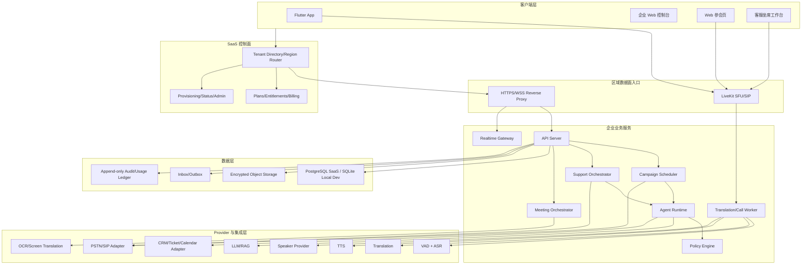
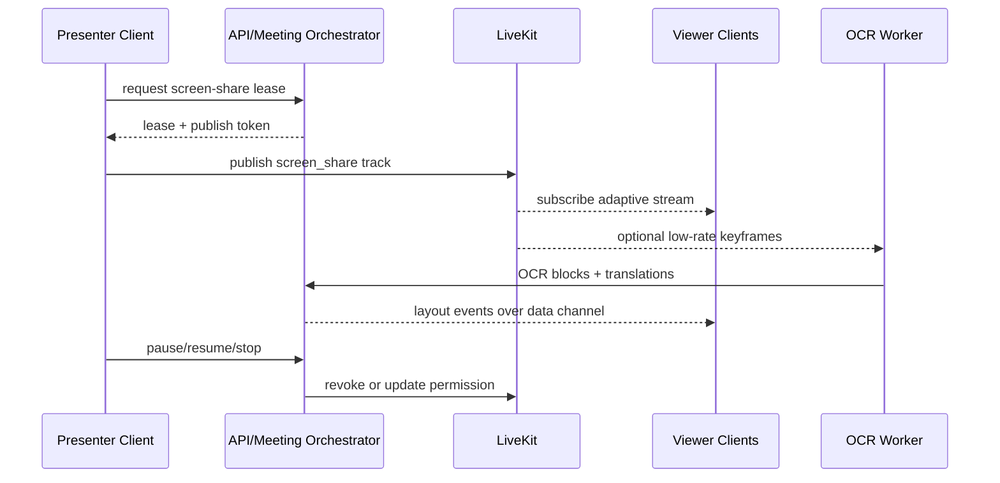
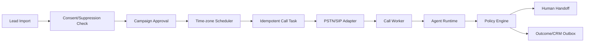
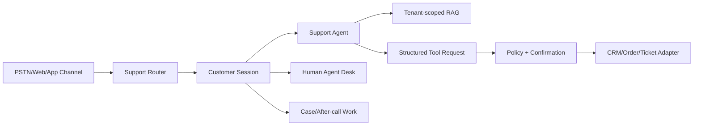

# AI Phone 企业版技术架构

版本：v1.0
日期：2026-07-15
状态：SaaS 基线待评审

## 1. 架构目标

- 复用个人版实时翻译、Call Link、PSTN、LLM、TTS 和 Speaker 能力。
- 三条企业业务线共享租户、知识、会话、审计、用量和 Provider 层。
- 保持客户端层和服务器层两层部署，不引入 Mac 生产依赖。
- 以多租户 SaaS 统一交付，不向客户部署服务器或模型。
- 在本地开发环境和 SaaS 区域集群之间保持 Repository/Adapter 可迁移。
- AI 负责理解和生成，确定性状态机与 Policy Engine 负责执行和风险控制。

## 2. 总体架构



## 3. SaaS 拓扑和部署边界

### 3.1 控制面和区域数据面

SaaS 控制面保存租户目录、套餐、区域归属、全局功能版本和服务状态，不处理实时音频。租户创建时分配 `homeRegion`，控制面把客户端引导到对应区域数据面。

区域数据面保存租户业务数据并运行 API、LiveKit、Worker、模型和 Provider Adapter。实时音频不经过全局控制面，避免跨区域延迟和数据漂移。

首个 SaaS 试点可以只有一个区域 cell，但接口中仍保留 region 和 cell 归属；不能把固定 Beelink 地址写入客户端产品逻辑。

### 3.2 客户端层

- Flutter App：移动会议、实时翻译、告警、接管和企业设置入口。
- 企业 Web 控制台：活动、知识、坐席、会议、分析和审计。
- Web 参会页：免安装入会、麦克风、字幕、译音和屏幕共享。
- 坐席工作台：客服队列、实时字幕、客户信息和人工接管。

客户端不持有模型地址、PSTN 密钥、CRM 密钥或国家规则真值。

### 3.3 服务器层

服务器作为一个可发布单元，包含：

```text
reverse-proxy
api-server
realtime-gateway
translation-worker
livekit
campaign-scheduler
support-orchestrator
meeting-orchestrator
agent-runtime
pstn-bridge
asr-service
translation-service
tts-service
speaker-service
llm-runtime
ocr-service
database
object-storage
```

本地开发和封闭演示允许多个逻辑模块运行在同一 Node/Python 进程。真实企业 SaaS 试点必须使用 PostgreSQL、正式域名、HTTPS/WSS、租户限流、备份和监控；不能把单机 SQLite 演示环境直接升级为付费服务。

### 3.4 SaaS cell

一个区域可以包含多个 cell。每个租户在同一时刻只属于一个 cell，控制面目录记录 `tenantId -> homeRegion -> cellId`。cell 故障切换或迁移必须校验数据库、对象、ledger 和审计 hash，不能依靠 DNS 随机把同一租户写入两个数据面。

## 4. 领域边界

| 领域 | 权威职责 | 不负责 |
| --- | --- | --- |
| Identity/Tenant | 企业、成员、角色、会话和 API 凭证 | 不决定营销合规 |
| Knowledge | 文档、术语、话术、版本和检索权限 | 不直接生成外呼任务 |
| Campaign | 活动、线索快照、调度、结果和审批 | 不直接调用 LLM/PSTN |
| Support | 渠道、队列、客服会话、工单和 SLA | 不直接写 CRM |
| Meeting | 会议、参会者、权限、共享和材料 | 不处理普通营销任务 |
| Policy | 国家规则、授权、禁拨、工具和风险决策 | 不保存媒体流 |
| Agent | 对话状态、意图、回复和结构化工具建议 | 不越过 Policy 执行动作 |
| Call/Media | call legs、媒体、播放、抢话和路由 | 不决定业务结果 |
| Billing/Audit | hold、settle、成本、审计和幂等 | 不生成内容 |

## 5. 统一媒体架构

外呼、客服和会议统一复用：

```text
source leg
  -> LiveKit/PSTN Bridge
  -> VAD/ASR
  -> participant or speaker turn
  -> conservative correction
  -> translation
  -> Agent or meeting consumer
  -> TTS/playback target leg
```

约束：

- 每条 source leg 有独立 ASR/翻译队列。
- 每条 target leg 有独立 playback generation。
- Call Link participant track 是身份真值，不叠加单轨 diarization。
- TTS 播放可被目标腿的新语音取消；迟到帧由 generation fence 拒绝。
- ASR、翻译或 TTS 降级不得破坏会话、字幕和结算状态。

## 6. 企业会议和屏幕共享架构



屏幕共享使用租约控制同一会议的唯一活跃共享者。租约写入数据库并带 `version`；仅依赖客户端按钮状态不能防止并发覆盖。

## 7. 外呼营销架构



每次调度都重新检查授权、禁拨、当地时间、活动状态和租户预算。导入时通过不代表执行时继续有效。

## 8. AI 客服架构



工具调用使用 allowlist schema。模型输出不是执行结果；只有 Adapter 返回成功并落库后，才能向客户确认操作已完成。

## 9. 数据架构

### 9.1 单一写入方

- API Server 是业务数据库唯一写入方。
- Worker 和 Orchestrator 通过内部命令 API 提交事件。
- 每个命令包含 `tenantId`、`aggregateId`、`idempotencyKey` 和预期 `version`。
- session 结束、hold 释放、ledger 和 outbox 必须同事务提交。

### 9.2 存储阶段

| 阶段 | 方案 | 适用范围 |
| --- | --- | --- |
| 本地开发/封闭演示 | SQLite WAL + busy timeout + 单 API 写入 | 不接真实企业生产数据 |
| SaaS 试点和发布 | PostgreSQL + 行级租户约束 + HA 备份 | 正式多租户和并发任务 |
| 多实例 | PostgreSQL + Redis ephemeral coordination | 多 Gateway/Worker、分布式租约 |

对象存储保存授权证据、知识文档、导出、参考声音和经授权的录音。数据库只保存归属、hash、版本和对象引用。

## 10. 安全架构

- 企业数据访问始终校验 tenant membership 和 RBAC。
- 控制面 token 只用于发现区域和获取短期数据面会话，不能直接访问租户业务表。
- 租户级限流、并发、预算和熔断防止共享基础设施中的 noisy neighbor。
- 标准套餐共享 SaaS cell；专属容量只隔离计算资源，仍由平台统一运维和升级。
- PSTN、CRM、日历和消息凭据只保存在服务器密钥系统。
- 号码、录音、声纹和屏幕内容按敏感级别脱敏和加密。
- Agent 工具调用使用最小权限服务账号。
- 高风险动作必须产生不可覆盖的审计事件。
- 外部 webhook 使用签名、时间戳、防重放和 inbox 去重。
- 客户端 token 短期有效，并限制房间、角色和可发布轨道类型。

## 11. 可观测性

每个请求贯通：

```text
tenantId -> campaign/support/meeting id -> sessionId -> callLegId
-> turnId -> segmentId -> playbackId/toolExecutionId -> ledgerId
```

日志不得记录完整手机号、token、声纹 embedding、原始音频或屏幕像素。质量报告记录延迟、Provider fingerprint、降级、取消、错误类别和用量。

## 12. 关键架构决策

| 决策 | 结论 |
| --- | --- |
| RTC | 继续 LiveKit，不自研 SFU |
| PSTN | Provider Adapter，不把 Twilio/Telnyx 逻辑写入业务层 |
| Agent | LLM + 确定性状态机 + Policy Engine |
| 数据 | SQLite 仅用于本地演示；真实 SaaS 试点起使用 PostgreSQL |
| SaaS 交付 | 控制面 + 区域数据面；不提供客户自建服务端 |
| 区域 | 租户固定 homeRegion/cell，迁移走受控任务 |
| 消息 | 先使用数据库 inbox/outbox，规模化后再引入消息中间件 |
| 屏幕共享 | LiveKit screen track + CAS 共享租约 |
| OCR | 可选旁路，失败不影响共享 |
| 多租户 | 所有企业聚合根强制 tenantId，不用客户端过滤代替服务端隔离 |
