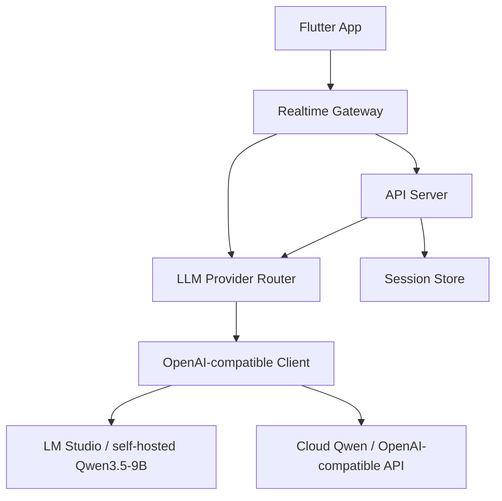
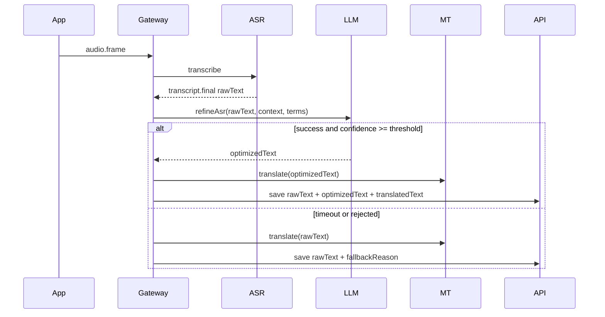

# LLM 接入层技术设计

版本：v0.2  
日期：2026-07-09  
状态：设计完成，待实现  
关联文档：

- `docs/model-provider-access-layer.md`
- `docs/llm-asr-refinement-and-record-review-functional-design.md`
- `docs/llm-asr-refinement-functional-design.md`
- `docs/llm-record-review-functional-design.md`

## 1. 结论

新增统一 `LLM Provider` 接入层，不让业务代码直接绑定模型、baseUrl 或 API Key。

MVP 使用同一个模型完成两类能力：

| 能力 | 默认模型 | 说明 |
| --- | --- | --- |
| ASR 文本优化 | `qwen/qwen3.5-9b` | 实时链路，只处理 final 文本 |
| 会后纪要/通话记录 | `qwen/qwen3.5-9b` | 离线整理，可接受更长延迟 |

实时翻译仍以 `Qwen3-ASR-0.6B original tuned v3 -> Hy-MT2-1.8B -> VoxCPM2` 为主链路。LLM 不替代 ASR、不替代 Hy-MT2，只做文本优化和结构化整理。

## 2. 设计目标

- ASR、翻译、TTS、LLM 四层职责分离。
- 原始 ASR 永远保留，LLM 只能生成 `optimizedText` 或 review JSON。
- 实时链路 LLM 失败必须回退 `rawText`，不能影响字幕、翻译、历史保存。
- 所有 LLM 输出必须通过 JSON schema 校验。
- 每次调用记录 `provider/model/promptVersion/latency/confidence/fallbackReason`。
- 支持 LM Studio、自建 OpenAI-compatible 服务、云端 Qwen/OpenAI-compatible API。

## 3. 总体架构



| 模块 | 职责 |
| --- | --- |
| Realtime Gateway | ASR final 后调用 `refineAsr`，决定翻译使用 raw 还是 optimized |
| API Server | 调用 `generateReview`，生成纪要、待办、关键事实和风险 |
| LLM Provider Router | 读取配置，选择 `off/mock/openai_compatible` |
| OpenAI-compatible Client | 调 `/v1/chat/completions`，处理超时、JSON、`<think>` 清理 |
| Model Routing | 在 `release/domestic/model-routing.json` 暴露当前 LLM 路由 |

## 4. 模块边界

建议新增共享模块 `services/shared/llm`，内部包含 config、provider interface、OpenAI-compatible provider、JSON schema、prompt template 和测试。API Server 和 Realtime Gateway 都依赖这个模块，避免各自实现一套 LLM 调用逻辑。

## 5. Provider 接口

`LlmProvider` 暴露三个方法：

| 方法 | 输入 | 输出 |
| --- | --- | --- |
| `healthCheck()` | baseUrl、model、apiKey 配置 | provider 可用性、模型可用性、错误原因 |
| `refineAsr()` | sessionId、segmentId、语言方向、rawText、前文 segments、protectedTerms、glossary | optimizedText、confidence、operations、warnings、usage、fallbackReason |
| `generateReview()` | sessionId、titleHint、语言方向、segments 三层文本 | title、summary、decisions、actionItems、keyFacts、risks、openQuestions、terms、evidenceSegmentIds |

Provider 类型先实现三种：`off`、`mock`、`openai_compatible`。后续云端 Qwen、OpenAI、其他私有模型都通过 `openai_compatible` 合约接入。

## 6. 配置

统一使用 `LLM_*`，旧的 `SUMMARY_*` 保留一版兼容读取。

```bash
LLM_PROVIDER=openai_compatible
LLM_BASE_URL=http://100.110.127.117:1234/v1
LLM_API_KEY=

LLM_CORRECTION_MODEL=qwen/qwen3.5-9b
LLM_REVIEW_MODEL=qwen/qwen3.5-9b

LLM_REFINEMENT_ENABLED=true
LLM_REVIEW_ENABLED=true
LLM_CORRECTION_TIMEOUT_MS=1200
LLM_REVIEW_TIMEOUT_MS=30000
LLM_CORRECTION_MAX_TOKENS=180
LLM_REVIEW_MAX_TOKENS=2048
LLM_TEMPERATURE=0
LLM_REASONING_EFFORT=none
LLM_MIN_CONFIDENCE=0.72
```

`release/domestic/model-routing.json` 增加：

```json
{
  "llm": {
    "provider": "openai_compatible",
    "correctionModel": "qwen/qwen3.5-9b",
    "reviewModel": "qwen/qwen3.5-9b",
    "contract": "OpenAI-compatible /v1/chat/completions"
  }
}
```

## 7. 数据模型

`SessionSegmentDto` 扩展为三层文本：

| 字段 | 含义 |
| --- | --- |
| `id` | segment ID |
| `rawText` | ASR 原文，不允许覆盖 |
| `optimizedText` | LLM 优化后的识别文本 |
| `sourceText` | 兼容展示字段，优先 `optimizedText`，否则 `rawText` |
| `translatedText` | 翻译结果，翻译输入优先 `optimizedText` |
| `refinement` | provider、model、promptVersion、confidence、latencyMs、operations、warnings、fallbackReason |

`SessionReviewResponse` 增加结构化字段：

| 字段 | 含义 |
| --- | --- |
| `provider/model/promptVersion/generatedAt` | 生成来源和版本追踪 |
| `title/summary` | 标题和摘要 |
| `decisions/actionItems/keyFacts` | 结论、待办、关键事实 |
| `risks/openQuestions` | 风险和待确认问题 |
| `highlights/terms/evidenceSegmentIds` | 高亮、术语和证据 segment |

## 8. 实时链路



实时规则：

1. 只优化 `transcript.final`，不优化 partial。
2. LLM 前先做确定性清洗：空文本、`<sil>`、提示词泄漏、本地高置信术语。
3. LLM 输出疑似翻译、提示词、扩写或改动数字时直接丢弃。
4. 超过 `LLM_CORRECTION_TIMEOUT_MS` 直接回退。
5. App 主字幕展示 `sourceText`，历史详情可展开 raw/optimized diff。

## 9. ASR 优化 Prompt 契约

Prompt version：`asr_refine_v1`

核心约束：

- 你是 ASR 文本纠错器，不是翻译器。
- 只返回 JSON，不返回解释。
- 不增加原文没有的信息。
- 不改变数字、金额、日期、地址、电话、订单号，除非上下文有强证据。
- 保留中英混合，不要把中文翻成英文，也不要把英文翻成中文。
- 产品术语、模型名、地址、订单号优先保持原样。

响应 schema：

```json
{
  "optimizedText": "string",
  "confidence": 0.0,
  "operations": ["term_correction"],
  "protectedTermsKept": ["Hy-MT2"],
  "warnings": []
}
```

MVP 保护词：

- 同传
- 字幕
- Qwen3 ASR
- FireRedASR2
- Hy-MT2
- VoxCPM2
- A-120
- iPhone 14

## 10. 会后纪要链路

`/sessions/:sessionId/review` 迁移到统一 LLM Provider。

流程：

1. API 读取 session 和 segments。
2. 使用 `optimizedText || rawText` 作为主文本，同时保留 `translatedText`。
3. 调 `LlmProvider.generateReview`。
4. 校验 `session_review_v2` JSON。
5. 保存 review，并在历史详情展示。

输出字段：

| 字段 | 说明 |
| --- | --- |
| `title` | 会话标题 |
| `summary` | 简洁摘要 |
| `decisions` | 明确结论 |
| `actionItems` | 待办，包含负责人、截止时间、证据 segment |
| `keyFacts` | 时间、金额、地址、电话、订单号等关键事实 |
| `risks` | 风险 |
| `openQuestions` | 待确认问题 |
| `terms` | 术语和专有名词 |

## 11. 失败回退

| 场景 | 实时处理 | Review 处理 |
| --- | --- | --- |
| LLM 超时 | 翻译 `rawText` | 返回可重试错误 |
| invalid JSON | 翻译 `rawText` | 返回 schema 错误 |
| 低置信度 | 翻译 `rawText` | 保留 warning |
| Provider 不可用 | 本场关闭 refinement | `/review` 返回 503 |
| 输出疑似翻译 | 丢弃 `optimizedText` | 记录 `translated_output_rejected` |
| 输出包含提示词 | 丢弃 `optimizedText` | 记录 `prompt_leak_rejected` |

## 12. 安全和合规

- 端侧模式默认不上传 ASR 文本。
- 在线模式可启用服务端 LLM，需要隐私政策说明文本处理用途。
- 日志只记录长度、provider、model、latency、错误类型，不记录完整文本。
- 不保存 `<think>`、reasoning、原始模型响应。
- 删除历史时同步删除 review 和 refinement 诊断。

## 13. 验收标准

实时纠错：

- `同船` 可修复为 `同传`。
- `Twin3ASR / HiMT2 / BoxCPM2` 可修复为 `Qwen3 ASR / Hy-MT2 / VoxCPM2`。
- `R120` 在订单号上下文中可修复为 `A-120`。
- P0 测试集不出现提示词泄漏。
- correction p95 小于 `1200ms`。
- LLM 失败时字幕、翻译、历史不丢。

会后纪要：

- 输出 title、summary、decisions、actionItems、keyFacts、risks、openQuestions。
- 每个待办和关键事实有 evidenceSegmentIds。
- Markdown 导出包含纪要、待办、全文 raw/optimized/translation。

Provider：

- health check 能识别 baseUrl、model、apiKey 缺失。
- OpenAI-compatible JSON 解析、`<think>` 清理、invalid JSON 回退有单测。
- `release/domestic/model-routing.json` 能渲染 LLM env。

## 14. 开发计划

Phase 1：Provider 抽象

- 新增 `services/shared/llm`。
- 实现 `OpenAiCompatibleLlmProvider`、`MockLlmProvider`、`OffLlmProvider`。
- 实现 JSON 提取、schema 校验、超时、`<think>` 清理。
- 增加 `LLM_*` env 和 readiness。

Phase 2：数据模型

- 扩展 contracts：`rawText`、`optimizedText`、`refinement`、review v2 字段。
- API session repository 支持三层文本。
- Markdown/JSON 导出支持三层文本。

Phase 3：实时接入

- Gateway 在 ASR final 后调用 `refineAsr`。
- 翻译输入改为 `optimizedText || rawText`。
- session event sink 保存 refinement。
- App 历史详情展示原始识别和智能优化。

Phase 4：Review 迁移

- `/sessions/:sessionId/review` 复用统一 LLM Provider。
- 兼容旧 `SUMMARY_*` env 一版。
- App 历史详情增加纪要、待办、关键事实、全文视图。

Phase 5：验收

- 用 `test-audio/realtime-online-eval-v1/p0-smoke.m4a` 回归。
- 对比 Qwen3-ASR raw、LLM optimized、Hy-MT2 translation。
- 记录 provider/model/promptVersion/latency/confidence。
