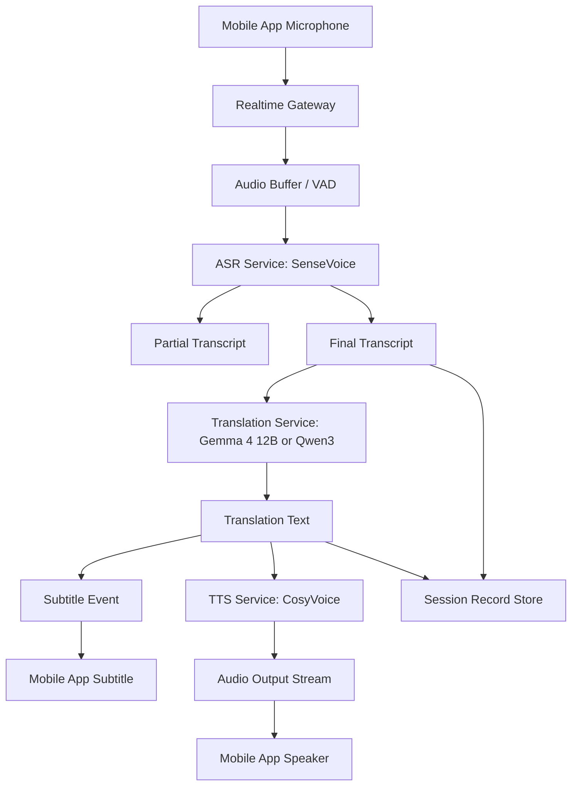
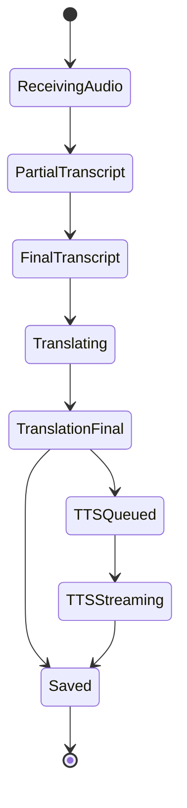
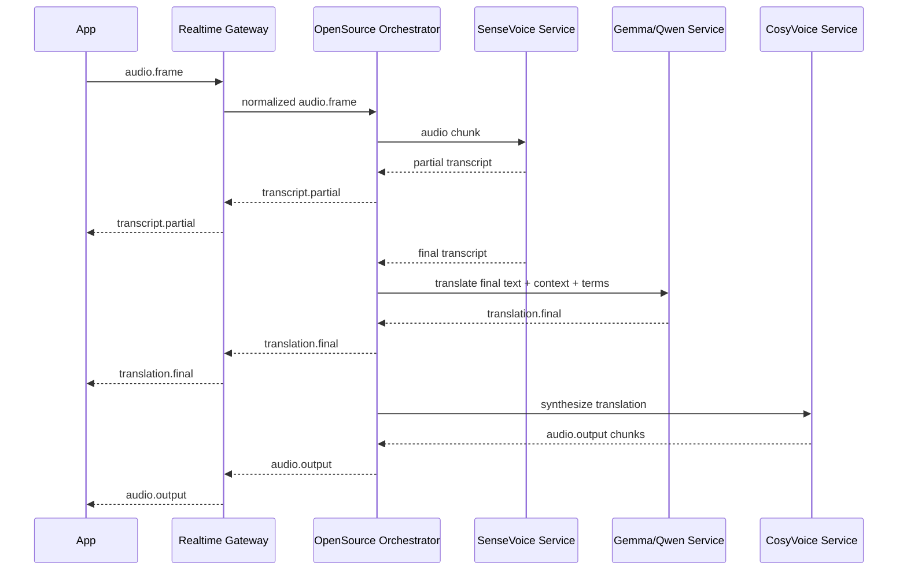
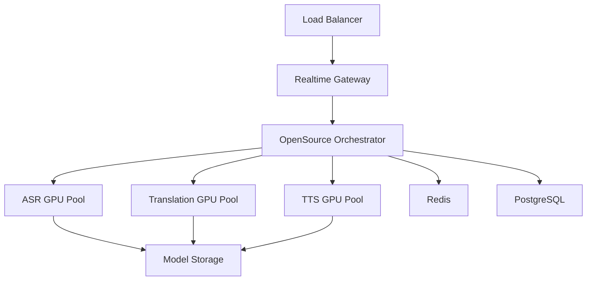

# 开源模型自部署技术设计文档

版本：v0.1  
日期：2026-06-04  
项目：翻译软件 App  
关联文档：`功能设计文档.md`、`技术设计文档.md`、`翻译模型选型对比.md`  
定位：开源 / 自部署模型 Provider 技术方案

---

## 1. 文档目的

本文档定义中英实时同传工作站 App 的开源模型自部署方案，重点覆盖：

1. 语音识别 ASR。
2. 文本翻译模型。
3. 语音合成 TTS。
4. 实时流式链路。
5. 服务端部署。
6. 端侧离线能力。
7. 模型路由和降级。
8. 成本、性能、合规和 POC 验收。

本文档不是替代主技术架构，而是作为 `技术设计文档.md` 中 Provider Adapter 的一个实现方案：

```text
Provider Adapter:
  - OpenAI Provider
  - 阿里 Provider
  - 腾讯 Provider
  - 开源自部署 Provider
```

---

## 2. 设计假设

1. 首版产品仍以在线实时同传为主。
2. 开源模型方案优先跑在服务端，不强制手机端本地运行。
3. 手机端离线模式作为增强能力，不作为 MVP 主链路。
4. 开源模型方案采用模块化级联链路，不直接追求单模型端到端同传。
5. 默认不保存原始录音。
6. 默认不开启声音克隆。
7. 所有模型许可证、权重使用条款、第三方依赖必须在商用前复核。
8. 本文档中的硬件成本和性能只作为设计估算，最终以 POC 压测为准。

---

## 3. 总体结论

### 3.1 推荐主方案

```text
ASR:
SenseVoice-Small / FunASR

Translation:
Gemma 4 12B-it 或 Qwen3 14B / 32B

TTS:
CosyVoice2 / CosyVoice3

Fallback:
Whisper large-v3-turbo + Qwen3 8B + 系统 TTS
```

### 3.2 端侧离线方案

```text
高端手机:
Gemma 4 E4B-it 做短句/字幕翻译

中低端手机:
Gemma 4 E2B-it 做应急短句翻译

不建议:
端侧完整实时同传 + 高质量 TTS
```

### 3.3 不推荐方案

不建议 MVP 直接用单个开源多模态模型承担：

```text
麦克风音频 -> 多模态模型 -> 译文字幕 + 译文语音
```

原因：

- partial 字幕、时间戳、断句、长会话稳定性不可控。
- 语音输出通常仍需要独立 TTS。
- 端到端延迟和工程可观测性弱。
- 成本和并发容量更难优化。

---

## 4. 模型角色分工

### 4.1 ASR 语音识别

职责：

- 接收音频流。
- 输出 partial transcript。
- 输出 final transcript。
- 返回语言、置信度和时间戳。

首选：

- SenseVoice / FunASR。

备用：

- Whisper large-v3 / large-v3-turbo。
- whisper.cpp，用于端侧或 CPU 备用。

### 4.2 文本翻译

职责：

- 接收 ASR final 文本。
- 根据上下文和术语库翻译。
- 输出目标语言译文。
- 支持专业领域提示。
- 支持会后润色和摘要前清洗。

候选：

- Gemma 4 12B-it。
- Gemma 4 E4B-it / E2B-it。
- Qwen3 8B / 14B / 32B。

### 4.3 TTS 语音合成

职责：

- 将译文文本转为目标语言音频。
- 支持流式输出。
- 支持中英文声音。
- 支持语速、音量、音色配置。

首选：

- CosyVoice2 / CosyVoice3。

MVP 快速方案：

- iOS / Android 系统 TTS。
- 云厂商 TTS。

### 4.4 后处理

职责：

- 术语命中检查。
- 数字、金额、型号校验。
- 标点和断句修正。
- 会话记录格式化。

---

## 5. 开源模型对比

### 5.1 ASR 模型

| 模型 | 优点 | 缺点 | 推荐用途 |
|---|---|---|---|
| SenseVoice-Small | 中文英文识别强，速度快，适合低延迟 | 需要服务端部署和测试长会话 | 默认 ASR |
| FunASR Paraformer | 中文语音生态成熟 | 英文和双语场景需实测 | 国内备用 |
| Whisper large-v3-turbo | 稳定、生态成熟、许可证友好 | 流式能力需要工程封装，延迟偏高 | 海外备用 |
| whisper.cpp | 可端侧、CPU 友好 | 质量和速度依设备而定 | 离线应急 |

### 5.2 翻译模型

| 模型 | 优点 | 缺点 | 推荐用途 |
|---|---|---|---|
| Gemma 4 12B-it | 支持音频输入，文本能力强，适合本地/服务端 | 实时同传仍建议走 ASR 后文本翻译 | 开源翻译 POC 主候选 |
| Gemma 4 E4B-it | 面向移动和边缘端，适合端侧隐私模式 | 专业翻译质量需测试 | 高端手机离线翻译 |
| Gemma 4 E2B-it | 更轻量，端侧成本低 | 复杂场景和长句翻译能力有限 | 应急短句翻译 |
| Qwen3 14B | 中文英文能力强，成本可控 | 需要 GPU 服务 | 云端开源翻译主候选 |
| Qwen3 32B | 翻译和复杂语义更强 | 成本更高，并发更低 | Premium / 企业质量模式 |
| Qwen3 8B | 成本低，速度快 | 专业场景质量有限 | 免费版 / 低成本模式 |

### 5.3 TTS 模型

| 模型 | 优点 | 缺点 | 推荐用途 |
|---|---|---|---|
| CosyVoice2 / 3 | 中文英文自然度好，支持流式语音生成 | 服务端推理成本和合规要控制 | 开源 TTS 主候选 |
| 系统 TTS | 接入快，无服务端成本 | 音色普通，平台差异大 | MVP 快速方案 |
| 云厂商 TTS | 稳定、并发好 | 按量计费，供应商依赖 | 上线初期备用 |
| Piper / Sherpa-ONNX | 部署轻，适合离线 | 中文英文自然度需测试 | 离线实验 |

---

## 6. 推荐架构

### 6.1 高质量开源云端链路



### 6.2 低成本字幕链路

适合免费版、课堂模式、会议模式默认状态。

```text
Audio
-> SenseVoice ASR
-> Gemma/Qwen text translation
-> subtitle only
```

特点：

- 不生成译文语音。
- 成本低。
- 延迟低。
- 更适合长会话。

### 6.3 语音播报链路

适合对话模式和外贸模式。

```text
Audio
-> ASR
-> Translation
-> TTS
-> Speaker
```

设计原则：

- 字幕先返回。
- TTS 可以稍后播放。
- TTS 失败不影响字幕。
- 用户可随时关闭语音播报。

### 6.4 端侧离线短句链路

适合无网络、隐私模式、旅行应急。

```text
Text input or local ASR output
-> Gemma 4 E2B/E4B
-> Text translation
-> System TTS
```

MVP 不建议做：

```text
本地麦克风连续收音 -> 本地 ASR -> 本地 LLM -> 本地 TTS -> 完整同传
```

---

## 7. 服务划分

### 7.1 新增服务

在现有技术架构中新增开源模型服务组：

```text
open-source-provider/
  realtime-orchestrator
  asr-service
  translation-service
  tts-service
  model-router
  model-metrics
```

### 7.2 Realtime Orchestrator

职责：

- 接收 Realtime Gateway 转发的音频事件。
- 管理 ASR、Translation、TTS 的调用顺序。
- 维护 segment 状态。
- 合并 partial / final 事件。
- 控制延迟和超时。
- 上报模型指标。

### 7.3 ASR Service

职责：

- 承载 SenseVoice / Whisper。
- 接收音频 chunk。
- 输出 partial 和 final 文本。
- 处理 VAD、断句和时间戳。

接口：

```http
POST /asr/sessions
POST /asr/sessions/{id}/audio
POST /asr/sessions/{id}/end
```

### 7.4 Translation Service

职责：

- 承载 Gemma / Qwen。
- 接收 final transcript。
- 注入术语库和上下文。
- 输出翻译结果。
- 支持质量模式和低成本模式。

接口：

```http
POST /translate
POST /translate/batch
POST /translate/refine
```

### 7.5 TTS Service

职责：

- 承载 CosyVoice。
- 接收译文文本。
- 返回音频 chunk。
- 支持流式输出。
- 控制音色、语速、语言。

接口：

```http
POST /tts
POST /tts/stream
GET /tts/voices
```

### 7.6 Model Router

职责：

- 根据套餐、地区、模式、负载选择模型。
- 控制成本。
- 灰度切换模型。
- 故障降级。

示例：

```text
Free user:
  SenseVoice + Qwen3 8B + no TTS

Pro user:
  SenseVoice + Gemma 4 12B or Qwen3 14B + system/cloud TTS

Premium user:
  SenseVoice + Qwen3 32B quality mode + CosyVoice

Offline:
  Gemma 4 E4B/E2B on device
```

---

## 8. 实时数据流

### 8.1 Segment 生命周期



### 8.2 时序流程



### 8.3 并发处理

原则：

- ASR 持续处理音频流。
- Translation 按 final segment 触发。
- TTS 不阻塞下一段翻译。
- 字幕事件优先级高于语音事件。
- 会话保存异步执行。

---

## 9. ASR 技术设计

### 9.1 输入音频格式

推荐：

```text
sample_rate: 16000 Hz
channel: mono
format: pcm16
frame_size: 20ms-100ms
```

客户端可采集更高采样率，但进入 ASR 前统一重采样。

### 9.2 VAD 和断句

断句策略：

- 短静音：300ms-700ms，尝试形成短句。
- 长静音：1000ms 以上，强制 final。
- 最大 segment：10 秒。
- 数字、金额、型号场景可允许更长上下文。

### 9.3 partial 策略

partial 只用于实时反馈，不进入最终记录。

规则：

- 300ms-500ms 推送一次 partial。
- partial 可覆盖。
- final 后清空当前 partial。

### 9.4 ASR 降级

```text
SenseVoice unavailable
-> Whisper service
-> cloud ASR provider
-> stop session with recoverable error
```

---

## 10. 翻译模型技术设计

### 10.1 输入格式

```json
{
  "session_id": "sess_123",
  "segment_id": "seg_456",
  "mode": "business",
  "source_language": "en",
  "target_language": "zh",
  "source_text": "We can offer a 5 percent discount for 1000 units.",
  "previous_segments": [
    {
      "source_text": "Could you confirm the MOQ?",
      "translated_text": "您能确认一下最小起订量吗？"
    }
  ],
  "terms": [
    {
      "source": "MOQ",
      "target": "最小起订量"
    }
  ]
}
```

### 10.2 Prompt 模板

```text
You are a real-time Chinese-English interpreter.
Translate the source text into the target language.
Keep the meaning accurate and natural.
Use the provided glossary exactly when applicable.
Preserve numbers, units, prices, dates, product names, and model numbers.
Return only the translation text.

Source language: {source_language}
Target language: {target_language}
Scene: {mode}
Glossary:
{terms}

Recent context:
{previous_segments}

Source:
{source_text}
```

### 10.3 输出格式

MVP 可要求纯文本输出。

高级模式可输出 JSON：

```json
{
  "translation": "如果订购 1000 件，我们可以提供 5% 的折扣。",
  "term_hits": ["MOQ"],
  "numbers": ["1000", "5%"],
  "confidence": 0.91
}
```

### 10.4 模型模式

| 模式 | 模型 | 用途 |
|---|---|---|
| low_cost | Qwen3 8B / Gemma E2B | 免费版、短句 |
| balanced | Gemma 4 12B / Qwen3 14B | Pro 默认 |
| quality | Qwen3 32B / 更强模型 | Premium / 企业 |
| offline | Gemma 4 E4B / E2B | 端侧离线 |

### 10.5 上下文窗口

实时翻译不应传入过长上下文。

建议：

- 最近 3-5 个 segment。
- 最多 1000-2000 tokens 上下文。
- 术语库最多 50 条。
- 当前场景提示固定短文本。

### 10.6 翻译降级

```text
quality model timeout
-> balanced model
-> low_cost model
-> cloud text translation API
-> return original text with error flag
```

---

## 11. TTS 技术设计

### 11.1 CosyVoice 职责

CosyVoice 只负责把译文文本合成为语音。

不负责：

- 语音识别。
- 翻译。
- 断句。
- 计费。
- 用户会话管理。

### 11.2 输入格式

```json
{
  "session_id": "sess_123",
  "segment_id": "seg_456",
  "language": "zh",
  "text": "如果订购 1000 件，我们可以提供 5% 的折扣。",
  "voice": "default_zh_female",
  "speed": 1.0,
  "stream": true
}
```

### 11.3 输出格式

流式输出：

```json
{
  "type": "audio.output",
  "session_id": "sess_123",
  "segment_id": "seg_456",
  "format": "pcm16",
  "sample_rate": 24000,
  "sequence": 1,
  "data": "base64..."
}
```

### 11.4 播放策略

客户端：

- 字幕先展示。
- TTS 音频进入播放队列。
- 用户关闭朗读时丢弃后续音频。
- 会话暂停时暂停新 TTS 请求。
- 会话结束时清空播放队列。

服务端：

- TTS 超过 3 秒未首包，返回超时事件。
- TTS 失败不重试超过 1 次。
- TTS 失败不影响会话记录。

### 11.5 声音克隆策略

默认不开放声音克隆。

原因：

- 权利授权复杂。
- 可能产生冒充风险。
- App Store / Google Play 审核风险更高。
- 对 MVP 价值不如稳定同传。

后续如开放：

- 必须要求用户录制授权声明。
- 必须保存授权记录。
- 必须限制生成敏感内容。
- 必须提供删除音色能力。

---

## 12. 端侧离线设计

### 12.1 端侧目标

端侧离线不是完整同传替代，而是：

- 无网络时短句翻译。
- 隐私模式文本翻译。
- 旅行应急。
- 课堂临时查句。

### 12.2 E2B / E4B 使用建议

| 模型 | 目标设备 | 推荐功能 |
|---|---|---|
| Gemma 4 E2B-it | 中端手机 | 短句文本翻译 |
| Gemma 4 E4B-it | 高端手机 | 短句翻译、离线字幕翻译 |
| Gemma 4 12B-it | 桌面/服务端 | 高质量翻译和会后处理 |

### 12.3 端侧限制

限制：

- 设备发热。
- 电量消耗。
- 内存占用。
- 模型下载体积。
- 首次加载时间。
- 不同芯片性能差异大。

策略：

- 用户手动下载离线模型。
- 默认只下载 E2B。
- 高端设备提示可下载 E4B。
- 模型文件支持删除。
- 电量低于阈值提示切换在线模式。

### 12.4 端侧推理框架

候选：

- MediaPipe LLM Inference。
- llama.cpp / ggml 系列。
- ONNX Runtime Mobile。
- MLC LLM。

最终以 Gemma 官方推荐部署方式和移动端性能测试为准。

---

## 13. 部署设计

### 13.1 服务端部署拓扑



### 13.2 GPU 池拆分

建议拆分：

- ASR GPU Pool。
- Translation GPU Pool。
- TTS GPU Pool。

原因：

- 三类模型负载不同。
- ASR 是持续流。
- Translation 是短请求。
- TTS 是突发生成。
- 分池后方便独立扩容和降级。

### 13.3 推理服务框架

ASR：

- FunASR runtime。
- Python FastAPI / gRPC 封装。

Translation：

- vLLM。
- TensorRT-LLM。
- llama.cpp server，用于量化小模型。

TTS：

- CosyVoice 官方推理服务封装。
- FastAPI / gRPC streaming。

### 13.4 模型文件管理

规则：

- 模型文件不进入业务代码仓库。
- 通过对象存储或模型仓库管理。
- 每个模型版本有唯一 model_version。
- 支持灰度切换。
- 支持回滚。

字段：

```text
model_name
model_version
model_type
license
storage_uri
checksum
created_at
enabled
```

---

## 14. 性能设计

### 14.1 延迟预算

目标：

```text
首字字幕 <= 1 秒
译文字幕 <= 3 秒
译文语音 <= 4 秒
```

预算拆分：

| 阶段 | 目标 |
|---|---:|
| 客户端采集和上传 | 100-300ms |
| VAD / ASR partial | 300-700ms |
| ASR final | 500-1500ms |
| Translation | 300-1000ms |
| TTS 首包 | 500-1500ms |
| 下行播放 | 100-300ms |

### 14.2 并发模型

ASR：

- 每个活跃会话持续占用流式资源。
- 需要按活跃连接数规划。

Translation：

- 按 segment 请求计费和调度。
- 可批处理低优先级请求。

TTS：

- 按启用语音播报的 segment 请求调度。
- 可按套餐控制并发。

### 14.3 缓存

可缓存：

- 常见短句翻译。
- 术语库 prompt 编译结果。
- TTS 常见短语音频。

不可缓存：

- 用户敏感会话全文。
- 未授权音色。
- 原始音频。

---

## 15. 成本设计

### 15.1 成本组成

开源模型没有 API 单价，但有基础设施成本：

- GPU 服务器。
- CPU / 内存。
- 带宽。
- 存储。
- 运维。
- 模型升级和测试。

### 15.2 成本公式

```text
单分钟成本 =
  GPU 小时成本 * 使用小时 / 有效同传分钟
  + 带宽成本
  + 存储成本
  + 运维摊销
```

### 15.3 成本优化

策略：

- 免费版默认字幕，不启用 TTS。
- 无声自动暂停。
- 长会话提醒。
- Qwen3 8B / Gemma E2B 用于低成本模式。
- Premium 才启用高质量翻译模型。
- TTS 按需生成，不预生成。
- 会议模式默认关闭朗读。

---

## 16. 安全与隐私

### 16.1 原始音频

默认策略：

- 仅实时处理。
- 不落盘。
- 不进入日志。
- 不用于训练。

如需保存录音：

- 必须用户显式开启。
- 必须展示保存期限。
- 必须允许删除。

### 16.2 文本记录

保存内容：

- final source_text。
- translated_text。
- segment 时间戳。
- 用户备注。

脱敏：

- 日志不打印完整文本。
- 错误排查只记录 segment_id 和 error_code。

### 16.3 模型训练

MVP 不用用户数据训练模型。

如果后续要做质量优化：

- 必须单独征得用户同意。
- 必须提供退出机制。
- 必须做匿名化。

### 16.4 开源许可证

上线前检查：

- 模型权重许可证。
- 代码许可证。
- 训练数据限制。
- 商用限制。
- 第三方依赖许可证。
- 声音样本授权。

---

## 17. 监控指标

### 17.1 ASR 指标

- asr_first_partial_latency_ms。
- asr_final_latency_ms。
- asr_error_rate。
- asr_empty_segment_rate。
- asr_language_detect_accuracy。

### 17.2 Translation 指标

- translation_latency_ms。
- translation_error_rate。
- term_hit_rate。
- hallucination_flag_rate。
- model_timeout_rate。

### 17.3 TTS 指标

- tts_first_chunk_latency_ms。
- tts_total_latency_ms。
- tts_error_rate。
- tts_queue_size。
- tts_audio_duration_seconds。

### 17.4 业务指标

- open_source_provider_usage_minutes。
- average_cost_per_minute。
- provider_fallback_rate。
- subtitle_only_ratio。
- voice_output_ratio。

---

## 18. API 设计

### 18.1 Provider 创建会话

```http
POST /providers/open-source/realtime/sessions
```

请求：

```json
{
  "session_id": "sess_123",
  "user_id": "user_123",
  "mode": "business",
  "source_language": "auto",
  "target_language": "auto",
  "voice_output": true,
  "quality_mode": "balanced",
  "termbase_id": "tb_123"
}
```

响应：

```json
{
  "provider_session_id": "osp_123",
  "asr_model": "sensevoice-small",
  "translation_model": "gemma-4-12b-it",
  "tts_model": "cosyvoice2",
  "max_duration_seconds": 1800
}
```

### 18.2 翻译接口

```http
POST /providers/open-source/translate
```

请求：

```json
{
  "source_language": "en",
  "target_language": "zh",
  "mode": "business",
  "source_text": "The delivery time is about 30 days after payment.",
  "terms": [
    {
      "source": "delivery time",
      "target": "交期"
    }
  ],
  "quality_mode": "balanced"
}
```

响应：

```json
{
  "translated_text": "付款后交期大约为 30 天。",
  "model": "gemma-4-12b-it",
  "latency_ms": 642,
  "term_hits": ["delivery time"]
}
```

### 18.3 TTS 接口

```http
POST /providers/open-source/tts/stream
```

请求：

```json
{
  "text": "付款后交期大约为 30 天。",
  "language": "zh",
  "voice": "default_zh",
  "speed": 1.0,
  "format": "pcm16"
}
```

响应：

```text
stream audio.output events
```

---

## 19. POC 计划

### 19.1 POC 目标

验证开源模型方案能否满足：

- 中英实时字幕。
- 低延迟翻译。
- 可选语音播报。
- 30 分钟稳定会话。
- 成本低于商业 API 主链路。

### 19.2 POC 组合

| 编号 | ASR | 翻译 | TTS | 目的 |
|---|---|---|---|---|
| POC-A | SenseVoice | Gemma 4 12B-it | CosyVoice | 验证 Gemma 方案 |
| POC-B | SenseVoice | Qwen3 14B | CosyVoice | 验证中文友好方案 |
| POC-C | Whisper turbo | Gemma 4 12B-it | System TTS | 验证备用链路 |
| POC-D | Local ASR/Text | Gemma 4 E4B-it | System TTS | 验证端侧离线 |

### 19.3 测试样本

至少 60 条：

- 普通话日常对话。
- 英文日常对话。
- 外贸报价。
- 产品型号。
- 金额和数量。
- 课堂讲座。
- 中式英语。
- 快速语速。
- 背景噪声。
- 远距离说话。

### 19.4 通过标准

字幕模式：

- 首字延迟 <= 1 秒。
- 译文 final <= 3 秒。
- 中英人工翻译评分 >= 4/5。
- 术语命中率 >= 80%。
- 30 分钟不中断。

语音播报模式：

- 译文语音首包 <= 4 秒。
- TTS 失败不影响字幕。
- 连续 10 分钟播放队列不明显堆积。

成本：

- 开源自部署单分钟成本低于对应商业 API 主链路。
- GPU 利用率可观测。
- 并发扩容路径清晰。

### 19.5 POC 输出模板

```text
POC 编号：
ASR 模型：
翻译模型：
TTS 模型：
部署硬件：
并发数：
平均首字延迟：
平均译文延迟：
平均 TTS 首包延迟：
30 分钟稳定性：
人工质量评分：
术语命中率：
单分钟成本：
主要问题：
是否进入 MVP：
```

---

## 20. MVP 取舍

### 20.1 MVP 必做

- SenseVoice ASR POC。
- Gemma 4 12B-it 和 Qwen3 14B 翻译对比。
- 系统 TTS 快速接入。
- Provider Adapter 接口。
- 字幕优先返回。
- TTS 可关闭。
- 模型延迟和错误监控。

### 20.2 MVP 可延后

- CosyVoice 正式上线。
- Gemma E2B/E4B 端侧离线。
- 高质量声音克隆。
- 企业专属模型部署。
- 用户自定义音色。
- 自动模型微调。

### 20.3 不建议 MVP 做

- 完整离线同传。
- 声音克隆。
- 保存用户原始录音训练。
- 单模型直接处理全部同传流程。

---

## 21. 风险和对策

### 21.1 开源模型延迟不达标

对策：

- 字幕优先，TTS 延后。
- 缩短上下文。
- 使用更小模型。
- 使用量化。
- 低成本模式和质量模式分开。

### 21.2 翻译质量不稳定

对策：

- Gemma 和 Qwen 同测。
- 用固定测试集评估。
- 引入术语库。
- 会后可二次润色。

### 21.3 GPU 成本过高

对策：

- 会议模式默认不开 TTS。
- 免费版使用低成本模型。
- 非实时任务排队处理。
- 根据负载自动扩缩容。

### 21.4 TTS 合规风险

对策：

- 默认只用系统预置音色。
- 不开放声音克隆。
- 所有音色来源可追溯。
- 后续开放克隆时必须有授权流程。

### 21.5 模型许可证风险

对策：

- 上线前做许可证审查。
- 记录模型来源和版本。
- 不使用许可证不清晰的权重。
- 替代模型保持可插拔。

---

## 22. 最终推荐

### 22.1 第一阶段

先做开源字幕链路：

```text
SenseVoice
-> Gemma 4 12B-it / Qwen3 14B
-> subtitle only
```

目标：

- 验证识别和翻译质量。
- 验证延迟。
- 验证术语库。
- 验证成本。

### 22.2 第二阶段

加入语音播报：

```text
translation text
-> system TTS or cloud TTS
-> later CosyVoice
```

目标：

- 先保证对话体验。
- 再替换成更自然的开源 TTS。

### 22.3 第三阶段

端侧离线实验：

```text
Gemma 4 E4B-it
-> offline short text translation
```

目标：

- 做隐私模式和应急模式。
- 不承诺完整离线同传。

---

## 23. 参考资料

- [SenseVoice GitHub](https://github.com/FunAudioLLM/SenseVoice)
- [CosyVoice GitHub](https://github.com/FunAudioLLM/CosyVoice)
- [Gemma 4 12B-it model card](https://huggingface.co/google/gemma-4-12B-it)
- [Gemma 4 E4B model card](https://huggingface.co/google/gemma-4-E4B)
- [Gemma Docs](https://ai.google.dev/gemma/docs)
- [Qwen3 GitHub](https://github.com/QwenLM/Qwen3)
- [Whisper GitHub](https://github.com/openai/whisper)

