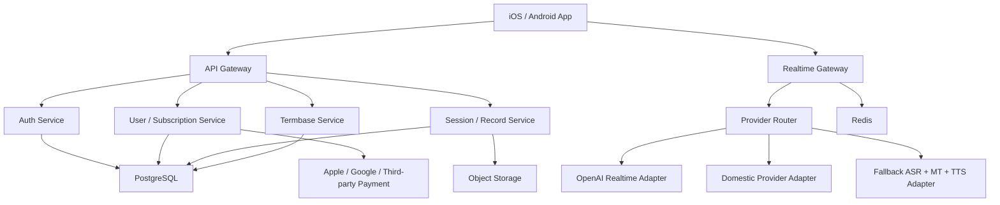
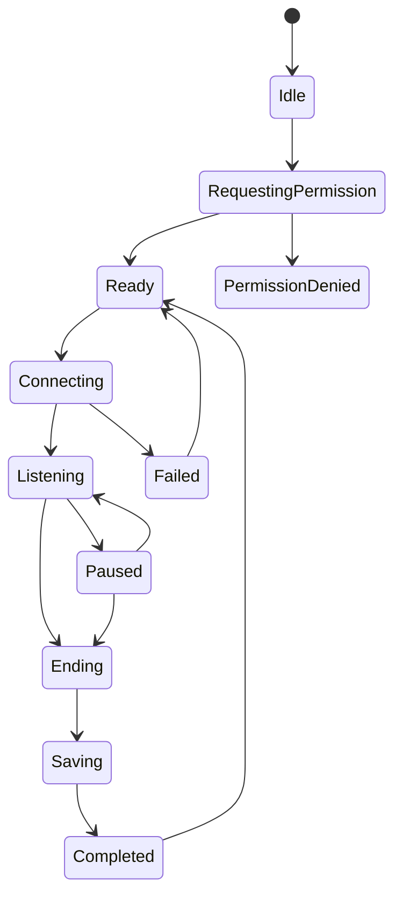
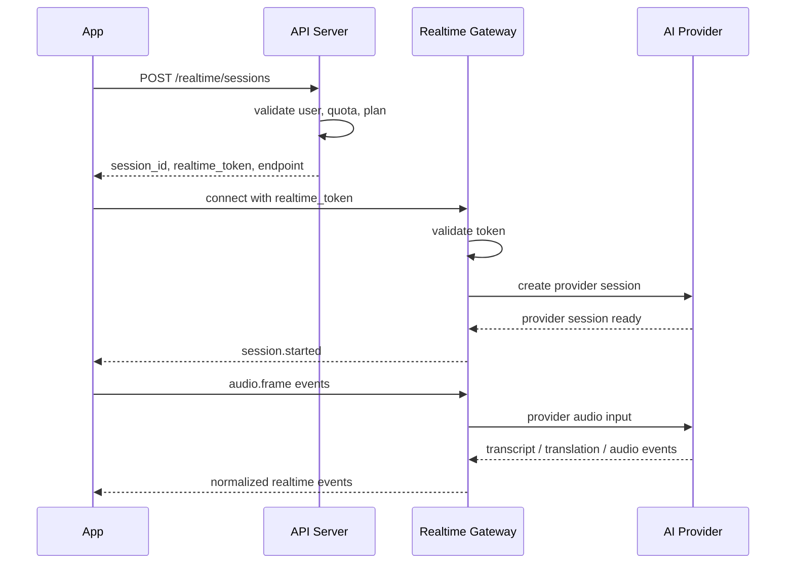
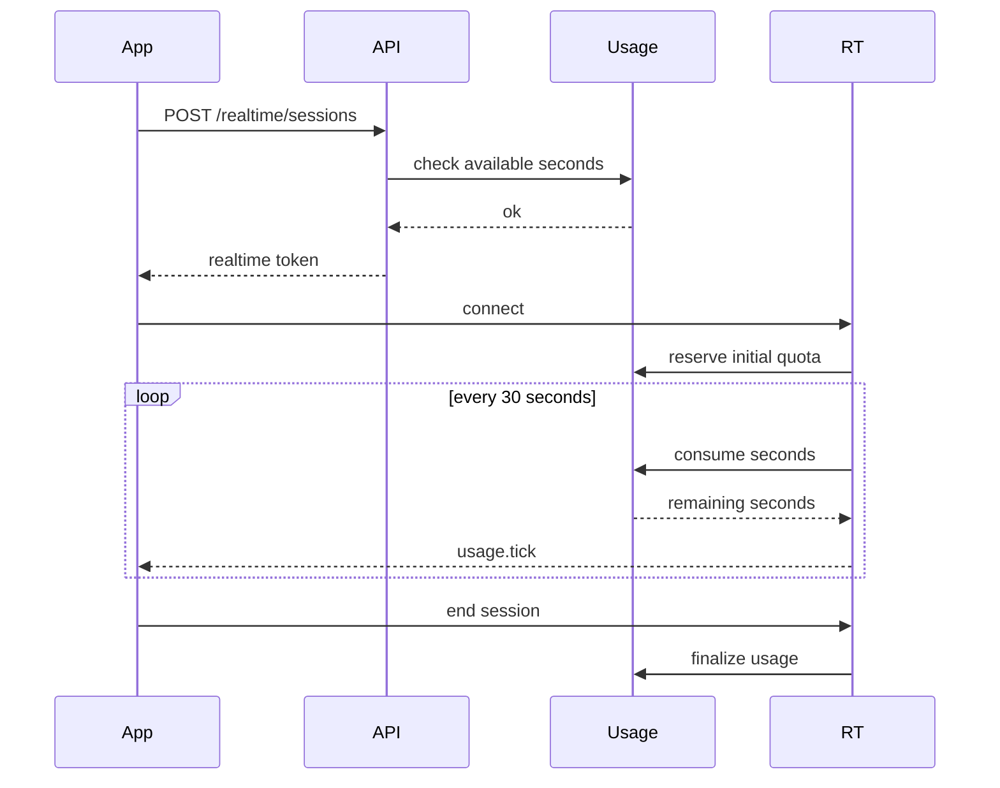
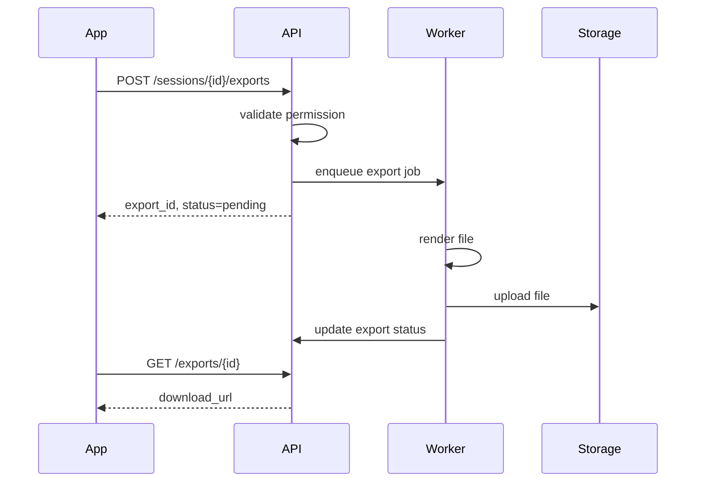
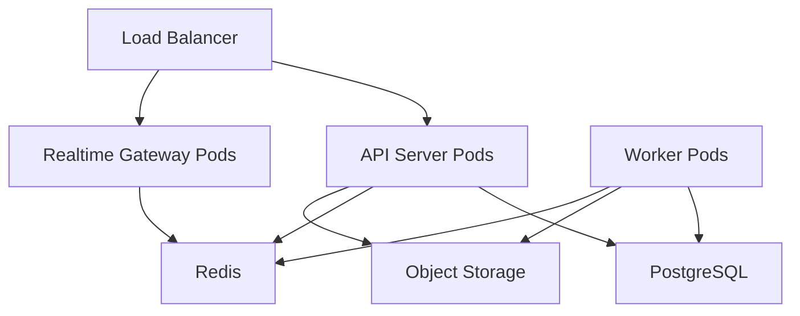

# 中英实时同传工作站 App 技术设计文档

版本：v0.1  
日期：2026-06-04  
项目：翻译软件 App  
关联文档：`功能设计文档.md`  
技术定位：跨平台移动端 + 后端服务 + 云端实时语音 AI 的产品化架构

---

## 1. 文档目的

本文档定义中英实时同传工作站 App 的技术架构、端到端链路、客户端设计、后端服务、数据模型、实时通信协议、AI 供应商适配、订阅计费、安全合规、部署运维和测试验收标准。

本文档用于指导：

1. 技术选型。
2. 原型验证。
3. 后端和移动端开发。
4. API 接口设计。
5. 数据库设计。
6. 测试用例设计。
7. 上架前安全与稳定性检查。

---

## 2. 设计假设

1. 首版支持 Android 与 iOS。
2. 首版只支持中文与英文互译。
3. 首版主链路为在线实时同传，不承诺完全离线同传。
4. 客户端不保存任何长期可用的模型供应商 API Key。
5. 所有用户身份、用量、订阅、会话元数据由自有后端管理。
6. 原始音频默认不长期保存，只保存文本记录。
7. 实时语音链路优先采用低延迟流式模式。
8. 供应商必须可替换，不把业务逻辑写死在某一家 AI 服务上。
9. 中国大陆和海外网络环境可能不同，后端需要支持多供应商路由。
10. MVP 先实现个人版，团队版和企业后台延后。

---

## 3. 成功标准

### 3.1 技术体验指标

- App 冷启动到同传首页可交互时间小于 3 秒。
- 点击开始后 1 秒内显示收音或识别中的状态。
- 网络正常时，首段译文字幕在 1-3 秒内出现。
- 单次会话至少支持 30 分钟连续运行。
- 异常退出后可恢复最近一场会话的已完成文本片段。
- 免费和付费用量扣减准确，不允许绕过。

### 3.2 稳定性指标

- 移动端崩溃率低于 0.5%。
- 实时会话异常中断率低于 3%。
- 服务端核心接口 P95 响应时间小于 500ms，不含 AI 流式处理时间。
- 实时网关连接建立成功率大于 98%。
- 付款成功后权益生效延迟小于 10 秒。

### 3.3 安全指标

- 客户端不出现供应商 API Key。
- 实时会话 token 有短有效期。
- 用户只能访问自己的会话记录。
- 删除账号后可触发用户数据删除流程。
- 后端所有敏感配置通过环境变量或密钥管理系统注入。

---

## 4. 总体架构

### 4.1 架构分层

系统分为 5 层：

1. 移动客户端层。
2. API 网关层。
3. 业务服务层。
4. 实时语音网关层。
5. AI 供应商适配层。



### 4.2 核心链路

实时同传链路：

```text
客户端麦克风
-> 音频预处理
-> 实时网关鉴权
-> AI 供应商流式连接
-> 增量识别文本
-> 增量翻译文本
-> 可选 TTS 音频
-> 客户端字幕渲染 / 语音播放
-> 后端异步保存会话片段
-> 用量统计和扣费
```

非实时业务链路：

```text
客户端 REST API
-> API 网关
-> 鉴权
-> 业务服务
-> PostgreSQL / Redis / Object Storage
-> 客户端展示
```

---

## 5. 技术选型建议

### 5.1 移动端

推荐方案：Flutter。

原因：

- 一套 UI 覆盖 Android 和 iOS。
- 音频、WebSocket、状态管理、订阅支付生态成熟。
- UI 性能稳定，适合字幕滚动和复杂状态页。
- 后续可通过 platform channel 接入原生音频能力。

备选方案：React Native。

适用条件：

- 团队更熟悉 TypeScript / React。
- 需要更快接入 Web 端或桌面端。

不建议首版使用纯原生双端。

原因：

- 开发成本高。
- UI 和业务逻辑重复。
- MVP 迭代速度慢。

### 5.2 后端

推荐方案：

- 语言：Node.js / TypeScript 或 Python / FastAPI。
- API：REST + WebSocket / WebRTC Signaling。
- 数据库：PostgreSQL。
- 缓存与实时状态：Redis。
- 对象存储：S3 兼容存储或云厂商对象存储。
- 队列：Redis Queue / BullMQ / Celery / Cloud Tasks。

首版更推荐 Node.js / TypeScript。

原因：

- 实时 WebSocket、供应商 SDK、支付 webhook 处理方便。
- 前后端类型可以共享部分 DTO。
- 工程人员招聘和维护成本较低。

### 5.3 实时通信

优先级：

1. WebRTC：适合低延迟双向音频。
2. WebSocket：适合事件、字幕、音频 chunk 流。
3. HTTP streaming：适合非音频实时文本流，不作为首选音频通道。

MVP 建议：

- 若选用支持 WebRTC 的实时模型，客户端通过后端获取短期 token 后直连供应商。
- 若供应商不支持客户端直连，客户端连接自有 Realtime Gateway，由网关转发音频与事件。

### 5.4 AI 供应商

供应商应通过统一接口适配。

首选能力：

- 实时语音输入。
- 实时文本输出。
- 实时语音输出。
- 支持中英互译。
- 支持低延迟流式返回。
- 支持临时 token 或服务端代理。

候选供应商：

- OpenAI Realtime API。
- 腾讯云实时语音翻译。
- 阿里云实时语音翻译。
- 火山引擎语音识别 + 翻译 + TTS。
- Google Cloud Speech-to-Text + Translation + Text-to-Speech。

设计原则：

- 供应商只存在于 Provider Adapter。
- 业务层不直接调用供应商 SDK。
- 用量、错误、延迟统一上报。
- 支持按地区、套餐、可用性动态路由。

---

## 6. 客户端技术设计

### 6.1 客户端模块

```text
app/
  core/
    config
    logging
    error
    network
    storage
  auth/
  realtime/
  audio/
  translation/
  sessions/
  termbase/
  subscription/
  settings/
  ui/
```

### 6.2 客户端状态管理

建议使用清晰的单向数据流。

状态模块：

- AuthState。
- SubscriptionState。
- RealtimeSessionState。
- AudioInputState。
- SubtitleState。
- PlaybackState。
- NetworkState。
- SettingsState。

实时会话状态机：



### 6.3 音频采集

客户端职责：

- 请求麦克风权限。
- 启动音频采集。
- 设置采样率和通道数。
- 将音频转换为供应商要求的格式。
- 按固定帧大小发送音频。
- 监听音量，计算简单音量条。
- 支持暂停和恢复。

建议参数：

- 采样率：16kHz 或 24kHz，按供应商要求调整。
- 通道：单声道。
- 位深：16-bit PCM。
- 分片：20ms-100ms。

注意：

- iOS 需要配置麦克风权限描述。
- Android 需要 RECORD_AUDIO 权限。
- Android 长时间后台收音涉及前台服务和系统限制，首版建议前台使用。

### 6.4 音频播放

客户端职责：

- 播放供应商返回的译文语音。
- 支持播放队列。
- 支持中断播放。
- 支持静音译文朗读。
- 支持耳机和扬声器输出。

播放策略：

- 对话模式默认开启。
- 会议和课堂模式默认关闭。
- 当用户暂停会话时，停止新音频播放。
- 当网络中断时，清空未完成的临时播放片段。

### 6.5 字幕渲染

字幕数据分为 3 类：

- partial：识别中的临时原文。
- final：确认后的原文。
- translation：译文。

渲染规则：

- partial 字幕可被后续内容覆盖。
- final 字幕进入会话记录。
- translation 与 final 原文绑定同一个 segment_id。
- 最新字幕固定在可见区域底部或中下方。
- 控制栏不得遮挡字幕。

### 6.6 本地缓存

本地缓存内容：

- 当前用户基础信息。
- 最近会话片段。
- 设置项。
- 草稿状态。
- 术语库只读缓存。

本地不缓存：

- 供应商 API Key。
- 长期有效访问 token。
- 原始录音，除非用户明确开启。

建议：

- 使用 SQLite / Drift / Hive 存储结构化本地数据。
- 使用 secure storage 存储短期 access token / refresh token。
- 会话片段边生成边落本地，再异步同步服务端。

### 6.7 离线和弱网体验

离线策略：

- 无网络时禁止开始在线同传。
- 已有历史记录可查看。
- 文本草稿可保存。
- 明确提示“实时同传需要网络”。

弱网策略：

- 显示网络状态。
- 自动重连实时通道。
- 保留已确认字幕。
- 断线时间超过阈值后自动暂停计时。

---

## 7. 后端技术设计

### 7.1 服务划分

MVP 可采用模块化单体，避免过早微服务化。

模块：

- Auth Module。
- User Module。
- Subscription Module。
- Usage Module。
- Session Module。
- Segment Module。
- Termbase Module。
- Realtime Module。
- Provider Module。
- Export Module。
- Notification Module。

后续可拆分：

- Realtime Gateway。
- Billing Service。
- AI Provider Service。
- Export Worker。

### 7.2 API 网关

职责：

- HTTPS 入口。
- 统一鉴权。
- 请求限流。
- 版本路由。
- 日志 trace_id 注入。
- 错误格式统一。

### 7.3 鉴权服务

支持方式：

- 手机号登录。
- Apple 登录。
- Google 登录。
- 游客试用。

Token 设计：

- access_token：短期有效。
- refresh_token：较长期有效，可撤销。
- realtime_token：仅用于实时会话，短期有效，单会话绑定。

realtime_token 字段：

- user_id。
- session_id。
- plan。
- max_duration_seconds。
- allowed_languages。
- provider_route。
- expires_at。

### 7.4 实时网关

职责：

- 校验 realtime_token。
- 建立客户端实时连接。
- 建立供应商实时连接。
- 转发音频帧。
- 接收供应商事件。
- 标准化事件格式。
- 上报用量和延迟。
- 处理断线重连。

实时网关设计原则：

- 不长期保存原始音频。
- 不在网关实现复杂业务逻辑。
- 所有供应商差异封装在 Provider Adapter。
- 每个连接必须有 trace_id 和 session_id。

### 7.5 业务数据库

推荐 PostgreSQL。

原因：

- 结构化关系清楚。
- 事务能力强。
- 适合订阅、用量、会话、术语库。
- 后续支持全文搜索和 JSONB 扩展。

### 7.6 Redis

用途：

- realtime_token 黑名单。
- 活跃会话状态。
- 用量计数缓存。
- 限流。
- 队列。
- 分布式锁。

### 7.7 对象存储

用途：

- 导出文件。
- 用户批量导入术语文件。
- 崩溃或诊断附件。
- 未来可选保存录音文件。

规则：

- 文件路径必须按 user_id 分区。
- 下载使用短期签名 URL。
- 敏感文件设置生命周期自动删除。

---

## 8. AI 供应商适配设计

### 8.1 统一接口

所有供应商实现统一接口。

```ts
interface RealtimeProvider {
  createSession(input: CreateProviderSessionInput): Promise<ProviderSession>;
  sendAudio(sessionId: string, frame: AudioFrame): Promise<void>;
  sendControl(sessionId: string, event: ControlEvent): Promise<void>;
  onEvent(handler: (event: ProviderEvent) => void): void;
  close(sessionId: string): Promise<void>;
}
```

### 8.2 标准事件

```ts
type RealtimeEvent =
  | SessionStartedEvent
  | AudioLevelEvent
  | PartialTranscriptEvent
  | FinalTranscriptEvent
  | TranslationDeltaEvent
  | TranslationFinalEvent
  | AudioOutputChunkEvent
  | UsageEvent
  | ErrorEvent
  | SessionEndedEvent;
```

事件字段：

- event_id。
- session_id。
- segment_id。
- type。
- timestamp。
- payload。
- provider。
- trace_id。

### 8.3 供应商路由

路由维度：

- 用户所在地区。
- 网络延迟。
- 套餐等级。
- 供应商可用性。
- 当前错误率。
- 成本。
- 是否需要语音输出。

示例策略：

```text
if region == mainland_china:
  prefer domestic_realtime_provider
else:
  prefer openai_realtime_provider

if realtime_provider_unavailable:
  fallback to asr_mt_tts_pipeline
```

### 8.4 级联兜底链路

当实时语音到语音供应商不可用时，使用级联链路：

```text
Streaming ASR
-> Text Translation
-> TTS
```

优点：

- 可替换性强。
- 多供应商可混用。
- 成本可控。

缺点：

- 延迟更高。
- 上下文一致性较弱。
- 语音自然度可能较差。

### 8.5 术语库注入

术语库注入方式：

1. 会话开始时注入系统提示或 provider instructions。
2. 每个翻译请求附带 top terms。
3. 后端对 final translation 做轻量术语校验。

术语数量控制：

- MVP 每场会话最多注入 50 条高优先级术语。
- 后续根据场景和近期命中动态筛选。

术语冲突处理：

- 用户自定义术语优先。
- 当前会话术语优先于默认术语。
- 长词优先于短词。

---

## 9. 实时协议设计

### 9.1 连接建立流程



### 9.2 客户端发送事件

#### audio.frame

```json
{
  "type": "audio.frame",
  "session_id": "sess_123",
  "sequence": 1024,
  "timestamp_ms": 123456,
  "format": "pcm16",
  "sample_rate": 16000,
  "data": "base64..."
}
```

#### session.pause

```json
{
  "type": "session.pause",
  "session_id": "sess_123",
  "timestamp_ms": 123456
}
```

#### session.resume

```json
{
  "type": "session.resume",
  "session_id": "sess_123",
  "timestamp_ms": 123456
}
```

#### segment.correct

```json
{
  "type": "segment.correct",
  "session_id": "sess_123",
  "segment_id": "seg_456",
  "source_text": "corrected source",
  "translated_text": "corrected translation"
}
```

### 9.3 服务端返回事件

#### transcript.partial

```json
{
  "type": "transcript.partial",
  "session_id": "sess_123",
  "segment_id": "seg_456",
  "text": "hello, I would like",
  "language": "en",
  "confidence": 0.82
}
```

#### transcript.final

```json
{
  "type": "transcript.final",
  "session_id": "sess_123",
  "segment_id": "seg_456",
  "text": "hello, I would like to confirm the price",
  "language": "en",
  "start_ms": 1200,
  "end_ms": 4200,
  "confidence": 0.91
}
```

#### translation.final

```json
{
  "type": "translation.final",
  "session_id": "sess_123",
  "segment_id": "seg_456",
  "text": "你好，我想确认一下价格。",
  "language": "zh",
  "term_hits": ["price"]
}
```

#### audio.output

```json
{
  "type": "audio.output",
  "session_id": "sess_123",
  "segment_id": "seg_456",
  "format": "pcm16",
  "sample_rate": 24000,
  "data": "base64..."
}
```

#### usage.tick

```json
{
  "type": "usage.tick",
  "session_id": "sess_123",
  "billable_seconds": 30,
  "remaining_seconds": 1770
}
```

### 9.4 顺序和幂等

规则：

- audio.frame 必须带 sequence。
- 服务端可丢弃重复 sequence。
- segment_id 由服务端生成。
- partial 事件可覆盖。
- final 事件不可覆盖，只能通过 correction 产生新版本。
- 客户端保存最后处理的 event_id，避免重连后重复渲染。

---

## 10. REST API 设计

### 10.1 通用规范

协议：

- HTTPS。
- JSON。
- UTF-8。

Header：

```http
Authorization: Bearer <access_token>
X-Client-Version: 1.0.0
X-Platform: ios | android
X-Request-Id: <uuid>
```

错误格式：

```json
{
  "error": {
    "code": "quota_not_enough",
    "message": "Remaining minutes are not enough",
    "request_id": "req_123"
  }
}
```

### 10.2 Auth API

```http
POST /auth/login/phone
POST /auth/login/apple
POST /auth/login/google
POST /auth/guest
POST /auth/refresh
POST /auth/logout
DELETE /auth/account
```

### 10.3 User API

```http
GET /me
PATCH /me/settings
GET /me/usage
GET /me/subscription
```

### 10.4 Realtime API

```http
POST /realtime/sessions
POST /realtime/sessions/{session_id}/end
GET /realtime/sessions/{session_id}/status
```

创建实时会话请求：

```json
{
  "mode": "conversation",
  "source_language": "auto",
  "target_language": "auto",
  "voice_output": true,
  "termbase_id": "tb_123"
}
```

创建实时会话响应：

```json
{
  "session_id": "sess_123",
  "realtime_token": "rt_...",
  "endpoint": "wss://api.example.com/realtime",
  "expires_at": "2026-06-04T05:00:00Z",
  "max_duration_seconds": 1800
}
```

### 10.5 Session API

```http
GET /sessions
GET /sessions/{session_id}
PATCH /sessions/{session_id}
DELETE /sessions/{session_id}
GET /sessions/{session_id}/segments
POST /sessions/{session_id}/segments/{segment_id}/highlight
POST /sessions/{session_id}/segments/{segment_id}/note
POST /sessions/{session_id}/summary
```

### 10.6 Termbase API

```http
GET /termbases
POST /termbases
GET /termbases/{termbase_id}
PATCH /termbases/{termbase_id}
DELETE /termbases/{termbase_id}
GET /termbases/{termbase_id}/terms
POST /termbases/{termbase_id}/terms
PATCH /terms/{term_id}
DELETE /terms/{term_id}
POST /termbases/{termbase_id}/import
GET /termbases/{termbase_id}/export
```

### 10.7 Export API

```http
POST /sessions/{session_id}/exports
GET /exports/{export_id}
```

创建导出请求：

```json
{
  "format": "markdown",
  "include_summary": true,
  "include_timestamps": true,
  "include_highlights": true
}
```

### 10.8 Billing API

```http
GET /plans
POST /billing/apple/verify
POST /billing/google/verify
POST /billing/webhook/apple
POST /billing/webhook/google
GET /billing/orders
```

---

## 11. 数据库设计

### 11.1 users

```sql
CREATE TABLE users (
  id UUID PRIMARY KEY,
  login_type TEXT NOT NULL,
  phone TEXT,
  email TEXT,
  display_name TEXT,
  status TEXT NOT NULL DEFAULT 'active',
  created_at TIMESTAMPTZ NOT NULL DEFAULT now(),
  updated_at TIMESTAMPTZ NOT NULL DEFAULT now(),
  deleted_at TIMESTAMPTZ
);
```

### 11.2 user_settings

```sql
CREATE TABLE user_settings (
  user_id UUID PRIMARY KEY REFERENCES users(id),
  default_mode TEXT NOT NULL DEFAULT 'conversation',
  default_source_language TEXT NOT NULL DEFAULT 'auto',
  default_target_language TEXT NOT NULL DEFAULT 'auto',
  voice_output_enabled BOOLEAN NOT NULL DEFAULT true,
  subtitle_font_size INTEGER NOT NULL DEFAULT 18,
  auto_save_sessions BOOLEAN NOT NULL DEFAULT true,
  retention_days INTEGER,
  updated_at TIMESTAMPTZ NOT NULL DEFAULT now()
);
```

### 11.3 subscriptions

```sql
CREATE TABLE subscriptions (
  id UUID PRIMARY KEY,
  user_id UUID NOT NULL REFERENCES users(id),
  plan_code TEXT NOT NULL,
  platform TEXT NOT NULL,
  platform_subscription_id TEXT,
  status TEXT NOT NULL,
  current_period_start TIMESTAMPTZ,
  current_period_end TIMESTAMPTZ,
  created_at TIMESTAMPTZ NOT NULL DEFAULT now(),
  updated_at TIMESTAMPTZ NOT NULL DEFAULT now()
);
```

### 11.4 usage_balances

```sql
CREATE TABLE usage_balances (
  user_id UUID PRIMARY KEY REFERENCES users(id),
  total_seconds INTEGER NOT NULL DEFAULT 0,
  used_seconds INTEGER NOT NULL DEFAULT 0,
  reset_at TIMESTAMPTZ,
  updated_at TIMESTAMPTZ NOT NULL DEFAULT now()
);
```

### 11.5 usage_records

```sql
CREATE TABLE usage_records (
  id UUID PRIMARY KEY,
  user_id UUID NOT NULL REFERENCES users(id),
  session_id UUID,
  provider TEXT NOT NULL,
  billable_seconds INTEGER NOT NULL,
  cost_estimate NUMERIC(12, 6),
  reason TEXT NOT NULL,
  created_at TIMESTAMPTZ NOT NULL DEFAULT now()
);
```

### 11.6 sessions

```sql
CREATE TABLE sessions (
  id UUID PRIMARY KEY,
  user_id UUID NOT NULL REFERENCES users(id),
  title TEXT,
  mode TEXT NOT NULL,
  source_language TEXT NOT NULL,
  target_language TEXT NOT NULL,
  termbase_id UUID,
  status TEXT NOT NULL,
  started_at TIMESTAMPTZ,
  ended_at TIMESTAMPTZ,
  duration_seconds INTEGER NOT NULL DEFAULT 0,
  consumed_seconds INTEGER NOT NULL DEFAULT 0,
  summary_status TEXT NOT NULL DEFAULT 'none',
  created_at TIMESTAMPTZ NOT NULL DEFAULT now(),
  updated_at TIMESTAMPTZ NOT NULL DEFAULT now(),
  deleted_at TIMESTAMPTZ
);
```

### 11.7 segments

```sql
CREATE TABLE segments (
  id UUID PRIMARY KEY,
  session_id UUID NOT NULL REFERENCES sessions(id),
  user_id UUID NOT NULL REFERENCES users(id),
  start_ms INTEGER,
  end_ms INTEGER,
  source_language TEXT NOT NULL,
  target_language TEXT NOT NULL,
  source_text TEXT NOT NULL,
  translated_text TEXT NOT NULL,
  confidence NUMERIC(4, 3),
  is_highlighted BOOLEAN NOT NULL DEFAULT false,
  note TEXT,
  version INTEGER NOT NULL DEFAULT 1,
  created_at TIMESTAMPTZ NOT NULL DEFAULT now(),
  updated_at TIMESTAMPTZ NOT NULL DEFAULT now()
);
```

### 11.8 termbases

```sql
CREATE TABLE termbases (
  id UUID PRIMARY KEY,
  user_id UUID NOT NULL REFERENCES users(id),
  name TEXT NOT NULL,
  description TEXT,
  enabled BOOLEAN NOT NULL DEFAULT true,
  created_at TIMESTAMPTZ NOT NULL DEFAULT now(),
  updated_at TIMESTAMPTZ NOT NULL DEFAULT now(),
  deleted_at TIMESTAMPTZ
);
```

### 11.9 terms

```sql
CREATE TABLE terms (
  id UUID PRIMARY KEY,
  termbase_id UUID NOT NULL REFERENCES termbases(id),
  user_id UUID NOT NULL REFERENCES users(id),
  source_text TEXT NOT NULL,
  target_text TEXT NOT NULL,
  direction TEXT NOT NULL,
  category TEXT,
  note TEXT,
  enabled BOOLEAN NOT NULL DEFAULT true,
  created_at TIMESTAMPTZ NOT NULL DEFAULT now(),
  updated_at TIMESTAMPTZ NOT NULL DEFAULT now()
);
```

### 11.10 exports

```sql
CREATE TABLE exports (
  id UUID PRIMARY KEY,
  user_id UUID NOT NULL REFERENCES users(id),
  session_id UUID NOT NULL REFERENCES sessions(id),
  format TEXT NOT NULL,
  status TEXT NOT NULL,
  object_key TEXT,
  error_message TEXT,
  created_at TIMESTAMPTZ NOT NULL DEFAULT now(),
  completed_at TIMESTAMPTZ
);
```

### 11.11 indexes

```sql
CREATE INDEX idx_sessions_user_created
  ON sessions(user_id, created_at DESC)
  WHERE deleted_at IS NULL;

CREATE INDEX idx_segments_session_start
  ON segments(session_id, start_ms);

CREATE INDEX idx_terms_termbase_source
  ON terms(termbase_id, source_text)
  WHERE enabled = true;

CREATE INDEX idx_usage_records_user_created
  ON usage_records(user_id, created_at DESC);
```

---

## 12. 用量和计费设计

### 12.1 计费单位

内部统一以秒为单位，前端展示可按分钟。

规则：

- 开始同传后进入计时。
- 暂停后停止计时。
- 断线短于 10 秒可继续同一会话。
- 断线超过阈值自动暂停。
- 每 30 秒产生一次 usage.tick。
- 会话结束后做最终对账。

### 12.2 扣费流程



### 12.3 配额控制

规则：

- 免费用户每日重置免费秒数。
- 订阅用户按自然月或订阅周期重置。
- 余额不足时拒绝新会话。
- 会中余额低于 3 分钟、1 分钟分别提醒。
- 余额用尽后停止新音频处理，但保存已有内容。

### 12.4 支付平台

iOS：

- 使用 Apple StoreKit。
- 后端接收 Apple server notifications。
- 后端校验交易状态。

Android：

- 使用 Google Play Billing。
- 后端通过 Google Play Developer API 校验购买。

中国大陆可选：

- 支付宝。
- 微信支付。

注意：

- App Store 内数字订阅通常需要走 Apple IAP。
- Google Play 上架版本通常需要走 Google Play Billing。
- 国内安卓渠道需要按渠道接入支付。

---

## 13. 订阅权益设计

### 13.1 Plan 配置

Plan 不写死在客户端，由后端下发。

字段：

- plan_code。
- display_name。
- monthly_seconds。
- max_session_seconds。
- export_enabled。
- summary_enabled。
- termbase_enabled。
- history_limit。
- price_display。

### 13.2 权益校验点

需要后端校验：

- 创建实时会话。
- 生成 AI 摘要。
- 导出文件。
- 创建术语库。
- 查看超出限制的历史记录。

客户端只做展示限制，不作为最终安全边界。

---

## 14. 会话保存设计

### 14.1 保存策略

实时过程中：

- 客户端收到 final segment 后立即写本地缓存。
- 客户端异步调用后端保存。
- 实时网关也可异步写入队列作为兜底。

会话结束：

- 后端汇总 session duration。
- 后端更新 consumed_seconds。
- 后端标记 status = completed。
- 若用户开启摘要，则进入摘要任务队列。

### 14.2 异常恢复

场景：

- App 崩溃。
- 网络断开。
- 用户强杀 App。
- 供应商连接中断。

恢复策略：

- 客户端重启后检查本地 active session。
- 若后端 session 仍 active，可尝试恢复。
- 若后端已超时关闭，则展示已保存记录。
- 未上传 segment 在网络恢复后补传。

### 14.3 数据一致性

原则：

- session 是主对象。
- segment 属于 session。
- usage_records 只追加，不覆盖。
- 余额通过事务或乐观锁扣减。
- 导出文件可重新生成，不作为唯一数据源。

---

## 15. 导出设计

### 15.1 格式

MVP：

- TXT。
- Markdown。

后续：

- PDF。
- DOCX。
- SRT。

### 15.2 导出流程



### 15.3 Markdown 导出示例

```markdown
# 会话标题

- 模式：会议
- 时间：2026-06-04 10:00
- 语言：英文 -> 中文

## 摘要

...

## 逐句记录

### 00:01:20

原文：...

译文：...
```

---

## 16. 安全设计

### 16.1 API Key 管理

规则：

- 供应商 API Key 只存在服务端。
- 使用密钥管理系统或云平台 Secret Manager。
- 禁止写入代码仓库。
- 禁止返回给客户端。
- 日志中禁止打印 Key。

### 16.2 Realtime Token

规则：

- 短有效期，建议 1-5 分钟内必须建立连接。
- 绑定 user_id 和 session_id。
- 绑定套餐和最大会话时长。
- 单次使用或可撤销。
- 服务端可加入黑名单。

### 16.3 权限控制

所有资源访问必须检查 user_id：

- session。
- segment。
- termbase。
- term。
- export。
- usage。

### 16.4 限流

限流维度：

- IP。
- user_id。
- device_id。
- session_id。

限流场景：

- 登录验证码。
- 创建实时会话。
- 导出。
- 摘要生成。
- 术语库导入。

### 16.5 日志脱敏

日志中避免记录：

- 完整手机号。
- 邮箱。
- access_token。
- refresh_token。
- API Key。
- 完整会话文本。
- 原始音频。

允许记录：

- trace_id。
- user_id hash。
- session_id。
- provider。
- latency。
- error_code。
- billable_seconds。

---

## 17. 隐私与合规技术实现

### 17.1 麦克风权限

iOS：

- Info.plist 配置 NSMicrophoneUsageDescription。
- 权限请求前展示用途说明。

Android：

- 申请 RECORD_AUDIO。
- 如需要长时间后台录音，必须评估前台服务限制。
- MVP 建议仅支持前台实时同传。

### 17.2 数据保留

默认：

- 保存文本会话记录。
- 不保存原始录音。

用户可选：

- 不保存记录。
- 自动删除 7 天前记录。
- 自动删除 30 天前记录。
- 手动删除全部记录。

### 17.3 删除账号

删除流程：

1. 用户发起注销。
2. 后端校验身份。
3. 标记用户为 pending_delete。
4. 撤销 refresh_token。
5. 删除或匿名化会话数据。
6. 删除对象存储文件。
7. 记录合规审计日志。

### 17.4 高风险提示

前端在首次使用和导出页展示：

- 翻译结果仅供沟通辅助。
- 医疗、法律、合同等重要事项需人工确认。

---

## 18. 可观测性设计

### 18.1 Trace

每次会话生成 trace_id。

贯穿：

- 客户端日志。
- API 请求。
- Realtime Gateway。
- Provider Adapter。
- Usage。
- Export Worker。

### 18.2 指标

客户端指标：

- 冷启动耗时。
- 权限授权率。
- 会话开始成功率。
- 实时连接失败率。
- 崩溃率。

服务端指标：

- API QPS。
- API P50 / P95 / P99。
- 实时连接数。
- 实时连接建立耗时。
- 平均会话时长。
- Provider error rate。
- Provider latency。
- 用量扣减失败率。

业务指标：

- 新用户首次同传转化率。
- 日活跃同传用户。
- 人均同传分钟。
- 免费额度耗尽率。
- 订阅转化率。
- 导出使用率。

### 18.3 日志

日志级别：

- debug：仅本地或测试环境。
- info：关键状态变更。
- warn：可恢复异常。
- error：失败和不可恢复异常。

### 18.4 告警

告警条件：

- Provider error rate 超阈值。
- Realtime Gateway CPU / memory 超阈值。
- 支付 webhook 失败。
- 用量扣费失败。
- 数据库连接池耗尽。
- 队列积压。

---

## 19. 部署架构

### 19.1 环境

至少 3 套环境：

- dev：开发。
- staging：测试和预发。
- production：生产。

### 19.2 后端部署

推荐：

- Docker 容器化。
- API Server 多实例。
- Realtime Gateway 独立扩缩容。
- Worker 独立部署。
- PostgreSQL 托管数据库。
- Redis 托管实例。



### 19.3 扩容策略

API Server：

- 按 CPU、请求数扩容。

Realtime Gateway：

- 按活跃连接数、CPU、网络吞吐扩容。

Worker：

- 按队列长度扩容。

Database：

- 读写分离不是 MVP 必须。
- 先通过索引、连接池、慢查询优化支撑早期流量。

---

## 20. 灾备和降级

### 20.1 供应商降级

策略：

- 主供应商失败后切换备用供应商。
- 实时语音到语音失败后降级为字幕翻译。
- TTS 失败不影响字幕。
- 摘要失败不影响会话记录。

### 20.2 服务降级

可降级功能：

- AI 摘要。
- 导出。
- 术语库导入。
- 语音朗读。

不可降级核心：

- 登录。
- 用量校验。
- 实时字幕。
- 会话保存。

### 20.3 数据备份

建议：

- PostgreSQL 每日全量备份。
- 关键表开启时间点恢复。
- 对象存储开启版本控制或生命周期策略。
- 定期演练恢复。

---

## 21. 测试设计

### 21.1 单元测试

覆盖：

- 用量扣减。
- 权益判断。
- 术语库筛选。
- 事件标准化。
- 错误码映射。
- API 参数校验。

### 21.2 集成测试

覆盖：

- 创建实时会话。
- 保存 segment。
- 会话结束。
- 导出文件。
- 订阅回调。
- 账号删除。

### 21.3 端到端测试

覆盖：

- 新用户首次使用。
- 免费额度不足升级。
- 对话模式同传。
- 会议模式保存记录。
- 弱网重连。
- 拒绝麦克风权限。

### 21.4 音频测试

测试样本：

- 普通话男声。
- 普通话女声。
- 英语男声。
- 英语女声。
- 中式英语。
- 背景噪声。
- 远距离说话。
- 快速语速。

指标：

- 首字延迟。
- 译文延迟。
- 字幕完整率。
- 翻译可理解率。
- 术语命中率。

### 21.5 压力测试

目标：

- 100 并发实时会话。
- 500 并发实时会话。
- 1000 并发实时会话。

观察：

- Realtime Gateway CPU。
- 网络吞吐。
- Provider 限流。
- Redis 延迟。
- 数据库写入延迟。

---

## 22. MVP 开发切分

### 22.1 里程碑 1：技术验证

目标：
跑通实时中英互译链路。

范围：

- 简单移动端页面。
- 麦克风采集。
- 实时连接。
- 字幕展示。
- 译文朗读。

验收：

- 可连续演示 3 分钟。

### 22.2 里程碑 2：账户和用量

目标：
形成可控使用闭环。

范围：

- 登录。
- 免费额度。
- 创建会话前校验。
- 用量扣减。
- 余额展示。

验收：

- 免费用户不能无限使用。

### 22.3 里程碑 3：会话记录

目标：
会后可复盘。

范围：

- session 保存。
- segment 保存。
- 历史列表。
- 会话详情。
- TXT / Markdown 导出。

验收：

- 会后可查看和导出完整记录。

### 22.4 里程碑 4：订阅支付

目标：
付费权益闭环。

范围：

- 套餐页。
- Apple IAP。
- Google Play Billing。
- 后端交易校验。
- 权益生效。

验收：

- 支付成功后实时增加权益。

### 22.5 里程碑 5：上架准备

目标：
发布 Beta 或正式版本。

范围：

- 隐私政策。
- 用户协议。
- 崩溃监控。
- 帮助反馈。
- 上架材料。

验收：

- 满足 App Store / Google Play 提审要求。

---

## 23. 风险和对策

### 23.1 实时延迟过高

原因：

- 网络延迟。
- 供应商响应慢。
- 分段策略太保守。
- TTS 队列阻塞。

对策：

- 优先展示字幕，语音可稍后。
- partial 文本即时显示。
- 分离字幕和语音播放。
- 按地区选择供应商。

### 23.2 识别准确率不足

原因：

- 噪声。
- 远距离。
- 口音。
- 多人重叠说话。

对策：

- 提示靠近声源。
- 做音量反馈。
- 支持手动纠错。
- 后续支持外接麦克风和降噪。

### 23.3 成本失控

原因：

- 免费额度过高。
- 用户长时间挂机。
- 失败重试过多。
- 供应商费用高。

对策：

- 强制会话最长时长。
- 无声音超时暂停。
- 免费额度严格限制。
- 按供应商成本动态路由。
- 记录 provider cost_estimate。

### 23.4 支付和权益不一致

原因：

- App 端支付成功但后端未收到通知。
- webhook 延迟。
- 交易重复。

对策：

- 客户端主动提交交易凭证。
- 后端 webhook 幂等。
- 订阅状态定期校准。
- orders 表记录平台交易 ID。

### 23.5 合规风险

原因：

- 麦克风权限说明不足。
- 用户不知道音频会上传云端。
- 默认保存敏感记录。

对策：

- 权限前说明。
- 隐私政策明确云端处理。
- 默认不保存原始录音。
- 提供删除和不保存历史设置。

---

## 24. 非目标范围

MVP 不做：

- 电话通话内翻译。
- 微信、Zoom、Teams 等第三方 App 系统音频捕获。
- 完全离线同传。
- 多人说话人分离。
- 医疗法律级专业保证。
- 企业后台。
- 私有化部署。

---

## 25. 参考资料

- [OpenAI Realtime API](https://developers.openai.com/api/docs/guides/realtime)：用于低延迟多模态和语音到语音体验。
- [OpenAI Speech-to-Text](https://developers.openai.com/api/docs/guides/speech-to-text) / [Text-to-Speech](https://developers.openai.com/api/docs/guides/text-to-speech)：可作为级联兜底链路的一部分。
- [Apple StoreKit](https://developer.apple.com/documentation/storekit)：用于 iOS 订阅和内购。
- [Google Play Billing](https://developer.android.com/google/play/billing)：用于 Android 上架版本订阅。
- [Apple NSMicrophoneUsageDescription](https://developer.apple.com/documentation/bundleresources/information-property-list/nsmicrophoneusagedescription)：iOS 需要配置麦克风使用说明。
- [Android RECORD_AUDIO](https://developer.android.com/reference/android/Manifest.permission#RECORD_AUDIO) / [Foreground service types](https://developer.android.com/develop/background-work/services/fgs/service-types)：用于 Android 录音权限和长时间运行评估。

---

## 26. 后续待补充

1. 具体 AI 供应商 POC 对比报告。
2. 详细 API OpenAPI 文档。
3. Flutter 工程目录设计。
4. 后端工程目录设计。
5. 支付订阅状态机文档。
6. 隐私政策和用户协议草案。
7. 成本测算表。
8. 测试用例表。
