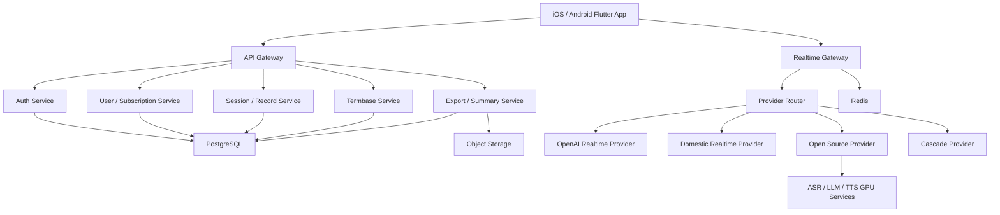
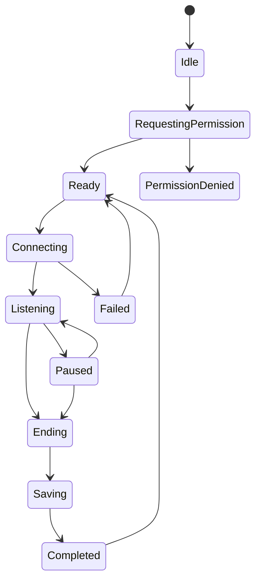
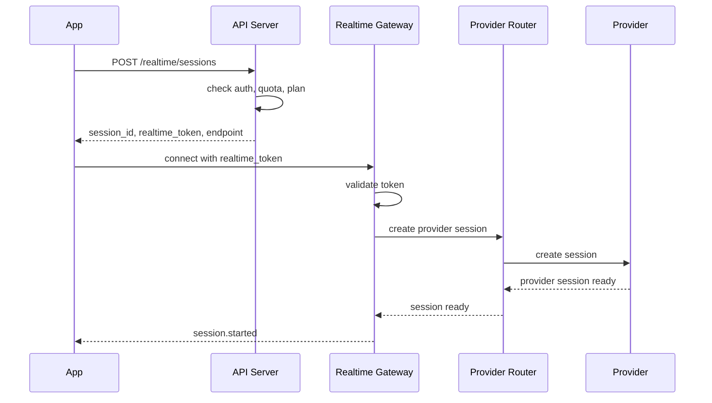
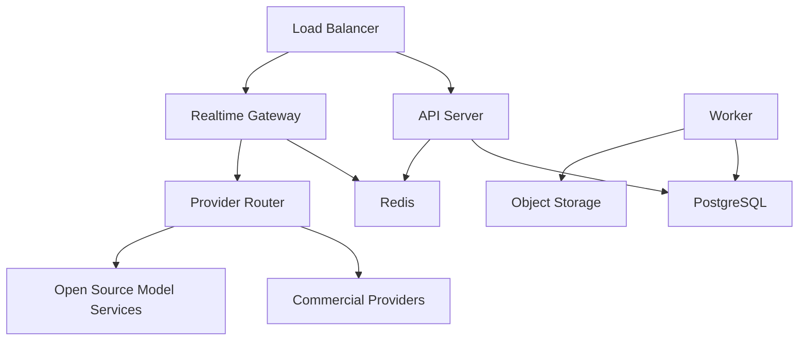

# 中英实时同传工作站 App 最新技术设计文档

版本：v0.3  
日期：2026-06-11  
状态：最新技术基准  
项目：翻译软件 App  
定位：中英实时同传工作站 App  
关联文档：`功能设计文档.md`、`翻译模型选型对比.md`、`开源模型自部署技术设计文档.md`

---

## 1. 最新决策

### 1.1 不使用 CodeClaw

本项目不以 CodeClaw 为基础开发。

原因：

- CodeClaw 是 TypeScript/Node 的个人智能体平台，不是移动 App 或实时语音产品框架。
- 本产品核心是音频采集、实时字幕、同声传译、订阅计费和移动端体验。
- CodeClaw 的 AgentEngine、工具系统、Codebase RAG、CLI、MCP 等能力与本产品首版目标无关。
- 商业化项目应采用干净的新工程，避免不必要的源码来源和许可证风险。

最终决策：

```text
Flutter App：全新开发
后端 API：全新开发
Realtime Gateway：全新开发
模型服务：独立开发
Provider Router：按本项目业务重写
```

### 1.2 最新主架构

```text
Mobile App
-> API Gateway
-> Realtime Gateway
-> Provider Router
-> Commercial Realtime Provider / Open Source Provider
-> Session Record / Usage / Billing
```

最新补充：

```text
Mobile App 仍负责展示和录音，不作为最终会话记录来源。
Realtime Gateway 负责实时运行态、字幕/译文事件、End flush。
API Server 负责持久会话记录、幂等结束、用量扣减和历史导出。
Gateway 可通过 SESSION_EVENT_SINK=api 将 transcript.final / translation.final / session.ended 同步给 API。
```

### 1.3 最新模型策略

```text
海外/全球版主链路：
OpenAI gpt-realtime-translate

中国大陆版主链路：
阿里 Qwen LiveTranslate 或腾讯实时语音翻译，按 POC 定版

开源自部署 POC：
SenseVoice -> Gemma 4 12B-it / Qwen3 14B -> System TTS / CosyVoice

兜底链路：
Streaming ASR -> Text Translation -> TTS

离线模式：
MVP 不做完整离线同传，只保留后续 Gemma E2B/E4B 短句离线翻译方向
```

### 1.4 端侧系统 ASR 策略

苹果和安卓自带 ASR 可作为备用/隐私模式，不作为首版唯一主链路。

```text
默认模式：
Mobile Audio Capture -> Realtime Gateway -> 服务端 ASR -> 翻译 -> API 持久化

系统 ASR 模式：
iOS/Android System ASR -> client.text.segment -> Realtime Gateway -> 翻译 -> API 持久化

后续离线模式：
Local ASR -> Local / Server Translation -> Local Cache / API Sync
```

工程要求：

- 移动端通过 `MobileAsrProvider` 抽象系统 ASR。
- Gateway 协议支持 `client.text.segment`。
- Provider 需要支持 `sendText`，用于绕过服务端 ASR 直接翻译端侧识别文本。
- API 仍是历史记录和计费的唯一可信来源。

---

## 2. 文档目的

本文档是当前最新技术设计基准，用于指导：

1. 工程初始化。
2. POC 开发。
3. 移动端开发。
4. 后端 API 开发。
5. 实时同传链路开发。
6. 模型供应商接入。
7. 用量计费和订阅系统。
8. 测试、部署和上架准备。

本文档优先级高于早期技术设计文档。早期文档仍可作为细节参考。

---

## 3. 产品技术目标

### 3.1 核心体验目标

- 用户打开 App 后 3 步内开始同传。
- 点击开始后 1 秒内看到收音或识别反馈。
- 网络正常时，译文字幕 1-3 秒内出现。
- 单场会话至少支持 30 分钟。
- 会话结束后可查看双语记录。
- 可选译文朗读，不影响字幕优先展示。

### 3.2 商业化目标

- 支持免费分钟数。
- 支持 Pro / Premium 订阅。
- 支持模型用量统计。
- 支持按供应商统计成本。
- 支持会话记录、导出、术语库、摘要等付费能力。

### 3.3 安全目标

- 客户端不保存供应商 API Key。
- 实时会话 token 短期有效。
- 默认不保存原始录音。
- 用户可删除会话记录。
- 所有用户资源按 user_id 隔离。

---

## 4. 总体架构

### 4.1 架构图



### 4.2 架构分层

| 层级 | 组成 | 职责 |
|---|---|---|
| 客户端层 | Flutter App | 音频采集、字幕渲染、播放、页面交互、本地缓存 |
| API 层 | API Gateway | 鉴权、用户、订阅、记录、导出、术语库 |
| 实时层 | Realtime Gateway | 实时连接、音频流、字幕事件、断线重连 |
| 模型路由层 | Provider Router | 按地区、套餐、成本、可用性选择模型 |
| 模型层 | OpenAI/阿里/腾讯/开源模型 | ASR、翻译、TTS 或端到端实时同传 |
| 数据层 | PostgreSQL/Redis/Object Storage | 会话、用量、订阅、缓存、导出文件 |
| 运维层 | 日志、指标、告警 | 稳定性、成本、质量和异常追踪 |

---

## 5. 技术选型

### 5.1 移动端

推荐：Flutter。

原因：

- 一套代码支持 Android 和 iOS。
- UI 表现稳定，适合字幕滚动和实时状态。
- 音频、WebSocket、订阅支付、本地存储生态成熟。
- 必要时可通过原生插件接入低层音频能力。

主要技术：

| 模块 | 选型 |
|---|---|
| UI | Flutter |
| 状态管理 | Riverpod 或 Bloc |
| 路由 | go_router |
| 本地数据库 | Drift / SQLite |
| 安全存储 | flutter_secure_storage |
| 实时通信 | WebSocket；可选 WebRTC |
| 音频采集 | 原生插件封装 |
| 播放 | just_audio 或原生音频队列 |
| 支付 | in_app_purchase |
| 崩溃监控 | Sentry / Firebase Crashlytics |

### 5.2 后端 API

推荐：TypeScript + Node.js。

原因：

- WebSocket 和实时事件处理方便。
- 支付 webhook、REST API、订阅状态处理生态成熟。
- 与移动端 API 类型定义协作成本低。

建议技术：

| 模块 | 选型 |
|---|---|
| API 框架 | Fastify 或 NestJS |
| 类型校验 | Zod |
| ORM | Prisma 或 Drizzle |
| 数据库 | PostgreSQL |
| 缓存 | Redis |
| 对象存储 | S3 兼容存储 / 云厂商 OSS |
| 队列 | BullMQ / Cloud Tasks |
| 日志 | Pino |
| 文档 | OpenAPI |

### 5.3 模型服务

商业模型接入：

- TypeScript Provider Adapter。
- 后端代理或短期 token。

开源模型服务：

- Python FastAPI / gRPC。
- ASR、LLM、TTS 独立服务。
- GPU 服务独立部署和扩缩容。

建议：

```text
Node.js:
  API / Realtime / Billing / Routing

Python:
  SenseVoice / Whisper / Gemma / Qwen / CosyVoice 推理服务
```

---

## 6. 工程结构

### 6.1 推荐仓库结构

```text
translation-app/
  apps/
    mobile/                 # Flutter App
    admin-web/              # 后续企业后台，可延后
  services/
    api-server/             # REST API / 业务服务
    realtime-gateway/       # 实时音频和字幕网关
    worker/                 # 导出、摘要、异步任务
    model-services/         # Python 模型服务
      asr-service/
      translation-service/
      tts-service/
  packages/
    contracts/              # API DTO、事件类型、错误码
    shared-config/
  docs/
    product/
    technical/
    api/
    poc/
  infra/
    docker/
    k8s/
    terraform/
```

### 6.2 MVP 可简化结构

MVP 阶段可先用：

```text
apps/mobile
services/api-server
services/realtime-gateway
services/model-services
packages/contracts
```

暂不做：

- admin-web。
- 企业后台。
- 多租户。
- 私有化部署。

---

## 7. 客户端设计

### 7.1 客户端模块

```text
mobile/lib/
  app/
  core/
    config/
    network/
    storage/
    error/
    analytics/
  features/
    auth/
    realtime/
    audio/
    subtitles/
    sessions/
    termbase/
    subscription/
    settings/
```

### 7.2 实时会话状态机



### 7.3 音频采集

客户端职责：

- 请求麦克风权限。
- 采集 PCM 音频。
- 做基础音量检测。
- 按固定帧发送音频。
- 支持暂停、恢复、结束。

推荐格式：

```text
sample_rate: 16000 或 24000
channel: mono
format: pcm16
frame: 20ms-100ms
```

### 7.4 字幕渲染

字幕事件类型：

- `transcript.partial`
- `transcript.final`
- `translation.delta`
- `translation.final`
- `usage.tick`
- `error`

渲染规则：

- partial 可覆盖。
- final 不覆盖，只能产生修订版本。
- translation 和 transcript 通过 segment_id 绑定。
- 字幕优先于语音播放。
- 网络异常时保留已确认字幕。

### 7.5 本地缓存

缓存内容：

- 用户设置。
- 最近会话草稿。
- 已确认 segment。
- 术语库缓存。

不缓存：

- 供应商 API Key。
- 原始录音，除非用户明确开启。
- 长期有效 token。

---

## 8. 后端服务设计

### 8.1 API Server

职责：

- 登录注册。
- 用户信息。
- 套餐和订阅。
- 用量统计。
- 会话记录。
- 术语库。
- 导出。
- 摘要。
- 管理 realtime_token。

### 8.2 Realtime Gateway

职责：

- 校验 realtime_token。
- 建立实时连接。
- 接收音频 frame。
- 转发到 Provider Router。
- 接收模型事件。
- 标准化事件并返回 App。
- 统计连接状态、延迟、错误和用量。

### 8.3 Worker

职责：

- 会话导出。
- AI 摘要。
- 订阅状态校准。
- 数据清理。
- 失败任务重试。

### 8.4 Model Services

职责：

- ASR 推理。
- 文本翻译。
- TTS 合成。
- 模型健康检查。
- 模型指标上报。

---

## 9. Provider Router 设计

### 9.1 Provider 类型

```text
Realtime Provider:
  OpenAI gpt-realtime-translate
  阿里 Qwen LiveTranslate
  腾讯实时语音翻译

Open Source Provider:
  SenseVoice -> Gemma/Qwen -> TTS

Cascade Provider:
  ASR -> Text Translation -> TTS
```

### 9.2 路由规则

```text
if region == "CN":
  prefer aliyun_or_tencent
else:
  prefer openai

if provider unhealthy:
  switch fallback provider

if user plan == free:
  prefer subtitle-only low-cost route

if voice_output_enabled:
  prefer speech-to-speech or TTS-enabled route

if mode == classroom or meeting:
  default subtitle-only

if mode == conversation or business:
  allow voice output
```

### 9.3 Provider 接口

```ts
interface RealtimeProvider {
  name: string;
  type: "realtime" | "cascade" | "open_source";
  createSession(input: CreateRealtimeSessionInput): Promise<ProviderSession>;
  sendAudio(sessionId: string, frame: AudioFrame): Promise<void>;
  sendControl(sessionId: string, event: ControlEvent): Promise<void>;
  closeSession(sessionId: string): Promise<void>;
  healthCheck(): Promise<ProviderHealth>;
}
```

### 9.4 标准事件

```ts
type RealtimeEvent =
  | { type: "session.started"; sessionId: string }
  | { type: "transcript.partial"; segmentId: string; text: string; language: string }
  | { type: "transcript.final"; segmentId: string; text: string; language: string }
  | { type: "translation.delta"; segmentId: string; text: string; language: string }
  | { type: "translation.final"; segmentId: string; text: string; language: string }
  | { type: "audio.output"; segmentId: string; audio: string; format: string }
  | { type: "usage.tick"; billableSeconds: number; remainingSeconds: number }
  | { type: "error"; code: string; message: string };
```

---

## 10. 实时协议设计

### 10.1 建立会话



### 10.2 音频事件

```json
{
  "type": "audio.frame",
  "session_id": "sess_123",
  "sequence": 1024,
  "timestamp_ms": 123456,
  "format": "pcm16",
  "sample_rate": 16000,
  "data": "base64..."
}
```

### 10.3 翻译事件

```json
{
  "type": "translation.final",
  "session_id": "sess_123",
  "segment_id": "seg_456",
  "text": "付款后交期大约为 30 天。",
  "language": "zh",
  "term_hits": ["delivery time"]
}
```

### 10.4 用量事件

```json
{
  "type": "usage.tick",
  "session_id": "sess_123",
  "billable_seconds": 30,
  "remaining_seconds": 1770
}
```

---

## 11. 开源模型链路

### 11.1 字幕优先链路

MVP 开源 POC 先做字幕链路：

```text
Mobile audio
-> Realtime Gateway
-> SenseVoice ASR
-> Gemma 4 12B-it / Qwen3 14B translation
-> subtitle event
-> session record
```

### 11.2 语音播报链路

语音播报作为可选能力：

```text
translation text
-> system TTS / cloud TTS
-> later CosyVoice
-> audio output
```

### 11.3 模型模式

| 模式 | ASR | 翻译 | TTS | 用途 |
|---|---|---|---|---|
| free | SenseVoice | Qwen3 8B / Gemma E2B | 无 | 免费字幕 |
| pro | SenseVoice | Gemma 4 12B-it / Qwen3 14B | 系统/云 TTS | 标准同传 |
| premium | SenseVoice | Qwen3 32B / 更强模型 | CosyVoice | 高质量 |
| offline | 本地输入 | Gemma E2B/E4B | 系统 TTS | 短句离线 |

### 11.4 端侧离线

MVP 不做完整端侧同传。

后续方向：

- Gemma E2B：短句文本翻译。
- Gemma E4B：高端设备离线字幕翻译。
- 系统 TTS：离线朗读。

---

## 12. 数据库设计

### 12.1 核心表

```text
users
user_settings
subscriptions
usage_balances
usage_records
sessions
segments
termbases
terms
exports
provider_events
```

### 12.2 users

```sql
CREATE TABLE users (
  id UUID PRIMARY KEY,
  login_type TEXT NOT NULL,
  phone TEXT,
  email TEXT,
  display_name TEXT,
  status TEXT NOT NULL DEFAULT 'active',
  created_at TIMESTAMPTZ NOT NULL DEFAULT now(),
  updated_at TIMESTAMPTZ NOT NULL DEFAULT now(),
  deleted_at TIMESTAMPTZ
);
```

### 12.3 sessions

```sql
CREATE TABLE sessions (
  id UUID PRIMARY KEY,
  user_id UUID NOT NULL REFERENCES users(id),
  title TEXT,
  mode TEXT NOT NULL,
  source_language TEXT NOT NULL,
  target_language TEXT NOT NULL,
  provider TEXT,
  termbase_id UUID,
  status TEXT NOT NULL,
  started_at TIMESTAMPTZ,
  ended_at TIMESTAMPTZ,
  duration_seconds INTEGER NOT NULL DEFAULT 0,
  consumed_seconds INTEGER NOT NULL DEFAULT 0,
  summary_status TEXT NOT NULL DEFAULT 'none',
  created_at TIMESTAMPTZ NOT NULL DEFAULT now(),
  updated_at TIMESTAMPTZ NOT NULL DEFAULT now(),
  deleted_at TIMESTAMPTZ
);
```

### 12.4 segments

```sql
CREATE TABLE segments (
  id UUID PRIMARY KEY,
  session_id UUID NOT NULL REFERENCES sessions(id),
  user_id UUID NOT NULL REFERENCES users(id),
  start_ms INTEGER,
  end_ms INTEGER,
  source_language TEXT NOT NULL,
  target_language TEXT NOT NULL,
  source_text TEXT NOT NULL,
  translated_text TEXT NOT NULL,
  confidence NUMERIC(4, 3),
  provider TEXT,
  model TEXT,
  is_highlighted BOOLEAN NOT NULL DEFAULT false,
  note TEXT,
  version INTEGER NOT NULL DEFAULT 1,
  created_at TIMESTAMPTZ NOT NULL DEFAULT now(),
  updated_at TIMESTAMPTZ NOT NULL DEFAULT now()
);
```

### 12.5 usage_records

```sql
CREATE TABLE usage_records (
  id UUID PRIMARY KEY,
  user_id UUID NOT NULL REFERENCES users(id),
  session_id UUID,
  provider TEXT NOT NULL,
  model TEXT,
  billable_seconds INTEGER NOT NULL,
  cost_estimate NUMERIC(12, 6),
  reason TEXT NOT NULL,
  created_at TIMESTAMPTZ NOT NULL DEFAULT now()
);
```

### 12.6 provider_events

```sql
CREATE TABLE provider_events (
  id UUID PRIMARY KEY,
  session_id UUID NOT NULL,
  user_id UUID NOT NULL,
  provider TEXT NOT NULL,
  event_type TEXT NOT NULL,
  latency_ms INTEGER,
  error_code TEXT,
  created_at TIMESTAMPTZ NOT NULL DEFAULT now()
);
```

---

## 13. REST API 设计

### 13.1 Auth

```http
POST /auth/guest
POST /auth/login/phone
POST /auth/login/apple
POST /auth/login/google
POST /auth/refresh
POST /auth/logout
DELETE /auth/account
```

### 13.2 Realtime

```http
POST /realtime/sessions
POST /realtime/sessions/{session_id}/end
GET /realtime/sessions/{session_id}/status
```

创建会话请求：

```json
{
  "mode": "conversation",
  "source_language": "auto",
  "target_language": "auto",
  "voice_output": true,
  "termbase_id": "tb_123"
}
```

创建会话响应：

```json
{
  "session_id": "sess_123",
  "realtime_token": "rt_...",
  "endpoint": "wss://api.example.com/realtime",
  "expires_at": "2026-06-04T05:00:00Z",
  "max_duration_seconds": 1800
}
```

### 13.3 Sessions

```http
GET /sessions
GET /sessions/{session_id}
PATCH /sessions/{session_id}
DELETE /sessions/{session_id}
GET /sessions/{session_id}/segments
POST /sessions/{session_id}/summary
POST /sessions/{session_id}/exports
```

### 13.4 Termbase

```http
GET /termbases
POST /termbases
GET /termbases/{termbase_id}
PATCH /termbases/{termbase_id}
DELETE /termbases/{termbase_id}
POST /termbases/{termbase_id}/terms
POST /termbases/{termbase_id}/import
GET /termbases/{termbase_id}/export
```

### 13.5 Billing

```http
GET /plans
GET /me/subscription
GET /me/usage
POST /billing/apple/verify
POST /billing/google/verify
POST /billing/webhook/apple
POST /billing/webhook/google
```

---

## 14. 用量计费设计

### 14.1 计费规则

- 内部统一按秒计费。
- 同传开始后计时。
- 暂停后停止计时。
- 无声超过阈值自动暂停或提示。
- 每 30 秒产生一次 usage tick。
- 会话结束后做最终对账。

### 14.2 配额规则

| 用户类型 | 建议规则 |
|---|---|
| 免费用户 | 每日少量分钟，默认字幕模式 |
| Pro | 中等分钟数，支持导出和历史 |
| Premium | 高分钟数，支持术语库、摘要、高级导出 |
| 企业 | 按分钟包或席位报价 |

### 14.3 成本控制

- 免费版默认不开 TTS。
- 会议/课堂模式默认不开朗读。
- 单场最长时长限制。
- 无声音自动暂停。
- Provider Router 按成本和质量路由。
- 每个 provider 记录 cost_estimate。

---

## 15. 订阅支付设计

### 15.1 iOS

- 使用 Apple StoreKit。
- 后端校验交易。
- 接收 Apple server notifications。
- 权益以后端为准。

### 15.2 Android

- Google Play 版本使用 Google Play Billing。
- 后端校验 purchase token。
- 接收 Google 订阅状态变化。

### 15.3 国内安卓

可根据渠道接入：

- 微信支付。
- 支付宝。
- 华为/小米/OPPO/vivo 渠道支付。

---

## 16. 安全与隐私

### 16.1 API Key

- 供应商 API Key 只在服务端。
- 不写入客户端。
- 不写入代码仓库。
- 日志不打印 Key。

### 16.2 实时 Token

realtime_token 必须：

- 短有效期。
- 绑定 user_id。
- 绑定 session_id。
- 绑定最大时长。
- 可撤销。

### 16.3 音频数据

默认：

- 只实时处理。
- 不保存原始录音。
- 不进入日志。
- 不用于训练。

用户可选：

- 保存文字记录。
- 不保存历史。
- 删除历史。
- 自动清理历史。

### 16.4 合规提示

首次使用必须告知：

- 需要麦克风权限。
- 音频可能发送到云端处理。
- 翻译仅供沟通辅助。
- 医疗、法律、合同等场景需人工确认。

---

## 17. 可观测性

### 17.1 Trace

每场会话生成 trace_id，贯穿：

- App。
- API Server。
- Realtime Gateway。
- Provider Router。
- Model Provider。
- Usage。
- Session Record。

### 17.2 关键指标

客户端：

- 冷启动耗时。
- 权限授权率。
- 会话开始成功率。
- 崩溃率。

实时链路：

- 首字延迟。
- 译文延迟。
- TTS 首包延迟。
- 断线率。
- 重连成功率。

模型：

- provider latency。
- provider error rate。
- fallback rate。
- cost per minute。
- term hit rate。

业务：

- 新用户首次同传率。
- 人均同传分钟。
- 免费额度耗尽率。
- 订阅转化率。
- 导出使用率。

---

## 18. 部署架构

### 18.1 环境

```text
dev
staging
production
```

### 18.2 部署拓扑



### 18.3 扩容策略

- API Server 按请求量扩容。
- Realtime Gateway 按活跃连接数扩容。
- Worker 按队列长度扩容。
- 开源模型服务按 GPU 利用率和队列长度扩容。

---

## 19. MVP 开发阶段

### 19.1 阶段一：实时链路 POC

目标：

- 跑通 3 分钟中英实时同传。

范围：

- Flutter 简单工作台。
- 麦克风采集。
- Realtime Gateway。
- OpenAI 或国内实时 Provider。
- 字幕展示。

验收：

- 首字延迟 <= 1 秒。
- 译文延迟 <= 3 秒。
- 能连续演示 3 分钟。

### 19.2 阶段二：模型 POC

目标：

- 比较 OpenAI、阿里、腾讯、开源链路。

范围：

- Provider Router。
- 统一事件格式。
- 60 条测试音频。
- 成本和延迟统计。

验收：

- 确认海外主链路。
- 确认国内主链路。
- 确认开源链路是否进入 MVP。

### 19.3 阶段三：产品闭环

目标：

- 内测可用。

范围：

- 登录。
- 会话保存。
- 历史记录。
- 用量扣减。
- 基础导出。
- 免费分钟。

验收：

- 用户可完成“开始同传 -> 保存 -> 查看 -> 导出”。

### 19.4 阶段四：订阅支付

目标：

- 付费闭环。

范围：

- 套餐页。
- Apple IAP。
- Google Play Billing。
- 后端交易校验。
- 权益生效。

验收：

- 支付成功后权益实时更新。
- 余额不足时正确阻止新会话。

### 19.5 阶段五：上架准备

目标：

- App Store / Google Play 提审。

范围：

- 隐私政策。
- 用户协议。
- 麦克风权限说明。
- 崩溃监控。
- 帮助反馈。
- 上架截图和描述。

---

## 20. 测试计划

### 20.1 单元测试

- 用量扣减。
- 权益判断。
- Provider 路由。
- 术语库筛选。
- 事件标准化。
- 错误码映射。

### 20.2 集成测试

- 创建实时会话。
- 保存 segment。
- 会话结束。
- 导出文件。
- 支付回调。
- 账号删除。

### 20.3 音频测试

样本：

- 普通话男声/女声。
- 英文男声/女声。
- 中式英语。
- 外贸术语。
- 课堂讲座。
- 背景噪声。
- 快速语速。

指标：

- 首字延迟。
- 译文延迟。
- 字幕完整率。
- 翻译可理解率。
- 术语命中率。
- 单分钟成本。

### 20.4 压力测试

阶段目标：

- 100 并发实时会话。
- 500 并发实时会话。
- 1000 并发实时会话。

观察：

- Realtime Gateway CPU。
- 网络吞吐。
- Redis 延迟。
- Provider 限流。
- 数据库写入延迟。

---

## 21. 风险与对策

### 21.1 实时延迟过高

对策：

- 字幕优先，语音延后。
- partial transcript 快速展示。
- TTS 不阻塞翻译。
- 按地区选择 Provider。

### 21.2 成本失控

对策：

- 免费额度严格限制。
- 单场时长上限。
- 无声自动暂停。
- 低成本字幕链路。
- TTS 仅付费或按需开启。

### 21.3 国内外网络差异

对策：

- 国内走阿里/腾讯。
- 海外走 OpenAI。
- Provider Router 动态切换。
- 保留开源自部署兜底。

### 21.4 翻译质量不稳定

对策：

- 固定测试集评估。
- 术语库注入。
- 会后可修订。
- Gemma/Qwen/OpenAI/国内模型并行 POC。

### 21.5 合规风险

对策：

- 权限前说明。
- 默认不保存录音。
- 用户可删除数据。
- 高风险场景提示。
- 商用前审查模型和依赖许可证。

---

## 22. 非目标范围

MVP 不做：

- CodeClaw 集成。
- 电话通话内翻译。
- 微信、Zoom、Teams 等跨 App 系统音频捕获。
- 完整离线同传。
- 多人说话人分离。
- 医疗法律级专业保证。
- 企业后台。
- 私有化部署。
- 声音克隆。

---

## 23. 最终开发建议

第一步不要直接写完整 App，先做 POC。

推荐顺序：

1. 初始化全新仓库结构。
2. Flutter 做最小同传工作台。
3. Node.js 做 API Server 和 Realtime Gateway。
4. 接入 OpenAI realtime 做海外链路 POC。
5. 接入阿里或腾讯做国内链路 POC。
6. 接入 SenseVoice + Gemma/Qwen 做开源链路 POC。
7. 用同一套音频测试集比较延迟、质量和成本。
8. POC 通过后再进入 MVP 产品闭环。

当前最新推荐：

```text
不使用 CodeClaw。
全新 Flutter + Node.js + Python 模型服务。
Provider Router 必须保留。
MVP 字幕优先，语音播报可选。
商业模型先跑通，开源模型并行 POC。
端侧离线延后。
```
